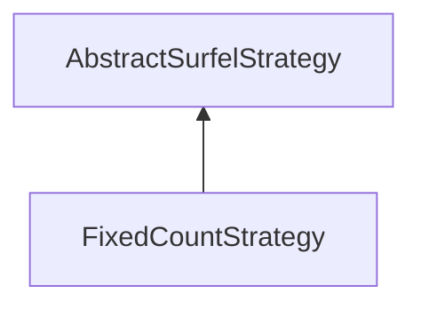

| public |
{:.api_label}

#### Inheritance Graph

## Description

## Public Functions

|
| ------: | ----------------- |
|  | |
|  | **[FixedCountStrategy](#classMinSG_1_1BlueSurfels_1_1FixedCountStrategy_1a2d3ff16e563336bfed7f36c8c4a082c3)**() |
|  | |
| bool | **[update](#classMinSG_1_1BlueSurfels_1_1FixedCountStrategy_1a3caa938d322db9e04ecb36d6f2fcf25c)**( [MinSG::FrameContext](classMinSG_1_1FrameContext) & context,  [MinSG::Node](classMinSG_1_1Node) * node,  [SurfelObject](structMinSG_1_1BlueSurfels_1_1SurfelObject) & surfel) |
{: .nohead .nowrap1 .api_section }

-------------------------------------------------------------------

## Documentation

### <small>function</small>  MinSG::BlueSurfels::FixedCountStrategy::FixedCountStrategy {#classMinSG_1_1BlueSurfels_1_1FixedCountStrategy_1a2d3ff16e563336bfed7f36c8c4a082c3}

| public | inline |
{:.api_label}

|
| ------: | ----------------- |
|  |
|  **[FixedCountStrategy](#classMinSG_1_1BlueSurfels_1_1FixedCountStrategy_1a2d3ff16e563336bfed7f36c8c4a082c3)**( |  ) |
{: .nohead .nowrap1 .api_doc }

Defined in `MinSG/Ext/BlueSurfels/Strategies/CommonStrategies.h:38`{:style="float: right"}

-------------------------------------------------------------------

### <small>function</small>  MinSG::BlueSurfels::FixedCountStrategy::update {#classMinSG_1_1BlueSurfels_1_1FixedCountStrategy_1a3caa938d322db9e04ecb36d6f2fcf25c}

| public | virtual |
{:.api_label}

|
| ------: | ----------------- |
|  |
| bool **[update](#classMinSG_1_1BlueSurfels_1_1FixedCountStrategy_1a3caa938d322db9e04ecb36d6f2fcf25c)**( |  [MinSG::FrameContext](classMinSG_1_1FrameContext) & | **context**, |
| |  [MinSG::Node](classMinSG_1_1Node) * | **node**, |
| |  [SurfelObject](structMinSG_1_1BlueSurfels_1_1SurfelObject) & | **surfel** |
|   ) |
{: .nohead .nowrap1 .api_doc }

Defined in `MinSG/Ext/BlueSurfels/Strategies/CommonStrategies.h:39`{:style="float: right"}

-------------------------------------------------------------------

