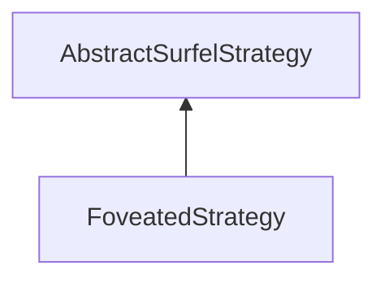

| public |
{:.api_label}

#### Inheritance Graph

## Description

## Public Functions

|
| ------: | ----------------- |
|  | |
|  | **[FoveatedStrategy](#classMinSG_1_1BlueSurfels_1_1FoveatedStrategy_1a07e2f4771400ec937d8b5ed66e127fd4)**() |
|  | |
| bool | **[update](#classMinSG_1_1BlueSurfels_1_1FoveatedStrategy_1aa712e2bde1e604199aa18fc6a5708145)**( [MinSG::FrameContext](classMinSG_1_1FrameContext) & context,  [MinSG::Node](classMinSG_1_1Node) * node,  [SurfelObject](structMinSG_1_1BlueSurfels_1_1SurfelObject) & surfel) |
|  | |
| const std::vector< std::pair< float, float > > & | **[getFoveaZones](#classMinSG_1_1BlueSurfels_1_1FoveatedStrategy_1a82894063228651f36cd5b44043fbb424)**() const |
|  | |
| void | **[setFoveaZones](#classMinSG_1_1BlueSurfels_1_1FoveatedStrategy_1a63d424e6543baf0bc21f197b4fb24ccb)**(const std::vector< std::pair< float, float >> & zones) |
|  | |
| void | **[addFoveaZone](#classMinSG_1_1BlueSurfels_1_1FoveatedStrategy_1ae4abbc5587538910f1a72b4a8c843245)**(float pos, float scale) |
{: .nohead .nowrap1 .api_section }

-------------------------------------------------------------------

## Documentation

### <small>function</small>  MinSG::BlueSurfels::FoveatedStrategy::FoveatedStrategy {#classMinSG_1_1BlueSurfels_1_1FoveatedStrategy_1a07e2f4771400ec937d8b5ed66e127fd4}

| public | inline |
{:.api_label}

|
| ------: | ----------------- |
|  |
|  **[FoveatedStrategy](#classMinSG_1_1BlueSurfels_1_1FoveatedStrategy_1a07e2f4771400ec937d8b5ed66e127fd4)**( |  ) |
{: .nohead .nowrap1 .api_doc }

Defined in `MinSG/Ext/BlueSurfels/Strategies/FoveatedStrategy.h:28`{:style="float: right"}

-------------------------------------------------------------------

### <small>function</small>  MinSG::BlueSurfels::FoveatedStrategy::update {#classMinSG_1_1BlueSurfels_1_1FoveatedStrategy_1aa712e2bde1e604199aa18fc6a5708145}

| public | virtual |
{:.api_label}

|
| ------: | ----------------- |
|  |
| bool **[update](#classMinSG_1_1BlueSurfels_1_1FoveatedStrategy_1aa712e2bde1e604199aa18fc6a5708145)**( |  [MinSG::FrameContext](classMinSG_1_1FrameContext) & | **context**, |
| |  [MinSG::Node](classMinSG_1_1Node) * | **node**, |
| |  [SurfelObject](structMinSG_1_1BlueSurfels_1_1SurfelObject) & | **surfel** |
|   ) |
{: .nohead .nowrap1 .api_doc }

Defined in `MinSG/Ext/BlueSurfels/Strategies/FoveatedStrategy.h:29`{:style="float: right"}

-------------------------------------------------------------------

### <small>function</small>  MinSG::BlueSurfels::FoveatedStrategy::getFoveaZones {#classMinSG_1_1BlueSurfels_1_1FoveatedStrategy_1a82894063228651f36cd5b44043fbb424}

| public | const | inline |
{:.api_label}

|
| ------: | ----------------- |
|  |
| const std::vector< std::pair< float, float > > & **[getFoveaZones](#classMinSG_1_1BlueSurfels_1_1FoveatedStrategy_1a82894063228651f36cd5b44043fbb424)**( |  ) const |
{: .nohead .nowrap1 .api_doc }

Defined in `MinSG/Ext/BlueSurfels/Strategies/FoveatedStrategy.h:34`{:style="float: right"}

-------------------------------------------------------------------

### <small>function</small>  MinSG::BlueSurfels::FoveatedStrategy::setFoveaZones {#classMinSG_1_1BlueSurfels_1_1FoveatedStrategy_1a63d424e6543baf0bc21f197b4fb24ccb}

| public | inline |
{:.api_label}

|
| ------: | ----------------- |
|  |
| void **[setFoveaZones](#classMinSG_1_1BlueSurfels_1_1FoveatedStrategy_1a63d424e6543baf0bc21f197b4fb24ccb)**( | const std::vector< std::pair< float, float >> & | **zones** ) |
{: .nohead .nowrap1 .api_doc }

Defined in `MinSG/Ext/BlueSurfels/Strategies/FoveatedStrategy.h:35`{:style="float: right"}

-------------------------------------------------------------------

### <small>function</small>  MinSG::BlueSurfels::FoveatedStrategy::addFoveaZone {#classMinSG_1_1BlueSurfels_1_1FoveatedStrategy_1ae4abbc5587538910f1a72b4a8c843245}

| public | inline |
{:.api_label}

|
| ------: | ----------------- |
|  |
| void **[addFoveaZone](#classMinSG_1_1BlueSurfels_1_1FoveatedStrategy_1ae4abbc5587538910f1a72b4a8c843245)**( | float | **pos**, |
| | float | **scale** |
|   ) |
{: .nohead .nowrap1 .api_doc }

Defined in `MinSG/Ext/BlueSurfels/Strategies/FoveatedStrategy.h:40`{:style="float: right"}

-------------------------------------------------------------------

