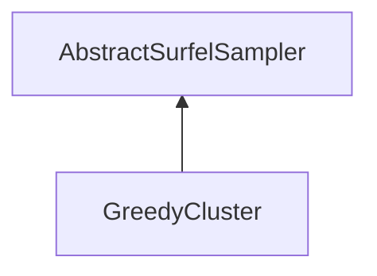

| public |
{:.api_label}

#### Inheritance Graph

## Description

Computes an exact greedy permutation of the input samples.

Inspired by: Sariel Har-Peled and Manor Mendel Fast Construction of Nets in Low-Dimensional Metrics and Their Applications SIAM Journal on Computing (2006).[https://doi.org/10.1137/s0097539704446281](https://doi.org/10.1137/s0097539704446281)

## Public Functions

|
| ------: | ----------------- |
|  | |
| [Rendering::Mesh](classRendering_1_1Mesh) * | **[sampleSurfels](#classMinSG_1_1BlueSurfels_1_1GreedyCluster_1a04ea1988b194bc50c8ef33a4c1589aa7)**( [Rendering::Mesh](classRendering_1_1Mesh) * sourceMesh) |
|  | |
| void | **[setMinRadius](#classMinSG_1_1BlueSurfels_1_1GreedyCluster_1a904189ac2b52125e0c35acbfb2402633)**(float r) |
|  | |
| float | **[getMinRadius](#classMinSG_1_1BlueSurfels_1_1GreedyCluster_1aef9dc92d6a05880ab2171f6bb3bf8464)**() const |
|  | |
| std::map< uint32_t, float > | **[getSampleTimes](#classMinSG_1_1BlueSurfels_1_1GreedyCluster_1a75755b2de77d88ffb01ed6b61eaa6939)**() const |
{: .nohead .nowrap1 .api_section }

-------------------------------------------------------------------

## Documentation

### <small>function</small>  MinSG::BlueSurfels::GreedyCluster::sampleSurfels {#classMinSG_1_1BlueSurfels_1_1GreedyCluster_1a04ea1988b194bc50c8ef33a4c1589aa7}

| public | virtual |
{:.api_label}

|
| ------: | ----------------- |
|  |
| [Rendering::Mesh](classRendering_1_1Mesh) * **[sampleSurfels](#classMinSG_1_1BlueSurfels_1_1GreedyCluster_1a04ea1988b194bc50c8ef33a4c1589aa7)**( |  [Rendering::Mesh](classRendering_1_1Mesh) * | **sourceMesh** ) |
{: .nohead .nowrap1 .api_doc }

Defined in `MinSG/Ext/BlueSurfels/Samplers/GreedyCluster.h:33`{:style="float: right"}

-------------------------------------------------------------------

### <small>function</small>  MinSG::BlueSurfels::GreedyCluster::setMinRadius {#classMinSG_1_1BlueSurfels_1_1GreedyCluster_1a904189ac2b52125e0c35acbfb2402633}

| public | inline |
{:.api_label}

|
| ------: | ----------------- |
|  |
| void **[setMinRadius](#classMinSG_1_1BlueSurfels_1_1GreedyCluster_1a904189ac2b52125e0c35acbfb2402633)**( | float | **r** ) |
{: .nohead .nowrap1 .api_doc }

Defined in `MinSG/Ext/BlueSurfels/Samplers/GreedyCluster.h:35`{:style="float: right"}

-------------------------------------------------------------------

### <small>function</small>  MinSG::BlueSurfels::GreedyCluster::getMinRadius {#classMinSG_1_1BlueSurfels_1_1GreedyCluster_1aef9dc92d6a05880ab2171f6bb3bf8464}

| public | const | inline |
{:.api_label}

|
| ------: | ----------------- |
|  |
| float **[getMinRadius](#classMinSG_1_1BlueSurfels_1_1GreedyCluster_1aef9dc92d6a05880ab2171f6bb3bf8464)**( |  ) const |
{: .nohead .nowrap1 .api_doc }

Defined in `MinSG/Ext/BlueSurfels/Samplers/GreedyCluster.h:36`{:style="float: right"}

-------------------------------------------------------------------

### <small>function</small>  MinSG::BlueSurfels::GreedyCluster::getSampleTimes {#classMinSG_1_1BlueSurfels_1_1GreedyCluster_1a75755b2de77d88ffb01ed6b61eaa6939}

| public | const | inline |
{:.api_label}

|
| ------: | ----------------- |
|  |
| std::map< uint32_t, float > **[getSampleTimes](#classMinSG_1_1BlueSurfels_1_1GreedyCluster_1a75755b2de77d88ffb01ed6b61eaa6939)**( |  ) const |
{: .nohead .nowrap1 .api_doc }

Defined in `MinSG/Ext/BlueSurfels/Samplers/GreedyCluster.h:38`{:style="float: right"}

-------------------------------------------------------------------

