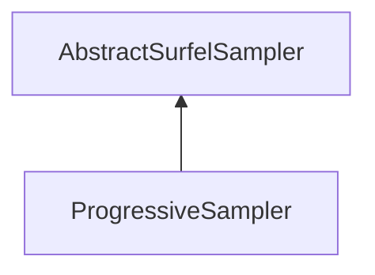

| public |
{:.api_label}

#### Inheritance Graph

## Description

## Public Functions

|
| ------: | ----------------- |
|  | |
| [Rendering::Mesh](classRendering_1_1Mesh) * | **[sampleSurfels](#classMinSG_1_1BlueSurfels_1_1ProgressiveSampler_1a834a25fb3d9bba28955ed4130c63e667)**( [Rendering::Mesh](classRendering_1_1Mesh) * sourceMesh) |
|  | |
| uint32_t | **[getSamplesPerRound](#classMinSG_1_1BlueSurfels_1_1ProgressiveSampler_1afb254d8fd3b361e2eec7805b378d05c1)**() const |
|  | |
| void | **[setSamplesPerRound](#classMinSG_1_1BlueSurfels_1_1ProgressiveSampler_1ab290f820a0b02bb67c4d9cae70708582)**(uint32_t v) |
{: .nohead .nowrap1 .api_section }

-------------------------------------------------------------------

## Documentation

### <small>function</small>  MinSG::BlueSurfels::ProgressiveSampler::sampleSurfels {#classMinSG_1_1BlueSurfels_1_1ProgressiveSampler_1a834a25fb3d9bba28955ed4130c63e667}

| public | virtual |
{:.api_label}

|
| ------: | ----------------- |
|  |
| [Rendering::Mesh](classRendering_1_1Mesh) * **[sampleSurfels](#classMinSG_1_1BlueSurfels_1_1ProgressiveSampler_1a834a25fb3d9bba28955ed4130c63e667)**( |  [Rendering::Mesh](classRendering_1_1Mesh) * | **sourceMesh** ) |
{: .nohead .nowrap1 .api_doc }

Defined in `MinSG/Ext/BlueSurfels/Samplers/ProgressiveSampler.h:23`{:style="float: right"}

-------------------------------------------------------------------

### <small>function</small>  MinSG::BlueSurfels::ProgressiveSampler::getSamplesPerRound {#classMinSG_1_1BlueSurfels_1_1ProgressiveSampler_1afb254d8fd3b361e2eec7805b378d05c1}

| public | const | inline |
{:.api_label}

|
| ------: | ----------------- |
|  |
| uint32_t **[getSamplesPerRound](#classMinSG_1_1BlueSurfels_1_1ProgressiveSampler_1afb254d8fd3b361e2eec7805b378d05c1)**( |  ) const |
{: .nohead .nowrap1 .api_doc }

Defined in `MinSG/Ext/BlueSurfels/Samplers/ProgressiveSampler.h:24`{:style="float: right"}

-------------------------------------------------------------------

### <small>function</small>  MinSG::BlueSurfels::ProgressiveSampler::setSamplesPerRound {#classMinSG_1_1BlueSurfels_1_1ProgressiveSampler_1ab290f820a0b02bb67c4d9cae70708582}

| public | inline |
{:.api_label}

|
| ------: | ----------------- |
|  |
| void **[setSamplesPerRound](#classMinSG_1_1BlueSurfels_1_1ProgressiveSampler_1ab290f820a0b02bb67c4d9cae70708582)**( | uint32_t | **v** ) |
{: .nohead .nowrap1 .api_doc }

Defined in `MinSG/Ext/BlueSurfels/Samplers/ProgressiveSampler.h:25`{:style="float: right"}

-------------------------------------------------------------------

