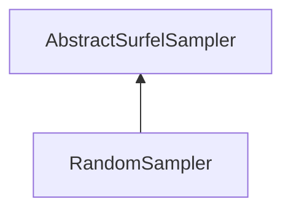

| public |
{:.api_label}

#### Inheritance Graph

## Description

## Public Functions

|
| ------: | ----------------- |
|  | |
| [Rendering::Mesh](classRendering_1_1Mesh) * | **[sampleSurfels](#classMinSG_1_1BlueSurfels_1_1RandomSampler_1a1d37d38bd6de555d14fd146cf62efb65)**( [Rendering::Mesh](classRendering_1_1Mesh) * sourceMesh) |
{: .nohead .nowrap1 .api_section }

-------------------------------------------------------------------

## Documentation

### <small>function</small>  MinSG::BlueSurfels::RandomSampler::sampleSurfels {#classMinSG_1_1BlueSurfels_1_1RandomSampler_1a1d37d38bd6de555d14fd146cf62efb65}

| public | virtual |
{:.api_label}

|
| ------: | ----------------- |
|  |
| [Rendering::Mesh](classRendering_1_1Mesh) * **[sampleSurfels](#classMinSG_1_1BlueSurfels_1_1RandomSampler_1a1d37d38bd6de555d14fd146cf62efb65)**( |  [Rendering::Mesh](classRendering_1_1Mesh) * | **sourceMesh** ) |
{: .nohead .nowrap1 .api_doc }

Defined in `MinSG/Ext/BlueSurfels/Samplers/RandomSampler.h:22`{:style="float: right"}

-------------------------------------------------------------------

