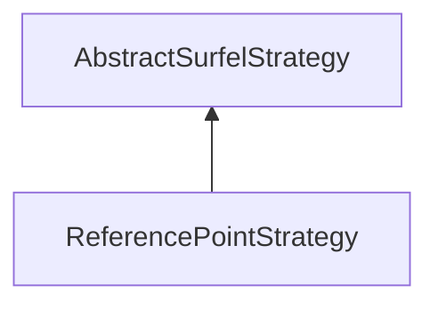

| public |
{:.api_label}

#### Inheritance Graph

## Description

## Public Functions

|
| ------: | ----------------- |
|  | |
|  | **[ReferencePointStrategy](#classMinSG_1_1BlueSurfels_1_1ReferencePointStrategy_1a11782a2ff44bd910f803be0afc35add2)**() |
|  | |
| bool | **[update](#classMinSG_1_1BlueSurfels_1_1ReferencePointStrategy_1a97191f78970f9f0c30f2bc481e46e131)**( [MinSG::FrameContext](classMinSG_1_1FrameContext) & context,  [MinSG::Node](classMinSG_1_1Node) * node,  [SurfelObject](structMinSG_1_1BlueSurfels_1_1SurfelObject) & surfel) |
{: .nohead .nowrap1 .api_section }

-------------------------------------------------------------------

## Documentation

### <small>function</small>  MinSG::BlueSurfels::ReferencePointStrategy::ReferencePointStrategy {#classMinSG_1_1BlueSurfels_1_1ReferencePointStrategy_1a11782a2ff44bd910f803be0afc35add2}

| public | inline |
{:.api_label}

|
| ------: | ----------------- |
|  |
|  **[ReferencePointStrategy](#classMinSG_1_1BlueSurfels_1_1ReferencePointStrategy_1a11782a2ff44bd910f803be0afc35add2)**( |  ) |
{: .nohead .nowrap1 .api_doc }

Defined in `MinSG/Ext/BlueSurfels/Strategies/CommonStrategies.h:63`{:style="float: right"}

-------------------------------------------------------------------

### <small>function</small>  MinSG::BlueSurfels::ReferencePointStrategy::update {#classMinSG_1_1BlueSurfels_1_1ReferencePointStrategy_1a97191f78970f9f0c30f2bc481e46e131}

| public | virtual |
{:.api_label}

|
| ------: | ----------------- |
|  |
| bool **[update](#classMinSG_1_1BlueSurfels_1_1ReferencePointStrategy_1a97191f78970f9f0c30f2bc481e46e131)**( |  [MinSG::FrameContext](classMinSG_1_1FrameContext) & | **context**, |
| |  [MinSG::Node](classMinSG_1_1Node) * | **node**, |
| |  [SurfelObject](structMinSG_1_1BlueSurfels_1_1SurfelObject) & | **surfel** |
|   ) |
{: .nohead .nowrap1 .api_doc }

Defined in `MinSG/Ext/BlueSurfels/Strategies/CommonStrategies.h:64`{:style="float: right"}

-------------------------------------------------------------------

