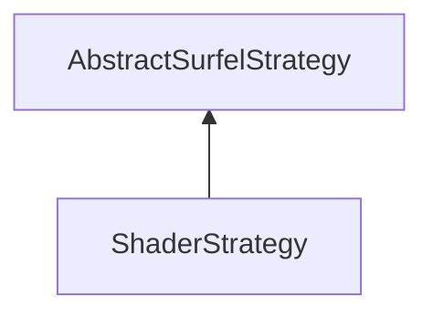

| public |
{:.api_label}

#### Inheritance Graph

## Description

## Public Functions

|
| ------: | ----------------- |
|  | |
|  | **[ShaderStrategy](#classMinSG_1_1BlueSurfels_1_1ShaderStrategy_1ab02252641705d92f1cf270dd109c58a2)**() |
|  | |
| bool | **[prepare](#classMinSG_1_1BlueSurfels_1_1ShaderStrategy_1ad221773d40c17441ab4da09df08cacab)**( [MinSG::FrameContext](classMinSG_1_1FrameContext) & context,  [MinSG::Node](classMinSG_1_1Node) * node) |
|  | |
| bool | **[beforeRendering](#classMinSG_1_1BlueSurfels_1_1ShaderStrategy_1a5d4dba4712d848a2627844e16d3d73f3)**( [MinSG::FrameContext](classMinSG_1_1FrameContext) & context) |
|  | |
| void | **[afterRendering](#classMinSG_1_1BlueSurfels_1_1ShaderStrategy_1a92961a551b5eedc403889aee37aa2e55)**( [MinSG::FrameContext](classMinSG_1_1FrameContext) & context) |
|  | |
| void | **[setSurfelCulling](#classMinSG_1_1BlueSurfels_1_1ShaderStrategy_1a668108463bcdb5c4868210a11297479d)**(bool v) |
|  | |
| bool | **[getSurfelCulling](#classMinSG_1_1BlueSurfels_1_1ShaderStrategy_1ab247b467346a0daa1e159338e67cf637)**() const |
|  | |
| void | **[setSurfelDynSize](#classMinSG_1_1BlueSurfels_1_1ShaderStrategy_1addb51d45f3b6fe720340bb3d23c600ab)**(bool v) |
|  | |
| bool | **[getSurfelDynSize](#classMinSG_1_1BlueSurfels_1_1ShaderStrategy_1a1d4e7a7ed18ad3f2ddd1cb7eb0c067f9)**() const |
|  | |
| void | **[refreshShader](#classMinSG_1_1BlueSurfels_1_1ShaderStrategy_1ae792309e7d344abee2f1f488c08c8f8f)**() |
|  | |
| [Util::FileLocator](classUtil_1_1FileLocator) & | **[getFileLocator](#classMinSG_1_1BlueSurfels_1_1ShaderStrategy_1a4b1bb939d0fc56d50cc331b0d00b3ab7)**() |
{: .nohead .nowrap1 .api_section }

-------------------------------------------------------------------

## Documentation

### <small>function</small>  MinSG::BlueSurfels::ShaderStrategy::ShaderStrategy {#classMinSG_1_1BlueSurfels_1_1ShaderStrategy_1ab02252641705d92f1cf270dd109c58a2}

| public |
{:.api_label}

|
| ------: | ----------------- |
|  |
|  **[ShaderStrategy](#classMinSG_1_1BlueSurfels_1_1ShaderStrategy_1ab02252641705d92f1cf270dd109c58a2)**( |  ) |
{: .nohead .nowrap1 .api_doc }

Defined in `MinSG/Ext/BlueSurfels/Strategies/ShaderStrategy.h:30`{:style="float: right"}

-------------------------------------------------------------------

### <small>function</small>  MinSG::BlueSurfels::ShaderStrategy::prepare {#classMinSG_1_1BlueSurfels_1_1ShaderStrategy_1ad221773d40c17441ab4da09df08cacab}

| public | virtual |
{:.api_label}

|
| ------: | ----------------- |
|  |
| bool **[prepare](#classMinSG_1_1BlueSurfels_1_1ShaderStrategy_1ad221773d40c17441ab4da09df08cacab)**( |  [MinSG::FrameContext](classMinSG_1_1FrameContext) & | **context**, |
| |  [MinSG::Node](classMinSG_1_1Node) * | **node** |
|   ) |
{: .nohead .nowrap1 .api_doc }

Defined in `MinSG/Ext/BlueSurfels/Strategies/ShaderStrategy.h:31`{:style="float: right"}

-------------------------------------------------------------------

### <small>function</small>  MinSG::BlueSurfels::ShaderStrategy::beforeRendering {#classMinSG_1_1BlueSurfels_1_1ShaderStrategy_1a5d4dba4712d848a2627844e16d3d73f3}

| public | virtual |
{:.api_label}

|
| ------: | ----------------- |
|  |
| bool **[beforeRendering](#classMinSG_1_1BlueSurfels_1_1ShaderStrategy_1a5d4dba4712d848a2627844e16d3d73f3)**( |  [MinSG::FrameContext](classMinSG_1_1FrameContext) & | **context** ) |
{: .nohead .nowrap1 .api_doc }

Defined in `MinSG/Ext/BlueSurfels/Strategies/ShaderStrategy.h:32`{:style="float: right"}

-------------------------------------------------------------------

### <small>function</small>  MinSG::BlueSurfels::ShaderStrategy::afterRendering {#classMinSG_1_1BlueSurfels_1_1ShaderStrategy_1a92961a551b5eedc403889aee37aa2e55}

| public | virtual |
{:.api_label}

|
| ------: | ----------------- |
|  |
| void **[afterRendering](#classMinSG_1_1BlueSurfels_1_1ShaderStrategy_1a92961a551b5eedc403889aee37aa2e55)**( |  [MinSG::FrameContext](classMinSG_1_1FrameContext) & | **context** ) |
{: .nohead .nowrap1 .api_doc }

Defined in `MinSG/Ext/BlueSurfels/Strategies/ShaderStrategy.h:33`{:style="float: right"}

-------------------------------------------------------------------

### <small>function</small>  MinSG::BlueSurfels::ShaderStrategy::setSurfelCulling {#classMinSG_1_1BlueSurfels_1_1ShaderStrategy_1a668108463bcdb5c4868210a11297479d}

| public | inline |
{:.api_label}

|
| ------: | ----------------- |
|  |
| void **[setSurfelCulling](#classMinSG_1_1BlueSurfels_1_1ShaderStrategy_1a668108463bcdb5c4868210a11297479d)**( | bool | **v** ) |
{: .nohead .nowrap1 .api_doc }

Defined in `MinSG/Ext/BlueSurfels/Strategies/ShaderStrategy.h:39`{:style="float: right"}

-------------------------------------------------------------------

### <small>function</small>  MinSG::BlueSurfels::ShaderStrategy::getSurfelCulling {#classMinSG_1_1BlueSurfels_1_1ShaderStrategy_1ab247b467346a0daa1e159338e67cf637}

| public | const | inline |
{:.api_label}

|
| ------: | ----------------- |
|  |
| bool **[getSurfelCulling](#classMinSG_1_1BlueSurfels_1_1ShaderStrategy_1ab247b467346a0daa1e159338e67cf637)**( |  ) const |
{: .nohead .nowrap1 .api_doc }

Defined in `MinSG/Ext/BlueSurfels/Strategies/ShaderStrategy.h:44`{:style="float: right"}

-------------------------------------------------------------------

### <small>function</small>  MinSG::BlueSurfels::ShaderStrategy::setSurfelDynSize {#classMinSG_1_1BlueSurfels_1_1ShaderStrategy_1addb51d45f3b6fe720340bb3d23c600ab}

| public | inline |
{:.api_label}

|
| ------: | ----------------- |
|  |
| void **[setSurfelDynSize](#classMinSG_1_1BlueSurfels_1_1ShaderStrategy_1addb51d45f3b6fe720340bb3d23c600ab)**( | bool | **v** ) |
{: .nohead .nowrap1 .api_doc }

Defined in `MinSG/Ext/BlueSurfels/Strategies/ShaderStrategy.h:46`{:style="float: right"}

-------------------------------------------------------------------

### <small>function</small>  MinSG::BlueSurfels::ShaderStrategy::getSurfelDynSize {#classMinSG_1_1BlueSurfels_1_1ShaderStrategy_1a1d4e7a7ed18ad3f2ddd1cb7eb0c067f9}

| public | const | inline |
{:.api_label}

|
| ------: | ----------------- |
|  |
| bool **[getSurfelDynSize](#classMinSG_1_1BlueSurfels_1_1ShaderStrategy_1a1d4e7a7ed18ad3f2ddd1cb7eb0c067f9)**( |  ) const |
{: .nohead .nowrap1 .api_doc }

Defined in `MinSG/Ext/BlueSurfels/Strategies/ShaderStrategy.h:51`{:style="float: right"}

-------------------------------------------------------------------

### <small>function</small>  MinSG::BlueSurfels::ShaderStrategy::refreshShader {#classMinSG_1_1BlueSurfels_1_1ShaderStrategy_1ae792309e7d344abee2f1f488c08c8f8f}

| public |
{:.api_label}

|
| ------: | ----------------- |
|  |
| void **[refreshShader](#classMinSG_1_1BlueSurfels_1_1ShaderStrategy_1ae792309e7d344abee2f1f488c08c8f8f)**( |  ) |
{: .nohead .nowrap1 .api_doc }

Defined in `MinSG/Ext/BlueSurfels/Strategies/ShaderStrategy.h:53`{:style="float: right"}

-------------------------------------------------------------------

### <small>function</small>  MinSG::BlueSurfels::ShaderStrategy::getFileLocator {#classMinSG_1_1BlueSurfels_1_1ShaderStrategy_1a4b1bb939d0fc56d50cc331b0d00b3ab7}

| public | inline |
{:.api_label}

|
| ------: | ----------------- |
|  |
| [Util::FileLocator](classUtil_1_1FileLocator) & **[getFileLocator](#classMinSG_1_1BlueSurfels_1_1ShaderStrategy_1a4b1bb939d0fc56d50cc331b0d00b3ab7)**( |  ) |
{: .nohead .nowrap1 .api_doc }

Defined in `MinSG/Ext/BlueSurfels/Strategies/ShaderStrategy.h:54`{:style="float: right"}

-------------------------------------------------------------------

