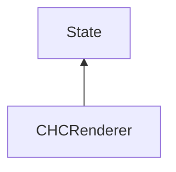

| public |
{:.api_label}

#### Inheritance Graph

## Description

CHC Occlusion Culling Algorithm. Based on: Bittner, J.; Wimmer, M.; Piringer, H. & Purgathofer, W.; "Coherent Hierarchical Culling: Hardware Occlusion Queries Made Useful"; Computer Graphics Forum, Blackwell Publishing, Inc, 2004, 23, 615-624

Minor adaptations to original algorithms and bug fix (don't render nodes twice)

## Public Functions

|
| ------: | ----------------- |
|  | |
|  | **[CHCRenderer](#classMinSG_1_1CHCRenderer_1ae5babd5ecf88f35b97d8d6865aa69d68)**() |
|  | |
|  | **[~CHCRenderer](#classMinSG_1_1CHCRenderer_1ac670be95033b04f2cfa606ee92d0a8c3)**() |
|  | |
| bool | **[getDebugShowVisible](#classMinSG_1_1CHCRenderer_1a1e256ca62ce8cfda4ffe8c40b415dd9a)**() const |
|  | |
| void | **[setDebugShowVisible](#classMinSG_1_1CHCRenderer_1ad6af8d9281619a522028e2435049518e)**(bool b) |
|  | |
| [CHCRenderer](classMinSG_1_1CHCRenderer) * | **[clone](#classMinSG_1_1CHCRenderer_1a5cafc5273f673f03755b2b171b998927)**() const   Create a duplicate of this [State](classMinSG_1_1State) object. |
{: .nohead .nowrap1 .api_section }

-------------------------------------------------------------------

## Documentation

### <small>function</small>  MinSG::CHCRenderer::CHCRenderer {#classMinSG_1_1CHCRenderer_1ae5babd5ecf88f35b97d8d6865aa69d68}

| public | inline |
{:.api_label}

|
| ------: | ----------------- |
|  |
|  **[CHCRenderer](#classMinSG_1_1CHCRenderer_1ae5babd5ecf88f35b97d8d6865aa69d68)**( |  ) |
{: .nohead .nowrap1 .api_doc }

Defined in `MinSG/Ext/OcclusionCulling/CHCRenderer.h:31`{:style="float: right"}

-------------------------------------------------------------------

### <small>function</small>  MinSG::CHCRenderer::~CHCRenderer {#classMinSG_1_1CHCRenderer_1ac670be95033b04f2cfa606ee92d0a8c3}

| public | inline | virtual |
{:.api_label}

|
| ------: | ----------------- |
|  |
|  **[~CHCRenderer](#classMinSG_1_1CHCRenderer_1ac670be95033b04f2cfa606ee92d0a8c3)**( |  ) |
{: .nohead .nowrap1 .api_doc }

Defined in `MinSG/Ext/OcclusionCulling/CHCRenderer.h:32`{:style="float: right"}

-------------------------------------------------------------------

### <small>function</small>  MinSG::CHCRenderer::getDebugShowVisible {#classMinSG_1_1CHCRenderer_1a1e256ca62ce8cfda4ffe8c40b415dd9a}

| public | const | inline |
{:.api_label}

|
| ------: | ----------------- |
|  |
| bool **[getDebugShowVisible](#classMinSG_1_1CHCRenderer_1a1e256ca62ce8cfda4ffe8c40b415dd9a)**( |  ) const |
{: .nohead .nowrap1 .api_doc }

Defined in `MinSG/Ext/OcclusionCulling/CHCRenderer.h:34`{:style="float: right"}

-------------------------------------------------------------------

### <small>function</small>  MinSG::CHCRenderer::setDebugShowVisible {#classMinSG_1_1CHCRenderer_1ad6af8d9281619a522028e2435049518e}

| public | inline |
{:.api_label}

|
| ------: | ----------------- |
|  |
| void **[setDebugShowVisible](#classMinSG_1_1CHCRenderer_1ad6af8d9281619a522028e2435049518e)**( | bool | **b** ) |
{: .nohead .nowrap1 .api_doc }

Defined in `MinSG/Ext/OcclusionCulling/CHCRenderer.h:35`{:style="float: right"}

-------------------------------------------------------------------

### <small>function</small>  MinSG::CHCRenderer::clone {#classMinSG_1_1CHCRenderer_1a5cafc5273f673f03755b2b171b998927}

| public | const | inline | virtual |
{:.api_label}

|
| ------: | ----------------- |
|  |
| [CHCRenderer](classMinSG_1_1CHCRenderer) * **[clone](#classMinSG_1_1CHCRenderer_1a5cafc5273f673f03755b2b171b998927)**( |  ) const |
{: .nohead .nowrap1 .api_doc }

Create a duplicate of this [State](classMinSG_1_1State) object.

Defined in `MinSG/Ext/OcclusionCulling/CHCRenderer.h:36`{:style="float: right"}

-------------------------------------------------------------------

