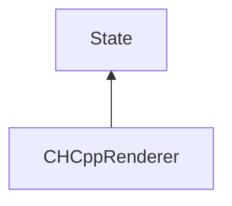

| public |
{:.api_label}

#### Inheritance Graph

## Description

*See also*: Mattausch O., Bittner J., Wimmer M.: CHC++: Coherent Hierarchical Culling Revisited.[http://www.cg.tuwien.ac.at/research/publications/2008/mattausch-2008-CHC/](http://www.cg.tuwien.ac.at/research/publications/2008/mattausch-2008-CHC/)

[ [CHCppRenderer](classMinSG_1_1CHCppRenderer) ]|> [ [State](classMinSG_1_1State) ]

## Public Types

|
| ------: | ----------------- |
|  | |
| enum | **[renderMode](#classMinSG_1_1CHCppRenderer_1a649ce565f42bb0a9596f60162032b98f)** {MODE_CULLING, MODE_SHOW_VISIBLE, MODE_SHOW_CULLED, MODE_UNCONDITIONED} |
{: .nohead .nowrap1 .api_section }

## Public Functions

|
| ------: | ----------------- |
|  | |
|  | **[CHCppRenderer](#classMinSG_1_1CHCppRenderer_1ae327f3837acdeba2446709f2944c27fa)**(const unsigned int _visibilityThreshold, const unsigned int _maxPrevInvisNodesBatchSize, const unsigned int _skippedFramesTillQuery, const unsigned int _maxDepthForTightBoundingVolumes, const float _maxAreaDerivationForTightBoundingVolumes) |
|  | |
|  | **[~CHCppRenderer](#classMinSG_1_1CHCppRenderer_1a4f9f631631ad44cfd804c518bd7345bf)**() |
|  | |
| NodeInfo * | **[getNodeInfo](#classMinSG_1_1CHCppRenderer_1aa7e4e0c1c5c6e574460dd2d04dcfff9b)**( [Node](classMinSG_1_1Node) * node, CHCppContext & chcppContext) const |
|  | |
| [renderMode](classMinSG_1_1CHCppRenderer#classMinSG_1_1CHCppRenderer_1a649ce565f42bb0a9596f60162032b98f) | **[getMode](#classMinSG_1_1CHCppRenderer_1ad729ec391e3bfae96729a02c0b92b447)**() const |
|  | |
| void | **[setMode](#classMinSG_1_1CHCppRenderer_1a5bf7aeb8a6e362e23d19fe1ab3e4e491)**(const [renderMode](classMinSG_1_1CHCppRenderer#classMinSG_1_1CHCppRenderer_1a649ce565f42bb0a9596f60162032b98f)  newMode) |
|  | |
| [CHCppRenderer](classMinSG_1_1CHCppRenderer) * | **[clone](#classMinSG_1_1CHCppRenderer_1ac9b0870bea427a0e7833c1b77c5ab4d2)**() const   Create a duplicate of this [State](classMinSG_1_1State) object. |
|  | |
| unsigned int | **[getVisibilityThreshold](#classMinSG_1_1CHCppRenderer_1aa7f97dfa3b8527e04127d01a5568e444)**() const |
|  | |
| void | **[setVisibilityThreshold](#classMinSG_1_1CHCppRenderer_1a0eb985948f3767785e73cae8ab9944b9)**(const unsigned int i) |
|  | |
| unsigned int | **[getMaxPrevInvisNodesBatchSize](#classMinSG_1_1CHCppRenderer_1a7b44b8ffb9e416c670ec0f82e3025cb6)**() const |
|  | |
| void | **[setMaxPrevInvisNodesBatchSize](#classMinSG_1_1CHCppRenderer_1a188eb65fa9a7fa6189a4fdad04ee4498)**(const unsigned int i) |
|  | |
| unsigned int | **[getSkippedFramesTillQuery](#classMinSG_1_1CHCppRenderer_1ac8cc016c6c6b2f3186bb81a1a3cc0f7e)**() const |
|  | |
| void | **[setSkippedFramesTillQuery](#classMinSG_1_1CHCppRenderer_1adb544d58d05f4ef79fc98f1cea7a49a4)**(const unsigned int i) |
|  | |
| unsigned int | **[getMaxDepthForTightBoundingVolumes](#classMinSG_1_1CHCppRenderer_1a3bd28fcac412e5601f81a617c6552619)**() const |
|  | |
| void | **[setMaxDepthForTightBoundingVolumes](#classMinSG_1_1CHCppRenderer_1acfaf7e185d4992989ee433bbe507e858)**(const unsigned int i) |
|  | |
| float | **[getMaxAreaDerivationForTightBoundingVolumes](#classMinSG_1_1CHCppRenderer_1a66a7b3c9c3cbc97be72a32b94169f7f4)**() const |
|  | |
| void | **[setMaxAreaDerivationForTightBoundingVolumes](#classMinSG_1_1CHCppRenderer_1acc87e7a18e978f875dcf8b6a31834385)**(const float f) |
{: .nohead .nowrap1 .api_section }

-------------------------------------------------------------------

## Documentation

### <small>enum</small>  MinSG::CHCppRenderer::renderMode {#classMinSG_1_1CHCppRenderer_1a649ce565f42bb0a9596f60162032b98f}

| public |
{:.api_label}

|
| ------: | ----------------- |
|  |
| enum **[renderMode](#classMinSG_1_1CHCppRenderer_1a649ce565f42bb0a9596f60162032b98f)** |
{: .nohead .nowrap1 .api_doc }

| Enumerator         |     | Description | 
| ------------------ | --- | ----------- | 
| Enumerator         |     | Description | 
| MODE_CULLING       | = 0 |             | 
| MODE_SHOW_VISIBLE  | = 1 |             | 
| MODE_SHOW_CULLED   | = 2 |             | 
| MODE_UNCONDITIONED | = 3 |             | 

Defined in `MinSG/Ext/OcclusionCulling/CHCppRenderer.h:42`{:style="float: right"}

-------------------------------------------------------------------

### <small>function</small>  MinSG::CHCppRenderer::CHCppRenderer {#classMinSG_1_1CHCppRenderer_1ae327f3837acdeba2446709f2944c27fa}

| public | explicit |
{:.api_label}

|
| ------: | ----------------- |
|  |
|  **[CHCppRenderer](#classMinSG_1_1CHCppRenderer_1ae327f3837acdeba2446709f2944c27fa)**( | const unsigned int | **_visibilityThreshold**, |
| | const unsigned int | **_maxPrevInvisNodesBatchSize**, |
| | const unsigned int | **_skippedFramesTillQuery**, |
| | const unsigned int | **_maxDepthForTightBoundingVolumes**, |
| | const float | **_maxAreaDerivationForTightBoundingVolumes** |
|   ) |
{: .nohead .nowrap1 .api_doc }

Defined in `MinSG/Ext/OcclusionCulling/CHCppRenderer.h:49`{:style="float: right"}

-------------------------------------------------------------------

### <small>function</small>  MinSG::CHCppRenderer::~CHCppRenderer {#classMinSG_1_1CHCppRenderer_1a4f9f631631ad44cfd804c518bd7345bf}

| public | virtual |
{:.api_label}

|
| ------: | ----------------- |
|  |
|  **[~CHCppRenderer](#classMinSG_1_1CHCppRenderer_1a4f9f631631ad44cfd804c518bd7345bf)**( |  ) |
{: .nohead .nowrap1 .api_doc }

Defined in `MinSG/Ext/OcclusionCulling/CHCppRenderer.h:54`{:style="float: right"}

-------------------------------------------------------------------

### <small>function</small>  MinSG::CHCppRenderer::getNodeInfo {#classMinSG_1_1CHCppRenderer_1aa7e4e0c1c5c6e574460dd2d04dcfff9b}

| public | const |
{:.api_label}

|
| ------: | ----------------- |
|  |
| NodeInfo * **[getNodeInfo](#classMinSG_1_1CHCppRenderer_1aa7e4e0c1c5c6e574460dd2d04dcfff9b)**( |  [Node](classMinSG_1_1Node) * | **node**, |
| | CHCppContext & | **chcppContext** |
|   ) const |
{: .nohead .nowrap1 .api_doc }

Defined in `MinSG/Ext/OcclusionCulling/CHCppRenderer.h:56`{:style="float: right"}

-------------------------------------------------------------------

### <small>function</small>  MinSG::CHCppRenderer::getMode {#classMinSG_1_1CHCppRenderer_1ad729ec391e3bfae96729a02c0b92b447}

| public | const | inline |
{:.api_label}

|
| ------: | ----------------- |
|  |
| [renderMode](classMinSG_1_1CHCppRenderer#classMinSG_1_1CHCppRenderer_1a649ce565f42bb0a9596f60162032b98f) **[getMode](#classMinSG_1_1CHCppRenderer_1ad729ec391e3bfae96729a02c0b92b447)**( |  ) const |
{: .nohead .nowrap1 .api_doc }

Defined in `MinSG/Ext/OcclusionCulling/CHCppRenderer.h:58`{:style="float: right"}

-------------------------------------------------------------------

### <small>function</small>  MinSG::CHCppRenderer::setMode {#classMinSG_1_1CHCppRenderer_1a5bf7aeb8a6e362e23d19fe1ab3e4e491}

| public | inline |
{:.api_label}

|
| ------: | ----------------- |
|  |
| void **[setMode](#classMinSG_1_1CHCppRenderer_1a5bf7aeb8a6e362e23d19fe1ab3e4e491)**( | const [renderMode](classMinSG_1_1CHCppRenderer#classMinSG_1_1CHCppRenderer_1a649ce565f42bb0a9596f60162032b98f)  | **newMode** ) |
{: .nohead .nowrap1 .api_doc }

Defined in `MinSG/Ext/OcclusionCulling/CHCppRenderer.h:59`{:style="float: right"}

-------------------------------------------------------------------

### <small>function</small>  MinSG::CHCppRenderer::clone {#classMinSG_1_1CHCppRenderer_1ac9b0870bea427a0e7833c1b77c5ab4d2}

| public | const | virtual |
{:.api_label}

|
| ------: | ----------------- |
|  |
| [CHCppRenderer](classMinSG_1_1CHCppRenderer) * **[clone](#classMinSG_1_1CHCppRenderer_1ac9b0870bea427a0e7833c1b77c5ab4d2)**( |  ) const |
{: .nohead .nowrap1 .api_doc }

Create a duplicate of this [State](classMinSG_1_1State) object.

Defined in `MinSG/Ext/OcclusionCulling/CHCppRenderer.h:62`{:style="float: right"}

-------------------------------------------------------------------

### <small>function</small>  MinSG::CHCppRenderer::getVisibilityThreshold {#classMinSG_1_1CHCppRenderer_1aa7f97dfa3b8527e04127d01a5568e444}

| public | const | inline |
{:.api_label}

|
| ------: | ----------------- |
|  |
| unsigned int **[getVisibilityThreshold](#classMinSG_1_1CHCppRenderer_1aa7f97dfa3b8527e04127d01a5568e444)**( |  ) const |
{: .nohead .nowrap1 .api_doc }

Defined in `MinSG/Ext/OcclusionCulling/CHCppRenderer.h:64`{:style="float: right"}

-------------------------------------------------------------------

### <small>function</small>  MinSG::CHCppRenderer::setVisibilityThreshold {#classMinSG_1_1CHCppRenderer_1a0eb985948f3767785e73cae8ab9944b9}

| public | inline |
{:.api_label}

|
| ------: | ----------------- |
|  |
| void **[setVisibilityThreshold](#classMinSG_1_1CHCppRenderer_1a0eb985948f3767785e73cae8ab9944b9)**( | const unsigned int | **i** ) |
{: .nohead .nowrap1 .api_doc }

Defined in `MinSG/Ext/OcclusionCulling/CHCppRenderer.h:65`{:style="float: right"}

-------------------------------------------------------------------

### <small>function</small>  MinSG::CHCppRenderer::getMaxPrevInvisNodesBatchSize {#classMinSG_1_1CHCppRenderer_1a7b44b8ffb9e416c670ec0f82e3025cb6}

| public | const | inline |
{:.api_label}

|
| ------: | ----------------- |
|  |
| unsigned int **[getMaxPrevInvisNodesBatchSize](#classMinSG_1_1CHCppRenderer_1a7b44b8ffb9e416c670ec0f82e3025cb6)**( |  ) const |
{: .nohead .nowrap1 .api_doc }

Defined in `MinSG/Ext/OcclusionCulling/CHCppRenderer.h:67`{:style="float: right"}

-------------------------------------------------------------------

### <small>function</small>  MinSG::CHCppRenderer::setMaxPrevInvisNodesBatchSize {#classMinSG_1_1CHCppRenderer_1a188eb65fa9a7fa6189a4fdad04ee4498}

| public | inline |
{:.api_label}

|
| ------: | ----------------- |
|  |
| void **[setMaxPrevInvisNodesBatchSize](#classMinSG_1_1CHCppRenderer_1a188eb65fa9a7fa6189a4fdad04ee4498)**( | const unsigned int | **i** ) |
{: .nohead .nowrap1 .api_doc }

Defined in `MinSG/Ext/OcclusionCulling/CHCppRenderer.h:68`{:style="float: right"}

-------------------------------------------------------------------

### <small>function</small>  MinSG::CHCppRenderer::getSkippedFramesTillQuery {#classMinSG_1_1CHCppRenderer_1ac8cc016c6c6b2f3186bb81a1a3cc0f7e}

| public | const | inline |
{:.api_label}

|
| ------: | ----------------- |
|  |
| unsigned int **[getSkippedFramesTillQuery](#classMinSG_1_1CHCppRenderer_1ac8cc016c6c6b2f3186bb81a1a3cc0f7e)**( |  ) const |
{: .nohead .nowrap1 .api_doc }

Defined in `MinSG/Ext/OcclusionCulling/CHCppRenderer.h:70`{:style="float: right"}

-------------------------------------------------------------------

### <small>function</small>  MinSG::CHCppRenderer::setSkippedFramesTillQuery {#classMinSG_1_1CHCppRenderer_1adb544d58d05f4ef79fc98f1cea7a49a4}

| public | inline |
{:.api_label}

|
| ------: | ----------------- |
|  |
| void **[setSkippedFramesTillQuery](#classMinSG_1_1CHCppRenderer_1adb544d58d05f4ef79fc98f1cea7a49a4)**( | const unsigned int | **i** ) |
{: .nohead .nowrap1 .api_doc }

Defined in `MinSG/Ext/OcclusionCulling/CHCppRenderer.h:71`{:style="float: right"}

-------------------------------------------------------------------

### <small>function</small>  MinSG::CHCppRenderer::getMaxDepthForTightBoundingVolumes {#classMinSG_1_1CHCppRenderer_1a3bd28fcac412e5601f81a617c6552619}

| public | const | inline |
{:.api_label}

|
| ------: | ----------------- |
|  |
| unsigned int **[getMaxDepthForTightBoundingVolumes](#classMinSG_1_1CHCppRenderer_1a3bd28fcac412e5601f81a617c6552619)**( |  ) const |
{: .nohead .nowrap1 .api_doc }

Defined in `MinSG/Ext/OcclusionCulling/CHCppRenderer.h:73`{:style="float: right"}

-------------------------------------------------------------------

### <small>function</small>  MinSG::CHCppRenderer::setMaxDepthForTightBoundingVolumes {#classMinSG_1_1CHCppRenderer_1acfaf7e185d4992989ee433bbe507e858}

| public | inline |
{:.api_label}

|
| ------: | ----------------- |
|  |
| void **[setMaxDepthForTightBoundingVolumes](#classMinSG_1_1CHCppRenderer_1acfaf7e185d4992989ee433bbe507e858)**( | const unsigned int | **i** ) |
{: .nohead .nowrap1 .api_doc }

Defined in `MinSG/Ext/OcclusionCulling/CHCppRenderer.h:74`{:style="float: right"}

-------------------------------------------------------------------

### <small>function</small>  MinSG::CHCppRenderer::getMaxAreaDerivationForTightBoundingVolumes {#classMinSG_1_1CHCppRenderer_1a66a7b3c9c3cbc97be72a32b94169f7f4}

| public | const | inline |
{:.api_label}

|
| ------: | ----------------- |
|  |
| float **[getMaxAreaDerivationForTightBoundingVolumes](#classMinSG_1_1CHCppRenderer_1a66a7b3c9c3cbc97be72a32b94169f7f4)**( |  ) const |
{: .nohead .nowrap1 .api_doc }

Defined in `MinSG/Ext/OcclusionCulling/CHCppRenderer.h:76`{:style="float: right"}

-------------------------------------------------------------------

### <small>function</small>  MinSG::CHCppRenderer::setMaxAreaDerivationForTightBoundingVolumes {#classMinSG_1_1CHCppRenderer_1acc87e7a18e978f875dcf8b6a31834385}

| public | inline |
{:.api_label}

|
| ------: | ----------------- |
|  |
| void **[setMaxAreaDerivationForTightBoundingVolumes](#classMinSG_1_1CHCppRenderer_1acc87e7a18e978f875dcf8b6a31834385)**( | const float | **f** ) |
{: .nohead .nowrap1 .api_doc }

Defined in `MinSG/Ext/OcclusionCulling/CHCppRenderer.h:77`{:style="float: right"}

-------------------------------------------------------------------

