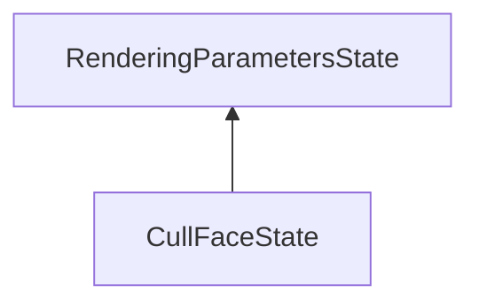

| public |
{:.api_label}

#### Inheritance Graph

## Description

## Public Functions

|
| ------: | ----------------- |
|  | |
|  | **[CullFaceState](#classMinSG_1_1CullFaceState_1a30447b319e708057b46fb43d585487bc)**() |
|  | |
|  | **[CullFaceState](#classMinSG_1_1CullFaceState_1a221376ab07e2b7ad3072108091de8bcb)**(const [Rendering::CullFaceParameters](classRendering_1_1CullFaceParameters) & newParameter) |
|  | |
|  | **[CullFaceState](#classMinSG_1_1CullFaceState_1af826a7065b17531c807cc8c047f3fe96)**(const [CullFaceState](classMinSG_1_1CullFaceState) & other) |
|  | |
|  | **[~CullFaceState](#classMinSG_1_1CullFaceState_1adc931fadde7b9555b206aa475022ce71)**() |
|  | |
| [CullFaceState](classMinSG_1_1CullFaceState) * | **[clone](#classMinSG_1_1CullFaceState_1a5b72e7c401499e9b9e4c94e9e84bcac5)**() const   Create a duplicate of this [State](classMinSG_1_1State) object. |
{: .nohead .nowrap1 .api_section }

-------------------------------------------------------------------

## Documentation

### <small>function</small>  MinSG::CullFaceState::CullFaceState {#classMinSG_1_1CullFaceState_1a30447b319e708057b46fb43d585487bc}

| public | inline |
{:.api_label}

|
| ------: | ----------------- |
|  |
|  **[CullFaceState](#classMinSG_1_1CullFaceState_1a30447b319e708057b46fb43d585487bc)**( |  ) |
{: .nohead .nowrap1 .api_doc }

Defined in `MinSG/Core/States/CullFaceState.h:23`{:style="float: right"}

-------------------------------------------------------------------

### <small>function</small>  MinSG::CullFaceState::CullFaceState {#classMinSG_1_1CullFaceState_1a221376ab07e2b7ad3072108091de8bcb}

| public | inline | explicit |
{:.api_label}

|
| ------: | ----------------- |
|  |
|  **[CullFaceState](#classMinSG_1_1CullFaceState_1a221376ab07e2b7ad3072108091de8bcb)**( | const [Rendering::CullFaceParameters](classRendering_1_1CullFaceParameters) & | **newParameter** ) |
{: .nohead .nowrap1 .api_doc }

Defined in `MinSG/Core/States/CullFaceState.h:27`{:style="float: right"}

-------------------------------------------------------------------

### <small>function</small>  MinSG::CullFaceState::CullFaceState {#classMinSG_1_1CullFaceState_1af826a7065b17531c807cc8c047f3fe96}

| public | inline |
{:.api_label}

|
| ------: | ----------------- |
|  |
|  **[CullFaceState](#classMinSG_1_1CullFaceState_1af826a7065b17531c807cc8c047f3fe96)**( | const [CullFaceState](classMinSG_1_1CullFaceState) & | **other** ) |
{: .nohead .nowrap1 .api_doc }

Defined in `MinSG/Core/States/CullFaceState.h:29`{:style="float: right"}

-------------------------------------------------------------------

### <small>function</small>  MinSG::CullFaceState::~CullFaceState {#classMinSG_1_1CullFaceState_1adc931fadde7b9555b206aa475022ce71}

| public | inline | virtual |
{:.api_label}

|
| ------: | ----------------- |
|  |
|  **[~CullFaceState](#classMinSG_1_1CullFaceState_1adc931fadde7b9555b206aa475022ce71)**( |  ) |
{: .nohead .nowrap1 .api_doc }

Defined in `MinSG/Core/States/CullFaceState.h:31`{:style="float: right"}

-------------------------------------------------------------------

### <small>function</small>  MinSG::CullFaceState::clone {#classMinSG_1_1CullFaceState_1a5b72e7c401499e9b9e4c94e9e84bcac5}

| public | const | inline | virtual |
{:.api_label}

|
| ------: | ----------------- |
|  |
| [CullFaceState](classMinSG_1_1CullFaceState) * **[clone](#classMinSG_1_1CullFaceState_1a5b72e7c401499e9b9e4c94e9e84bcac5)**( |  ) const |
{: .nohead .nowrap1 .api_doc }

Create a duplicate of this [State](classMinSG_1_1State) object.

Defined in `MinSG/Core/States/CullFaceState.h:33`{:style="float: right"}

-------------------------------------------------------------------

