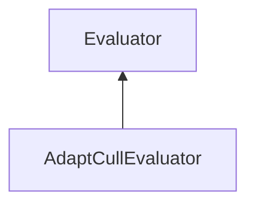

| public |
{:.api_label}

#### Inheritance Graph

## Description

## Public Static Attributes

|
| ------: | ----------------- |
|  | |
| [Rendering::Shader](classRendering_1_1Shader) * | **[whiteShader](#classMinSG_1_1Evaluators_1_1AdaptCullEvaluator_1a016f50064ed7671889d23dd64e013258)**  |
{: .nohead .nowrap1 .api_section }

## Public Functions

|
| ------: | ----------------- |
|  | |
|  | **[AdaptCullEvaluator](#classMinSG_1_1Evaluators_1_1AdaptCullEvaluator_1aff1266daa310e7b0ebf6c1b9c037c49e)**( [DirectionMode](classMinSG_1_1Evaluators_1_1Evaluator#classMinSG_1_1Evaluators_1_1Evaluator_1addbbec5e92458641beb8a715f7904b1b)  mode) |
|  | |
|  | **[~AdaptCullEvaluator](#classMinSG_1_1Evaluators_1_1AdaptCullEvaluator_1abfc932baf2571c0dcef472251b1401a1)**() |
|  | |
| void | **[beginMeasure](#classMinSG_1_1Evaluators_1_1AdaptCullEvaluator_1ab7325288f03b808d281d1f071d94a104)**() |
|  | |
| void | **[measure](#classMinSG_1_1Evaluators_1_1AdaptCullEvaluator_1aa2f46200c0b32a99bf5215c8ac9f7079)**( [FrameContext](classMinSG_1_1FrameContext) & context,  [Node](classMinSG_1_1Node) & node, const [Geometry::Rect](namespaceGeometry#namespaceGeometry_1acedeea2f6bddd99f077df6f73901a875) & r) |
|  | |
| void | **[endMeasure](#classMinSG_1_1Evaluators_1_1AdaptCullEvaluator_1afd7d0c3553f6e301a77cc80ed7b1e65a)**( [FrameContext](classMinSG_1_1FrameContext) & context) |
{: .nohead .nowrap1 .api_section }

-------------------------------------------------------------------

## Documentation

### <small>variable</small>  MinSG::Evaluators::AdaptCullEvaluator::whiteShader {#classMinSG_1_1Evaluators_1_1AdaptCullEvaluator_1a016f50064ed7671889d23dd64e013258}

| public | static |
{:.api_label}

|
| ------: | ----------------- |
|  |
| [Rendering::Shader](classRendering_1_1Shader) * **[whiteShader](#classMinSG_1_1Evaluators_1_1AdaptCullEvaluator_1a016f50064ed7671889d23dd64e013258)**  |
{: .nohead .nowrap1 .api_doc }

Defined in `MinSG/Ext/Evaluator/AdaptCullEvaluator.h:33`{:style="float: right"}

-------------------------------------------------------------------

### <small>function</small>  MinSG::Evaluators::AdaptCullEvaluator::AdaptCullEvaluator {#classMinSG_1_1Evaluators_1_1AdaptCullEvaluator_1aff1266daa310e7b0ebf6c1b9c037c49e}

| public |
{:.api_label}

|
| ------: | ----------------- |
|  |
|  **[AdaptCullEvaluator](#classMinSG_1_1Evaluators_1_1AdaptCullEvaluator_1aff1266daa310e7b0ebf6c1b9c037c49e)**( |  [DirectionMode](classMinSG_1_1Evaluators_1_1Evaluator#classMinSG_1_1Evaluators_1_1Evaluator_1addbbec5e92458641beb8a715f7904b1b)  | **mode** ) |
{: .nohead .nowrap1 .api_doc }

Defined in `MinSG/Ext/Evaluator/AdaptCullEvaluator.h:35`{:style="float: right"}

-------------------------------------------------------------------

### <small>function</small>  MinSG::Evaluators::AdaptCullEvaluator::~AdaptCullEvaluator {#classMinSG_1_1Evaluators_1_1AdaptCullEvaluator_1abfc932baf2571c0dcef472251b1401a1}

| public | virtual |
{:.api_label}

|
| ------: | ----------------- |
|  |
|  **[~AdaptCullEvaluator](#classMinSG_1_1Evaluators_1_1AdaptCullEvaluator_1abfc932baf2571c0dcef472251b1401a1)**( |  ) |
{: .nohead .nowrap1 .api_doc }

Defined in `MinSG/Ext/Evaluator/AdaptCullEvaluator.h:36`{:style="float: right"}

-------------------------------------------------------------------

### <small>function</small>  MinSG::Evaluators::AdaptCullEvaluator::beginMeasure {#classMinSG_1_1Evaluators_1_1AdaptCullEvaluator_1ab7325288f03b808d281d1f071d94a104}

| public | virtual |
{:.api_label}

|
| ------: | ----------------- |
|  |
| void **[beginMeasure](#classMinSG_1_1Evaluators_1_1AdaptCullEvaluator_1ab7325288f03b808d281d1f071d94a104)**( |  ) |
{: .nohead .nowrap1 .api_doc }

Defined in `MinSG/Ext/Evaluator/AdaptCullEvaluator.h:39`{:style="float: right"}

-------------------------------------------------------------------

### <small>function</small>  MinSG::Evaluators::AdaptCullEvaluator::measure {#classMinSG_1_1Evaluators_1_1AdaptCullEvaluator_1aa2f46200c0b32a99bf5215c8ac9f7079}

| public | virtual |
{:.api_label}

|
| ------: | ----------------- |
|  |
| void **[measure](#classMinSG_1_1Evaluators_1_1AdaptCullEvaluator_1aa2f46200c0b32a99bf5215c8ac9f7079)**( |  [FrameContext](classMinSG_1_1FrameContext) & | **context**, |
| |  [Node](classMinSG_1_1Node) & | **node**, |
| | const [Geometry::Rect](namespaceGeometry#namespaceGeometry_1acedeea2f6bddd99f077df6f73901a875) & | **r** |
|   ) |
{: .nohead .nowrap1 .api_doc }

Defined in `MinSG/Ext/Evaluator/AdaptCullEvaluator.h:40`{:style="float: right"}

-------------------------------------------------------------------

### <small>function</small>  MinSG::Evaluators::AdaptCullEvaluator::endMeasure {#classMinSG_1_1Evaluators_1_1AdaptCullEvaluator_1afd7d0c3553f6e301a77cc80ed7b1e65a}

| public | virtual |
{:.api_label}

|
| ------: | ----------------- |
|  |
| void **[endMeasure](#classMinSG_1_1Evaluators_1_1AdaptCullEvaluator_1afd7d0c3553f6e301a77cc80ed7b1e65a)**( |  [FrameContext](classMinSG_1_1FrameContext) & | **context** ) |
{: .nohead .nowrap1 .api_doc }

Defined in `MinSG/Ext/Evaluator/AdaptCullEvaluator.h:41`{:style="float: right"}

-------------------------------------------------------------------

