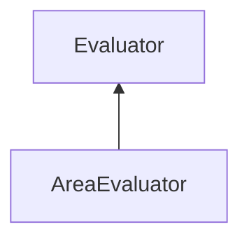

| public |
{:.api_label}

#### Inheritance Graph

## Description

## Public Static Attributes

|
| ------: | ----------------- |
|  | |
| [Util::Reference](classUtil_1_1Reference) < [Rendering::Shader](classRendering_1_1Shader) > | **[whiteShader](#classMinSG_1_1Evaluators_1_1AreaEvaluator_1a99e9bf244e3e0fd6ab5f72c2c66160d8)**  |
{: .nohead .nowrap1 .api_section }

## Public Functions

|
| ------: | ----------------- |
|  | |
|  | **[AreaEvaluator](#classMinSG_1_1Evaluators_1_1AreaEvaluator_1aa3289aa2cdc1aff57ecec3c98af64f9d)**( [DirectionMode](classMinSG_1_1Evaluators_1_1Evaluator#classMinSG_1_1Evaluators_1_1Evaluator_1addbbec5e92458641beb8a715f7904b1b)  mode) |
|  | |
|  | **[~AreaEvaluator](#classMinSG_1_1Evaluators_1_1AreaEvaluator_1aa84e50356ccdbaa615874b16ea744a7e)**() |
|  | |
| void | **[beginMeasure](#classMinSG_1_1Evaluators_1_1AreaEvaluator_1a989f33e0158dcbfad4b4b7ecf727aa9b)**() |
|  | |
| void | **[measure](#classMinSG_1_1Evaluators_1_1AreaEvaluator_1a19034ed3fe8eb0806ecfcab8b3c54358)**( [FrameContext](classMinSG_1_1FrameContext) & context,  [Node](classMinSG_1_1Node) & node, const [Geometry::Rect](namespaceGeometry#namespaceGeometry_1acedeea2f6bddd99f077df6f73901a875) & r) |
|  | |
| void | **[endMeasure](#classMinSG_1_1Evaluators_1_1AreaEvaluator_1ac405d4b6feeda862489142194f350051)**( [FrameContext](classMinSG_1_1FrameContext) & context) |
{: .nohead .nowrap1 .api_section }

-------------------------------------------------------------------

## Documentation

### <small>variable</small>  MinSG::Evaluators::AreaEvaluator::whiteShader {#classMinSG_1_1Evaluators_1_1AreaEvaluator_1a99e9bf244e3e0fd6ab5f72c2c66160d8}

| public | static |
{:.api_label}

|
| ------: | ----------------- |
|  |
| [Util::Reference](classUtil_1_1Reference) < [Rendering::Shader](classRendering_1_1Shader) > **[whiteShader](#classMinSG_1_1Evaluators_1_1AreaEvaluator_1a99e9bf244e3e0fd6ab5f72c2c66160d8)**  |
{: .nohead .nowrap1 .api_doc }

Defined in `MinSG/Ext/Evaluator/AreaEvaluator.h:32`{:style="float: right"}

-------------------------------------------------------------------

### <small>function</small>  MinSG::Evaluators::AreaEvaluator::AreaEvaluator {#classMinSG_1_1Evaluators_1_1AreaEvaluator_1aa3289aa2cdc1aff57ecec3c98af64f9d}

| public |
{:.api_label}

|
| ------: | ----------------- |
|  |
|  **[AreaEvaluator](#classMinSG_1_1Evaluators_1_1AreaEvaluator_1aa3289aa2cdc1aff57ecec3c98af64f9d)**( |  [DirectionMode](classMinSG_1_1Evaluators_1_1Evaluator#classMinSG_1_1Evaluators_1_1Evaluator_1addbbec5e92458641beb8a715f7904b1b)  | **mode** ) |
{: .nohead .nowrap1 .api_doc }

Defined in `MinSG/Ext/Evaluator/AreaEvaluator.h:34`{:style="float: right"}

-------------------------------------------------------------------

### <small>function</small>  MinSG::Evaluators::AreaEvaluator::~AreaEvaluator {#classMinSG_1_1Evaluators_1_1AreaEvaluator_1aa84e50356ccdbaa615874b16ea744a7e}

| public | virtual |
{:.api_label}

|
| ------: | ----------------- |
|  |
|  **[~AreaEvaluator](#classMinSG_1_1Evaluators_1_1AreaEvaluator_1aa84e50356ccdbaa615874b16ea744a7e)**( |  ) |
{: .nohead .nowrap1 .api_doc }

Defined in `MinSG/Ext/Evaluator/AreaEvaluator.h:35`{:style="float: right"}

-------------------------------------------------------------------

### <small>function</small>  MinSG::Evaluators::AreaEvaluator::beginMeasure {#classMinSG_1_1Evaluators_1_1AreaEvaluator_1a989f33e0158dcbfad4b4b7ecf727aa9b}

| public | virtual |
{:.api_label}

|
| ------: | ----------------- |
|  |
| void **[beginMeasure](#classMinSG_1_1Evaluators_1_1AreaEvaluator_1a989f33e0158dcbfad4b4b7ecf727aa9b)**( |  ) |
{: .nohead .nowrap1 .api_doc }

Defined in `MinSG/Ext/Evaluator/AreaEvaluator.h:38`{:style="float: right"}

-------------------------------------------------------------------

### <small>function</small>  MinSG::Evaluators::AreaEvaluator::measure {#classMinSG_1_1Evaluators_1_1AreaEvaluator_1a19034ed3fe8eb0806ecfcab8b3c54358}

| public | virtual |
{:.api_label}

|
| ------: | ----------------- |
|  |
| void **[measure](#classMinSG_1_1Evaluators_1_1AreaEvaluator_1a19034ed3fe8eb0806ecfcab8b3c54358)**( |  [FrameContext](classMinSG_1_1FrameContext) & | **context**, |
| |  [Node](classMinSG_1_1Node) & | **node**, |
| | const [Geometry::Rect](namespaceGeometry#namespaceGeometry_1acedeea2f6bddd99f077df6f73901a875) & | **r** |
|   ) |
{: .nohead .nowrap1 .api_doc }

Defined in `MinSG/Ext/Evaluator/AreaEvaluator.h:39`{:style="float: right"}

-------------------------------------------------------------------

### <small>function</small>  MinSG::Evaluators::AreaEvaluator::endMeasure {#classMinSG_1_1Evaluators_1_1AreaEvaluator_1ac405d4b6feeda862489142194f350051}

| public | virtual |
{:.api_label}

|
| ------: | ----------------- |
|  |
| void **[endMeasure](#classMinSG_1_1Evaluators_1_1AreaEvaluator_1ac405d4b6feeda862489142194f350051)**( |  [FrameContext](classMinSG_1_1FrameContext) & | **context** ) |
{: .nohead .nowrap1 .api_doc }

Defined in `MinSG/Ext/Evaluator/AreaEvaluator.h:40`{:style="float: right"}

-------------------------------------------------------------------

