| public | abstract |
{:.api_label}

#### Inheritance Graph

```mermaid
graph BT
	Evaluator
	AdaptCullEvaluator --> Evaluator
	AreaEvaluator --> Evaluator
	BoxQualityEvaluator --> Evaluator
	ColorVisibilityEvaluator --> Evaluator
	OccOverheadEvaluator --> Evaluator
	OverdrawFactorEvaluator --> Evaluator
	StatsEvaluator --> Evaluator
	TrianglesEvaluator --> Evaluator
	VisibilityEvaluator --> Evaluator
	CostEvaluator --> Evaluator
	click Evaluator "classMinSG_1_1Evaluators_1_1Evaluator"
	click AdaptCullEvaluator "classMinSG_1_1Evaluators_1_1AdaptCullEvaluator"
	click AreaEvaluator "classMinSG_1_1Evaluators_1_1AreaEvaluator"
	click BoxQualityEvaluator "classMinSG_1_1Evaluators_1_1BoxQualityEvaluator"
	click ColorVisibilityEvaluator "classMinSG_1_1Evaluators_1_1ColorVisibilityEvaluator"
	click OccOverheadEvaluator "classMinSG_1_1Evaluators_1_1OccOverheadEvaluator"
	click OverdrawFactorEvaluator "classMinSG_1_1Evaluators_1_1OverdrawFactorEvaluator"
	click StatsEvaluator "classMinSG_1_1Evaluators_1_1StatsEvaluator"
	click TrianglesEvaluator "classMinSG_1_1Evaluators_1_1TrianglesEvaluator"
	click VisibilityEvaluator "classMinSG_1_1Evaluators_1_1VisibilityEvaluator"
	click CostEvaluator "classMinSG_1_1VisibilitySubdivision_1_1CostEvaluator"
```

## Description

## Public Types

|
| ------: | ----------------- |
|  | |
| enum | **[DirectionMode](#classMinSG_1_1Evaluators_1_1Evaluator_1addbbec5e92458641beb8a715f7904b1b)** {SINGLE_VALUE, DIRECTION_VALUES} |
{: .nohead .nowrap1 .api_section }

## Protected Attributes

|
| ------: | ----------------- |
|  | |
| [DirectionMode](classMinSG_1_1Evaluators_1_1Evaluator#classMinSG_1_1Evaluators_1_1Evaluator_1addbbec5e92458641beb8a715f7904b1b) | **[mode](#classMinSG_1_1Evaluators_1_1Evaluator_1af0bb3274bedf198f9c7174867b475a5c)**  |
|  | |
| std::unique_ptr< [Util::GenericAttributeList](classUtil_1_1GenericAttributeList) > | **[values](#classMinSG_1_1Evaluators_1_1Evaluator_1af42154ccdd95209ae2b54aa269866755)**  |
{: .nohead .nowrap1 .api_section }

## Public Functions

|
| ------: | ----------------- |
|  | |
|  | **[Evaluator](#classMinSG_1_1Evaluators_1_1Evaluator_1a6dd0c57945ca766fd2117445628fa24d)**( [DirectionMode](classMinSG_1_1Evaluators_1_1Evaluator#classMinSG_1_1Evaluators_1_1Evaluator_1addbbec5e92458641beb8a715f7904b1b)  mode) |
|  | |
|  | **[~Evaluator](#classMinSG_1_1Evaluators_1_1Evaluator_1a8d1cd5d17ad0493e93300bc85a81e9bf)**() |
|  | |
| void | **[setMode](#classMinSG_1_1Evaluators_1_1Evaluator_1acd8172ac4fbba1f5d735de6fdb413035)**( [DirectionMode](classMinSG_1_1Evaluators_1_1Evaluator#classMinSG_1_1Evaluators_1_1Evaluator_1addbbec5e92458641beb8a715f7904b1b)  _mode) |
|  | |
| [DirectionMode](classMinSG_1_1Evaluators_1_1Evaluator#classMinSG_1_1Evaluators_1_1Evaluator_1addbbec5e92458641beb8a715f7904b1b) | **[getMode](#classMinSG_1_1Evaluators_1_1Evaluator_1aa6bf058d7348c74d78aed375a4f62c5f)**() const |
|  | |
| const [Util::GenericAttribute](classUtil_1_1GenericAttribute) * | **[getMaxValue](#classMinSG_1_1Evaluators_1_1Evaluator_1a02ddd0514615e26d401d07cb4b77f28a)**() const |
|  | |
| void | **[beginMeasure](#classMinSG_1_1Evaluators_1_1Evaluator_1a3c81d34e6e3a89baaae0f74135d7c12d)**() |
|  | |
| void | **[measure](#classMinSG_1_1Evaluators_1_1Evaluator_1aa8ceeae0c0e580c0e1ee0666ab6445e0)**( [FrameContext](classMinSG_1_1FrameContext) & context,  [Node](classMinSG_1_1Node) & node, const [Geometry::Rect](namespaceGeometry#namespaceGeometry_1acedeea2f6bddd99f077df6f73901a875) & r) |
|  | |
| void | **[endMeasure](#classMinSG_1_1Evaluators_1_1Evaluator_1a05a0088a456e30f79721680a6a098303)**( [FrameContext](classMinSG_1_1FrameContext) & context) |
|  | |
| const [Util::GenericAttributeList](classUtil_1_1GenericAttributeList) * | **[getResults](#classMinSG_1_1Evaluators_1_1Evaluator_1ac7fa9e9ec6797e23a4b18c5db7bd8595)**() |
{: .nohead .nowrap1 .api_section }

## Protected Functions

|
| ------: | ----------------- |
|  | |
| void | **[setMaxValue_i](#classMinSG_1_1Evaluators_1_1Evaluator_1aa620ac8328c45ca3a3e5bd44cbdae41c)**(unsigned int maxValue) |
|  | |
| void | **[setMaxValue_f](#classMinSG_1_1Evaluators_1_1Evaluator_1a6446f6cf7cdd1b08e69e8d33636a7777)**(float maxValue) |
|  | |
| void | **[setMaxValue](#classMinSG_1_1Evaluators_1_1Evaluator_1aa34caa3921605da6d4d71b0bc3bbc5f0)**( [Util::GenericAttribute](classUtil_1_1GenericAttribute) * maxValue) |
{: .nohead .nowrap1 .api_section }

-------------------------------------------------------------------

## Documentation

### <small>enum</small>  MinSG::Evaluators::Evaluator::DirectionMode {#classMinSG_1_1Evaluators_1_1Evaluator_1addbbec5e92458641beb8a715f7904b1b}

| public |
{:.api_label}

|
| ------: | ----------------- |
|  |
| enum **[DirectionMode](#classMinSG_1_1Evaluators_1_1Evaluator_1addbbec5e92458641beb8a715f7904b1b)** |
{: .nohead .nowrap1 .api_doc }

| Enumerator       |     | Description | 
| ---------------- | --- | ----------- | 
| Enumerator       |     | Description | 
| SINGLE_VALUE     | = 0 |             | 
| DIRECTION_VALUES | = 1 |             | 

Defined in `MinSG/Ext/Evaluator/Evaluator.h:44`{:style="float: right"}

-------------------------------------------------------------------

### <small>variable</small>  MinSG::Evaluators::Evaluator::mode {#classMinSG_1_1Evaluators_1_1Evaluator_1af0bb3274bedf198f9c7174867b475a5c}

| protected |
{:.api_label}

|
| ------: | ----------------- |
|  |
| [DirectionMode](classMinSG_1_1Evaluators_1_1Evaluator#classMinSG_1_1Evaluators_1_1Evaluator_1addbbec5e92458641beb8a715f7904b1b) **[mode](#classMinSG_1_1Evaluators_1_1Evaluator_1af0bb3274bedf198f9c7174867b475a5c)**  |
{: .nohead .nowrap1 .api_doc }

Defined in `MinSG/Ext/Evaluator/Evaluator.h:74`{:style="float: right"}

-------------------------------------------------------------------

### <small>variable</small>  MinSG::Evaluators::Evaluator::values {#classMinSG_1_1Evaluators_1_1Evaluator_1af42154ccdd95209ae2b54aa269866755}

| protected |
{:.api_label}

|
| ------: | ----------------- |
|  |
| std::unique_ptr< [Util::GenericAttributeList](classUtil_1_1GenericAttributeList) > **[values](#classMinSG_1_1Evaluators_1_1Evaluator_1af42154ccdd95209ae2b54aa269866755)**  |
{: .nohead .nowrap1 .api_doc }

Defined in `MinSG/Ext/Evaluator/Evaluator.h:76`{:style="float: right"}

-------------------------------------------------------------------

### <small>function</small>  MinSG::Evaluators::Evaluator::Evaluator {#classMinSG_1_1Evaluators_1_1Evaluator_1a6dd0c57945ca766fd2117445628fa24d}

| public |
{:.api_label}

|
| ------: | ----------------- |
|  |
|  **[Evaluator](#classMinSG_1_1Evaluators_1_1Evaluator_1a6dd0c57945ca766fd2117445628fa24d)**( |  [DirectionMode](classMinSG_1_1Evaluators_1_1Evaluator#classMinSG_1_1Evaluators_1_1Evaluator_1addbbec5e92458641beb8a715f7904b1b)  | **mode** ) |
{: .nohead .nowrap1 .api_doc }

Defined in `MinSG/Ext/Evaluator/Evaluator.h:49`{:style="float: right"}

-------------------------------------------------------------------

### <small>function</small>  MinSG::Evaluators::Evaluator::~Evaluator {#classMinSG_1_1Evaluators_1_1Evaluator_1a8d1cd5d17ad0493e93300bc85a81e9bf}

| public | virtual |
{:.api_label}

|
| ------: | ----------------- |
|  |
|  **[~Evaluator](#classMinSG_1_1Evaluators_1_1Evaluator_1a8d1cd5d17ad0493e93300bc85a81e9bf)**( |  ) |
{: .nohead .nowrap1 .api_doc }

Defined in `MinSG/Ext/Evaluator/Evaluator.h:50`{:style="float: right"}

-------------------------------------------------------------------

### <small>function</small>  MinSG::Evaluators::Evaluator::setMode {#classMinSG_1_1Evaluators_1_1Evaluator_1acd8172ac4fbba1f5d735de6fdb413035}

| public | inline |
{:.api_label}

|
| ------: | ----------------- |
|  |
| void **[setMode](#classMinSG_1_1Evaluators_1_1Evaluator_1acd8172ac4fbba1f5d735de6fdb413035)**( |  [DirectionMode](classMinSG_1_1Evaluators_1_1Evaluator#classMinSG_1_1Evaluators_1_1Evaluator_1addbbec5e92458641beb8a715f7904b1b)  | **_mode** ) |
{: .nohead .nowrap1 .api_doc }

Defined in `MinSG/Ext/Evaluator/Evaluator.h:52`{:style="float: right"}

-------------------------------------------------------------------

### <small>function</small>  MinSG::Evaluators::Evaluator::getMode {#classMinSG_1_1Evaluators_1_1Evaluator_1aa6bf058d7348c74d78aed375a4f62c5f}

| public | const | inline |
{:.api_label}

|
| ------: | ----------------- |
|  |
| [DirectionMode](classMinSG_1_1Evaluators_1_1Evaluator#classMinSG_1_1Evaluators_1_1Evaluator_1addbbec5e92458641beb8a715f7904b1b) **[getMode](#classMinSG_1_1Evaluators_1_1Evaluator_1aa6bf058d7348c74d78aed375a4f62c5f)**( |  ) const |
{: .nohead .nowrap1 .api_doc }

Defined in `MinSG/Ext/Evaluator/Evaluator.h:55`{:style="float: right"}

-------------------------------------------------------------------

### <small>function</small>  MinSG::Evaluators::Evaluator::getMaxValue {#classMinSG_1_1Evaluators_1_1Evaluator_1a02ddd0514615e26d401d07cb4b77f28a}

| public | const | inline |
{:.api_label}

|
| ------: | ----------------- |
|  |
| const [Util::GenericAttribute](classUtil_1_1GenericAttribute) * **[getMaxValue](#classMinSG_1_1Evaluators_1_1Evaluator_1a02ddd0514615e26d401d07cb4b77f28a)**( |  ) const |
{: .nohead .nowrap1 .api_doc }

Defined in `MinSG/Ext/Evaluator/Evaluator.h:58`{:style="float: right"}

-------------------------------------------------------------------

### <small>function</small>  MinSG::Evaluators::Evaluator::beginMeasure {#classMinSG_1_1Evaluators_1_1Evaluator_1a3c81d34e6e3a89baaae0f74135d7c12d}

| public | virtual |
{:.api_label}

|
| ------: | ----------------- |
|  |
| void **[beginMeasure](#classMinSG_1_1Evaluators_1_1Evaluator_1a3c81d34e6e3a89baaae0f74135d7c12d)**( |  ) |
{: .nohead .nowrap1 .api_doc }

Defined in `MinSG/Ext/Evaluator/Evaluator.h:62`{:style="float: right"}

-------------------------------------------------------------------

### <small>function</small>  MinSG::Evaluators::Evaluator::measure {#classMinSG_1_1Evaluators_1_1Evaluator_1aa8ceeae0c0e580c0e1ee0666ab6445e0}

| public | virtual |
{:.api_label}

|
| ------: | ----------------- |
|  |
| void **[measure](#classMinSG_1_1Evaluators_1_1Evaluator_1aa8ceeae0c0e580c0e1ee0666ab6445e0)**( |  [FrameContext](classMinSG_1_1FrameContext) & | **context**, |
| |  [Node](classMinSG_1_1Node) & | **node**, |
| | const [Geometry::Rect](namespaceGeometry#namespaceGeometry_1acedeea2f6bddd99f077df6f73901a875) & | **r** |
|   ) |
{: .nohead .nowrap1 .api_doc }

Defined in `MinSG/Ext/Evaluator/Evaluator.h:63`{:style="float: right"}

-------------------------------------------------------------------

### <small>function</small>  MinSG::Evaluators::Evaluator::endMeasure {#classMinSG_1_1Evaluators_1_1Evaluator_1a05a0088a456e30f79721680a6a098303}

| public | virtual |
{:.api_label}

|
| ------: | ----------------- |
|  |
| void **[endMeasure](#classMinSG_1_1Evaluators_1_1Evaluator_1a05a0088a456e30f79721680a6a098303)**( |  [FrameContext](classMinSG_1_1FrameContext) & | **context** ) |
{: .nohead .nowrap1 .api_doc }

Defined in `MinSG/Ext/Evaluator/Evaluator.h:64`{:style="float: right"}

-------------------------------------------------------------------

### <small>function</small>  MinSG::Evaluators::Evaluator::getResults {#classMinSG_1_1Evaluators_1_1Evaluator_1ac7fa9e9ec6797e23a4b18c5db7bd8595}

| public | inline | virtual |
{:.api_label}

|
| ------: | ----------------- |
|  |
| const [Util::GenericAttributeList](classUtil_1_1GenericAttributeList) * **[getResults](#classMinSG_1_1Evaluators_1_1Evaluator_1ac7fa9e9ec6797e23a4b18c5db7bd8595)**( |  ) |
{: .nohead .nowrap1 .api_doc }

Defined in `MinSG/Ext/Evaluator/Evaluator.h:65`{:style="float: right"}

-------------------------------------------------------------------

### <small>function</small>  MinSG::Evaluators::Evaluator::setMaxValue_i {#classMinSG_1_1Evaluators_1_1Evaluator_1aa620ac8328c45ca3a3e5bd44cbdae41c}

| protected |
{:.api_label}

|
| ------: | ----------------- |
|  |
| void **[setMaxValue_i](#classMinSG_1_1Evaluators_1_1Evaluator_1aa620ac8328c45ca3a3e5bd44cbdae41c)**( | unsigned int | **maxValue** ) |
{: .nohead .nowrap1 .api_doc }

Defined in `MinSG/Ext/Evaluator/Evaluator.h:70`{:style="float: right"}

-------------------------------------------------------------------

### <small>function</small>  MinSG::Evaluators::Evaluator::setMaxValue_f {#classMinSG_1_1Evaluators_1_1Evaluator_1a6446f6cf7cdd1b08e69e8d33636a7777}

| protected |
{:.api_label}

|
| ------: | ----------------- |
|  |
| void **[setMaxValue_f](#classMinSG_1_1Evaluators_1_1Evaluator_1a6446f6cf7cdd1b08e69e8d33636a7777)**( | float | **maxValue** ) |
{: .nohead .nowrap1 .api_doc }

Defined in `MinSG/Ext/Evaluator/Evaluator.h:71`{:style="float: right"}

-------------------------------------------------------------------

### <small>function</small>  MinSG::Evaluators::Evaluator::setMaxValue {#classMinSG_1_1Evaluators_1_1Evaluator_1aa34caa3921605da6d4d71b0bc3bbc5f0}

| protected |
{:.api_label}

|
| ------: | ----------------- |
|  |
| void **[setMaxValue](#classMinSG_1_1Evaluators_1_1Evaluator_1aa34caa3921605da6d4d71b0bc3bbc5f0)**( |  [Util::GenericAttribute](classUtil_1_1GenericAttribute) * | **maxValue** ) |
{: .nohead .nowrap1 .api_doc }

Defined in `MinSG/Ext/Evaluator/Evaluator.h:72`{:style="float: right"}

-------------------------------------------------------------------

