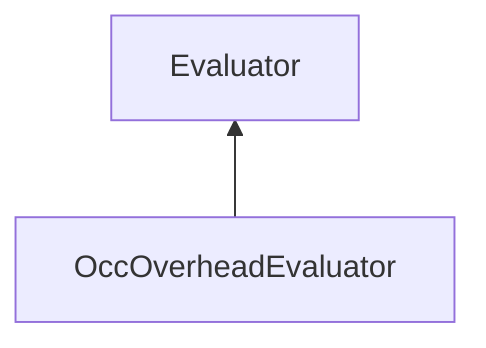

| public |
{:.api_label}

#### Inheritance Graph

## Description

## Public Functions

|
| ------: | ----------------- |
|  | |
|  | **[OccOverheadEvaluator](#classMinSG_1_1Evaluators_1_1OccOverheadEvaluator_1ad083bc52ac19e0da0d44d01ddf6bb8c3)**( [DirectionMode](classMinSG_1_1Evaluators_1_1Evaluator#classMinSG_1_1Evaluators_1_1Evaluator_1addbbec5e92458641beb8a715f7904b1b)  mode) |
|  | |
|  | **[~OccOverheadEvaluator](#classMinSG_1_1Evaluators_1_1OccOverheadEvaluator_1a7778d5fbf73bbcd3b02ffaffb4715317)**() |
|  | |
| void | **[beginMeasure](#classMinSG_1_1Evaluators_1_1OccOverheadEvaluator_1a1624ac752e9f8a3517b316e5f2a1c4c0)**() |
|  | |
| void | **[measure](#classMinSG_1_1Evaluators_1_1OccOverheadEvaluator_1a44a3ed3d2a448f6655a4e937d1e4ab4d)**( [FrameContext](classMinSG_1_1FrameContext) & context,  [Node](classMinSG_1_1Node) & node, const [Geometry::Rect](namespaceGeometry#namespaceGeometry_1acedeea2f6bddd99f077df6f73901a875) & r) |
|  | |
| void | **[endMeasure](#classMinSG_1_1Evaluators_1_1OccOverheadEvaluator_1a6a427bb44b6fd52eed3d1db89f309279)**( [FrameContext](classMinSG_1_1FrameContext) & context) |
{: .nohead .nowrap1 .api_section }

-------------------------------------------------------------------

## Documentation

### <small>function</small>  MinSG::Evaluators::OccOverheadEvaluator::OccOverheadEvaluator {#classMinSG_1_1Evaluators_1_1OccOverheadEvaluator_1ad083bc52ac19e0da0d44d01ddf6bb8c3}

| public |
{:.api_label}

|
| ------: | ----------------- |
|  |
|  **[OccOverheadEvaluator](#classMinSG_1_1Evaluators_1_1OccOverheadEvaluator_1ad083bc52ac19e0da0d44d01ddf6bb8c3)**( |  [DirectionMode](classMinSG_1_1Evaluators_1_1Evaluator#classMinSG_1_1Evaluators_1_1Evaluator_1addbbec5e92458641beb8a715f7904b1b)  | **mode** ) |
{: .nohead .nowrap1 .api_doc }

Defined in `MinSG/Ext/Evaluator/OccOverheadEvaluator.h:30`{:style="float: right"}

-------------------------------------------------------------------

### <small>function</small>  MinSG::Evaluators::OccOverheadEvaluator::~OccOverheadEvaluator {#classMinSG_1_1Evaluators_1_1OccOverheadEvaluator_1a7778d5fbf73bbcd3b02ffaffb4715317}

| public | virtual |
{:.api_label}

|
| ------: | ----------------- |
|  |
|  **[~OccOverheadEvaluator](#classMinSG_1_1Evaluators_1_1OccOverheadEvaluator_1a7778d5fbf73bbcd3b02ffaffb4715317)**( |  ) |
{: .nohead .nowrap1 .api_doc }

Defined in `MinSG/Ext/Evaluator/OccOverheadEvaluator.h:31`{:style="float: right"}

-------------------------------------------------------------------

### <small>function</small>  MinSG::Evaluators::OccOverheadEvaluator::beginMeasure {#classMinSG_1_1Evaluators_1_1OccOverheadEvaluator_1a1624ac752e9f8a3517b316e5f2a1c4c0}

| public | virtual |
{:.api_label}

|
| ------: | ----------------- |
|  |
| void **[beginMeasure](#classMinSG_1_1Evaluators_1_1OccOverheadEvaluator_1a1624ac752e9f8a3517b316e5f2a1c4c0)**( |  ) |
{: .nohead .nowrap1 .api_doc }

Defined in `MinSG/Ext/Evaluator/OccOverheadEvaluator.h:33`{:style="float: right"}

-------------------------------------------------------------------

### <small>function</small>  MinSG::Evaluators::OccOverheadEvaluator::measure {#classMinSG_1_1Evaluators_1_1OccOverheadEvaluator_1a44a3ed3d2a448f6655a4e937d1e4ab4d}

| public | virtual |
{:.api_label}

|
| ------: | ----------------- |
|  |
| void **[measure](#classMinSG_1_1Evaluators_1_1OccOverheadEvaluator_1a44a3ed3d2a448f6655a4e937d1e4ab4d)**( |  [FrameContext](classMinSG_1_1FrameContext) & | **context**, |
| |  [Node](classMinSG_1_1Node) & | **node**, |
| | const [Geometry::Rect](namespaceGeometry#namespaceGeometry_1acedeea2f6bddd99f077df6f73901a875) & | **r** |
|   ) |
{: .nohead .nowrap1 .api_doc }

Defined in `MinSG/Ext/Evaluator/OccOverheadEvaluator.h:34`{:style="float: right"}

-------------------------------------------------------------------

### <small>function</small>  MinSG::Evaluators::OccOverheadEvaluator::endMeasure {#classMinSG_1_1Evaluators_1_1OccOverheadEvaluator_1a6a427bb44b6fd52eed3d1db89f309279}

| public | virtual |
{:.api_label}

|
| ------: | ----------------- |
|  |
| void **[endMeasure](#classMinSG_1_1Evaluators_1_1OccOverheadEvaluator_1a6a427bb44b6fd52eed3d1db89f309279)**( |  [FrameContext](classMinSG_1_1FrameContext) & | **context** ) |
{: .nohead .nowrap1 .api_doc }

Defined in `MinSG/Ext/Evaluator/OccOverheadEvaluator.h:35`{:style="float: right"}

-------------------------------------------------------------------

