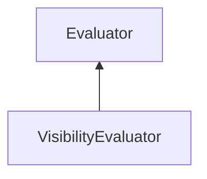

| public |
{:.api_label}

#### Inheritance Graph

## Description

Measures the number of visible GeometryNodes or the number of polygons contained in visible GeometryNodes. If mode is SINGLE_VALUE, each [Node](classMinSG_1_1Node) is at most counted once, even if it is visible from multiple sides.

 [VisibilityEvaluator](classMinSG_1_1Evaluators_1_1VisibilityEvaluator) |> [Evaluator](classMinSG_1_1Evaluators_1_1Evaluator) 

## Public Static Attributes

|
| ------: | ----------------- |
|  | |
| [Rendering::Shader](classRendering_1_1Shader) * | **[whiteShader](#classMinSG_1_1Evaluators_1_1VisibilityEvaluator_1a9d63b9b2387a0fec69045f30666e2d9c)**  |
{: .nohead .nowrap1 .api_section }

## Public Functions

|
| ------: | ----------------- |
|  | |
|  | **[VisibilityEvaluator](#classMinSG_1_1Evaluators_1_1VisibilityEvaluator_1af384f3416c2d77e7bb7e8a16e51d0bb8)**( [DirectionMode](classMinSG_1_1Evaluators_1_1Evaluator#classMinSG_1_1Evaluators_1_1Evaluator_1addbbec5e92458641beb8a715f7904b1b)  mode, bool _countPolygons) |
|  | |
|  | **[~VisibilityEvaluator](#classMinSG_1_1Evaluators_1_1VisibilityEvaluator_1af1b043445b9d7839d4127b2f2cac3ba2)**() |
|  | |
| bool | **[doesCountPolygons](#classMinSG_1_1Evaluators_1_1VisibilityEvaluator_1a32a74cb327c0302380f8c8889ee2a0bf)**() const |
|  | |
| void | **[setCountPolygons](#classMinSG_1_1Evaluators_1_1VisibilityEvaluator_1a7bca315f7b69829a23b012683e68d1f4)**(bool b) |
|  | |
| void | **[beginMeasure](#classMinSG_1_1Evaluators_1_1VisibilityEvaluator_1a23655de31e077459136aa77a6c5a5df1)**() |
|  | |
| void | **[measure](#classMinSG_1_1Evaluators_1_1VisibilityEvaluator_1a5810df7922f4341c28b92b7a83edb2b1)**( [FrameContext](classMinSG_1_1FrameContext) & context,  [Node](classMinSG_1_1Node) & node, const [Geometry::Rect](namespaceGeometry#namespaceGeometry_1acedeea2f6bddd99f077df6f73901a875) & r) |
|  | |
| void | **[endMeasure](#classMinSG_1_1Evaluators_1_1VisibilityEvaluator_1a8358ddcc307fed84675c5fdb6a049315)**( [FrameContext](classMinSG_1_1FrameContext) & context) |
{: .nohead .nowrap1 .api_section }

-------------------------------------------------------------------

## Documentation

### <small>variable</small>  MinSG::Evaluators::VisibilityEvaluator::whiteShader {#classMinSG_1_1Evaluators_1_1VisibilityEvaluator_1a9d63b9b2387a0fec69045f30666e2d9c}

| public | static |
{:.api_label}

|
| ------: | ----------------- |
|  |
| [Rendering::Shader](classRendering_1_1Shader) * **[whiteShader](#classMinSG_1_1Evaluators_1_1VisibilityEvaluator_1a9d63b9b2387a0fec69045f30666e2d9c)**  |
{: .nohead .nowrap1 .api_doc }

Defined in `MinSG/Ext/Evaluator/VisibilityEvaluator.h:36`{:style="float: right"}

-------------------------------------------------------------------

### <small>function</small>  MinSG::Evaluators::VisibilityEvaluator::VisibilityEvaluator {#classMinSG_1_1Evaluators_1_1VisibilityEvaluator_1af384f3416c2d77e7bb7e8a16e51d0bb8}

| public | explicit |
{:.api_label}

|
| ------: | ----------------- |
|  |
|  **[VisibilityEvaluator](#classMinSG_1_1Evaluators_1_1VisibilityEvaluator_1af384f3416c2d77e7bb7e8a16e51d0bb8)**( |  [DirectionMode](classMinSG_1_1Evaluators_1_1Evaluator#classMinSG_1_1Evaluators_1_1Evaluator_1addbbec5e92458641beb8a715f7904b1b)  | **mode**, |
| | bool | **_countPolygons** |
|   ) |
{: .nohead .nowrap1 .api_doc }

Defined in `MinSG/Ext/Evaluator/VisibilityEvaluator.h:38`{:style="float: right"}

-------------------------------------------------------------------

### <small>function</small>  MinSG::Evaluators::VisibilityEvaluator::~VisibilityEvaluator {#classMinSG_1_1Evaluators_1_1VisibilityEvaluator_1af1b043445b9d7839d4127b2f2cac3ba2}

| public | virtual |
{:.api_label}

|
| ------: | ----------------- |
|  |
|  **[~VisibilityEvaluator](#classMinSG_1_1Evaluators_1_1VisibilityEvaluator_1af1b043445b9d7839d4127b2f2cac3ba2)**( |  ) |
{: .nohead .nowrap1 .api_doc }

Defined in `MinSG/Ext/Evaluator/VisibilityEvaluator.h:39`{:style="float: right"}

-------------------------------------------------------------------

### <small>function</small>  MinSG::Evaluators::VisibilityEvaluator::doesCountPolygons {#classMinSG_1_1Evaluators_1_1VisibilityEvaluator_1a32a74cb327c0302380f8c8889ee2a0bf}

| public | const | inline |
{:.api_label}

|
| ------: | ----------------- |
|  |
| bool **[doesCountPolygons](#classMinSG_1_1Evaluators_1_1VisibilityEvaluator_1a32a74cb327c0302380f8c8889ee2a0bf)**( |  ) const |
{: .nohead .nowrap1 .api_doc }

Defined in `MinSG/Ext/Evaluator/VisibilityEvaluator.h:41`{:style="float: right"}

-------------------------------------------------------------------

### <small>function</small>  MinSG::Evaluators::VisibilityEvaluator::setCountPolygons {#classMinSG_1_1Evaluators_1_1VisibilityEvaluator_1a7bca315f7b69829a23b012683e68d1f4}

| public | inline |
{:.api_label}

|
| ------: | ----------------- |
|  |
| void **[setCountPolygons](#classMinSG_1_1Evaluators_1_1VisibilityEvaluator_1a7bca315f7b69829a23b012683e68d1f4)**( | bool | **b** ) |
{: .nohead .nowrap1 .api_doc }

Defined in `MinSG/Ext/Evaluator/VisibilityEvaluator.h:42`{:style="float: right"}

-------------------------------------------------------------------

### <small>function</small>  MinSG::Evaluators::VisibilityEvaluator::beginMeasure {#classMinSG_1_1Evaluators_1_1VisibilityEvaluator_1a23655de31e077459136aa77a6c5a5df1}

| public | virtual |
{:.api_label}

|
| ------: | ----------------- |
|  |
| void **[beginMeasure](#classMinSG_1_1Evaluators_1_1VisibilityEvaluator_1a23655de31e077459136aa77a6c5a5df1)**( |  ) |
{: .nohead .nowrap1 .api_doc }

Defined in `MinSG/Ext/Evaluator/VisibilityEvaluator.h:45`{:style="float: right"}

-------------------------------------------------------------------

### <small>function</small>  MinSG::Evaluators::VisibilityEvaluator::measure {#classMinSG_1_1Evaluators_1_1VisibilityEvaluator_1a5810df7922f4341c28b92b7a83edb2b1}

| public | virtual |
{:.api_label}

|
| ------: | ----------------- |
|  |
| void **[measure](#classMinSG_1_1Evaluators_1_1VisibilityEvaluator_1a5810df7922f4341c28b92b7a83edb2b1)**( |  [FrameContext](classMinSG_1_1FrameContext) & | **context**, |
| |  [Node](classMinSG_1_1Node) & | **node**, |
| | const [Geometry::Rect](namespaceGeometry#namespaceGeometry_1acedeea2f6bddd99f077df6f73901a875) & | **r** |
|   ) |
{: .nohead .nowrap1 .api_doc }

Defined in `MinSG/Ext/Evaluator/VisibilityEvaluator.h:46`{:style="float: right"}

-------------------------------------------------------------------

### <small>function</small>  MinSG::Evaluators::VisibilityEvaluator::endMeasure {#classMinSG_1_1Evaluators_1_1VisibilityEvaluator_1a8358ddcc307fed84675c5fdb6a049315}

| public | virtual |
{:.api_label}

|
| ------: | ----------------- |
|  |
| void **[endMeasure](#classMinSG_1_1Evaluators_1_1VisibilityEvaluator_1a8358ddcc307fed84675c5fdb6a049315)**( |  [FrameContext](classMinSG_1_1FrameContext) & | **context** ) |
{: .nohead .nowrap1 .api_doc }

Defined in `MinSG/Ext/Evaluator/VisibilityEvaluator.h:47`{:style="float: right"}

-------------------------------------------------------------------

