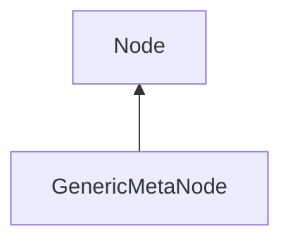

| public |
{:.api_label}

#### Inheritance Graph

## Description

 [GenericMetaNode](classMinSG_1_1GenericMetaNode) |> [Node](classMinSG_1_1Node) An invisible [Node](classMinSG_1_1Node) , which can be seen when SHOW_META_OBJECTS is enabled. Useful as generic target for various Behaviours (e.g. SoundSources) or as a particle emitter.

## Public Functions

|
| ------: | ----------------- |
|  | |
|  | **[GenericMetaNode](#classMinSG_1_1GenericMetaNode_1aa8e721eab4ae3730ff2d6ba0419d086e)**() |
|  | |
|  | **[~GenericMetaNode](#classMinSG_1_1GenericMetaNode_1aac1b11ddf7759f0b3745811398df711f)**() |
|  | |
| void | **[setBB](#classMinSG_1_1GenericMetaNode_1aed8f98e28af8490c8393a21221a351ea)**(const [Geometry::Box](namespaceGeometry#namespaceGeometry_1a02eb80497cc2daa40fba114c929f877a) & newBB) |
|  | |
| void | **[doDisplay](#classMinSG_1_1GenericMetaNode_1a775ca96659a70ca88fe7c59ee39dc8fd)**( [FrameContext](classMinSG_1_1FrameContext) & context, const [RenderParam](classMinSG_1_1RenderParam) & rp) |
{: .nohead .nowrap1 .api_section }

-------------------------------------------------------------------

## Documentation

### <small>function</small>  MinSG::GenericMetaNode::GenericMetaNode {#classMinSG_1_1GenericMetaNode_1aa8e721eab4ae3730ff2d6ba0419d086e}

| public | inline |
{:.api_label}

|
| ------: | ----------------- |
|  |
|  **[GenericMetaNode](#classMinSG_1_1GenericMetaNode_1aa8e721eab4ae3730ff2d6ba0419d086e)**( |  ) |
{: .nohead .nowrap1 .api_doc }

Defined in `MinSG/Ext/Nodes/GenericMetaNode.h:29`{:style="float: right"}

-------------------------------------------------------------------

### <small>function</small>  MinSG::GenericMetaNode::~GenericMetaNode {#classMinSG_1_1GenericMetaNode_1aac1b11ddf7759f0b3745811398df711f}

| public | virtual |
{:.api_label}

|
| ------: | ----------------- |
|  |
|  **[~GenericMetaNode](#classMinSG_1_1GenericMetaNode_1aac1b11ddf7759f0b3745811398df711f)**( |  ) |
{: .nohead .nowrap1 .api_doc }

Defined in `MinSG/Ext/Nodes/GenericMetaNode.h:31`{:style="float: right"}

-------------------------------------------------------------------

### <small>function</small>  MinSG::GenericMetaNode::setBB {#classMinSG_1_1GenericMetaNode_1aed8f98e28af8490c8393a21221a351ea}

| public | inline |
{:.api_label}

|
| ------: | ----------------- |
|  |
| void **[setBB](#classMinSG_1_1GenericMetaNode_1aed8f98e28af8490c8393a21221a351ea)**( | const [Geometry::Box](namespaceGeometry#namespaceGeometry_1a02eb80497cc2daa40fba114c929f877a) & | **newBB** ) |
{: .nohead .nowrap1 .api_doc }

Defined in `MinSG/Ext/Nodes/GenericMetaNode.h:33`{:style="float: right"}

-------------------------------------------------------------------

### <small>function</small>  MinSG::GenericMetaNode::doDisplay {#classMinSG_1_1GenericMetaNode_1a775ca96659a70ca88fe7c59ee39dc8fd}

| public | virtual |
{:.api_label}

|
| ------: | ----------------- |
|  |
| void **[doDisplay](#classMinSG_1_1GenericMetaNode_1a775ca96659a70ca88fe7c59ee39dc8fd)**( |  [FrameContext](classMinSG_1_1FrameContext) & | **context**, |
| | const [RenderParam](classMinSG_1_1RenderParam) & | **rp** |
|   ) |
{: .nohead .nowrap1 .api_doc }

o Render the node. All matrix operations and states must be applied when called. This function is internally called by the default to display(...) method.

Defined in `MinSG/Ext/Nodes/GenericMetaNode.h:39`{:style="float: right"}

-------------------------------------------------------------------

