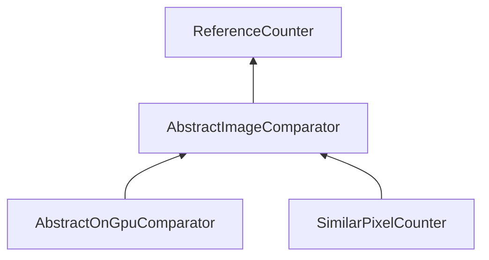

| public | abstract |
{:.api_label}

#### Inheritance Graph

## Description

Abstract base class for classes that compare two images to each other. Subclasses implement special algorithms for image comparison.

**Author**: Benjamin Eikel

**Date**: 2011-06-14

## Public Functions

|
| ------: | ----------------- |
|  | |
|  | **[AbstractImageComparator](#classMinSG_1_1ImageCompare_1_1AbstractImageComparator_1a135e78f6487bda5f066b6a7a93bb1c7f)**() |
|  | |
|  | **[~AbstractImageComparator](#classMinSG_1_1ImageCompare_1_1AbstractImageComparator_1a20de72e57ed4220f1149f3e0f790ea30)**() |
|  | |
| bool | **[compare](#classMinSG_1_1ImageCompare_1_1AbstractImageComparator_1a6bab629844d44d816ce33422da4656a8)**( [Rendering::RenderingContext](classRendering_1_1RenderingContext) & context,  [Rendering::Texture](classRendering_1_1Texture) * firstTex,  [Rendering::Texture](classRendering_1_1Texture) * secondTex, double & value,  [Rendering::Texture](classRendering_1_1Texture) * resultTex) |
{: .nohead .nowrap1 .api_section }

-------------------------------------------------------------------

## Documentation

### <small>function</small>  MinSG::ImageCompare::AbstractImageComparator::AbstractImageComparator {#classMinSG_1_1ImageCompare_1_1AbstractImageComparator_1a135e78f6487bda5f066b6a7a93bb1c7f}

| public | inline |
{:.api_label}

|
| ------: | ----------------- |
|  |
|  **[AbstractImageComparator](#classMinSG_1_1ImageCompare_1_1AbstractImageComparator_1a135e78f6487bda5f066b6a7a93bb1c7f)**( |  ) |
{: .nohead .nowrap1 .api_doc }

Defined in `MinSG/Ext/ImageCompare/AbstractImageComparator.h:39`{:style="float: right"}

-------------------------------------------------------------------

### <small>function</small>  MinSG::ImageCompare::AbstractImageComparator::~AbstractImageComparator {#classMinSG_1_1ImageCompare_1_1AbstractImageComparator_1a20de72e57ed4220f1149f3e0f790ea30}

| public | inline | virtual |
{:.api_label}

|
| ------: | ----------------- |
|  |
|  **[~AbstractImageComparator](#classMinSG_1_1ImageCompare_1_1AbstractImageComparator_1a20de72e57ed4220f1149f3e0f790ea30)**( |  ) |
{: .nohead .nowrap1 .api_doc }

Defined in `MinSG/Ext/ImageCompare/AbstractImageComparator.h:41`{:style="float: right"}

-------------------------------------------------------------------

### <small>function</small>  MinSG::ImageCompare::AbstractImageComparator::compare {#classMinSG_1_1ImageCompare_1_1AbstractImageComparator_1a6bab629844d44d816ce33422da4656a8}

| public | virtual |
{:.api_label}

|
| ------: | ----------------- |
|  |
| bool **[compare](#classMinSG_1_1ImageCompare_1_1AbstractImageComparator_1a6bab629844d44d816ce33422da4656a8)**( |  [Rendering::RenderingContext](classRendering_1_1RenderingContext) & | **context**, |
| |  [Rendering::Texture](classRendering_1_1Texture) * | **firstTex**, |
| |  [Rendering::Texture](classRendering_1_1Texture) * | **secondTex**, |
| | double & | **value**, |
| |  [Rendering::Texture](classRendering_1_1Texture) * | **resultTex** |
|   ) |
{: .nohead .nowrap1 .api_doc }

Compare two images to each other. Return a value from [0.0, 1.0], where 1.0 means that the two images are the same.

#### Parameters
**context**
:  Current rendering context.

**firstTex**
:  First source image to use for comparison. Must not be`nullptr`.

**secondTex**
:  Second source image to use for comparison. Must not be`nullptr`.

**value**
:  Result of the image comparison. The interpretation of the value depends on the actual implementation.

**resultTex**
:  Resulting texture that contains any kind of difference image specific to the actual implementation. May be`nullptr`.

#### Returns
`true`if the comparison was successful,`false`if something went wrong.

Defined in `MinSG/Ext/ImageCompare/AbstractImageComparator.h:55`{:style="float: right"}

-------------------------------------------------------------------

