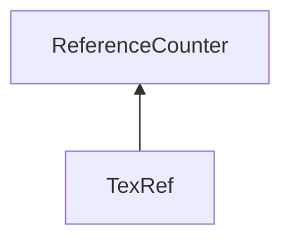

| protected |
{:.api_label}

#### Inheritance Graph

## Description

## Public Functions

|
| ------: | ----------------- |
|  | |
|  | **[TexRef](#classMinSG_1_1ImageCompare_1_1AbstractOnGpuComparator_1_1TexRef_1ae1df032bf956d15631196877547fb3a0)**(const [Geometry::Vec2i](namespaceGeometry#namespaceGeometry_1af5c374694b0993fb291b80677f10c64c) & vec) |
|  | |
|  | **[TexRef](#classMinSG_1_1ImageCompare_1_1AbstractOnGpuComparator_1_1TexRef_1a126330ae7f8dfe6f73883128af9c6955)**( [Util::Reference](classUtil_1_1Reference) < [Rendering::Texture](classRendering_1_1Texture) > _tex) |
|  | |
|  | **[~TexRef](#classMinSG_1_1ImageCompare_1_1AbstractOnGpuComparator_1_1TexRef_1aaa202767783d903e7b4580e9ce9e0783)**() |
|  | |
| [Rendering::Texture](classRendering_1_1Texture) * | **[get](#classMinSG_1_1ImageCompare_1_1AbstractOnGpuComparator_1_1TexRef_1aaaecfa7688d85285ed1c1a703710acb5)**() |
{: .nohead .nowrap1 .api_section }

-------------------------------------------------------------------

## Documentation

### <small>function</small>  MinSG::ImageCompare::AbstractOnGpuComparator::TexRef::TexRef {#classMinSG_1_1ImageCompare_1_1AbstractOnGpuComparator_1_1TexRef_1ae1df032bf956d15631196877547fb3a0}

| public | inline |
{:.api_label}

|
| ------: | ----------------- |
|  |
|  **[TexRef](#classMinSG_1_1ImageCompare_1_1AbstractOnGpuComparator_1_1TexRef_1ae1df032bf956d15631196877547fb3a0)**( | const [Geometry::Vec2i](namespaceGeometry#namespaceGeometry_1af5c374694b0993fb291b80677f10c64c) & | **vec** ) |
{: .nohead .nowrap1 .api_doc }

Defined in `MinSG/Ext/ImageCompare/AbstractOnGpuComparator.h:56`{:style="float: right"}

-------------------------------------------------------------------

### <small>function</small>  MinSG::ImageCompare::AbstractOnGpuComparator::TexRef::TexRef {#classMinSG_1_1ImageCompare_1_1AbstractOnGpuComparator_1_1TexRef_1a126330ae7f8dfe6f73883128af9c6955}

| public | inline |
{:.api_label}

|
| ------: | ----------------- |
|  |
|  **[TexRef](#classMinSG_1_1ImageCompare_1_1AbstractOnGpuComparator_1_1TexRef_1a126330ae7f8dfe6f73883128af9c6955)**( |  [Util::Reference](classUtil_1_1Reference) < [Rendering::Texture](classRendering_1_1Texture) > | **_tex** ) |
{: .nohead .nowrap1 .api_doc }

Defined in `MinSG/Ext/ImageCompare/AbstractOnGpuComparator.h:59`{:style="float: right"}

-------------------------------------------------------------------

### <small>function</small>  MinSG::ImageCompare::AbstractOnGpuComparator::TexRef::~TexRef {#classMinSG_1_1ImageCompare_1_1AbstractOnGpuComparator_1_1TexRef_1aaa202767783d903e7b4580e9ce9e0783}

| public | inline |
{:.api_label}

|
| ------: | ----------------- |
|  |
|  **[~TexRef](#classMinSG_1_1ImageCompare_1_1AbstractOnGpuComparator_1_1TexRef_1aaa202767783d903e7b4580e9ce9e0783)**( |  ) |
{: .nohead .nowrap1 .api_doc }

Defined in `MinSG/Ext/ImageCompare/AbstractOnGpuComparator.h:61`{:style="float: right"}

-------------------------------------------------------------------

### <small>function</small>  MinSG::ImageCompare::AbstractOnGpuComparator::TexRef::get {#classMinSG_1_1ImageCompare_1_1AbstractOnGpuComparator_1_1TexRef_1aaaecfa7688d85285ed1c1a703710acb5}

| public | inline |
{:.api_label}

|
| ------: | ----------------- |
|  |
| [Rendering::Texture](classRendering_1_1Texture) * **[get](#classMinSG_1_1ImageCompare_1_1AbstractOnGpuComparator_1_1TexRef_1aaaecfa7688d85285ed1c1a703710acb5)**( |  ) |
{: .nohead .nowrap1 .api_doc }

Defined in `MinSG/Ext/ImageCompare/AbstractOnGpuComparator.h:65`{:style="float: right"}

-------------------------------------------------------------------

