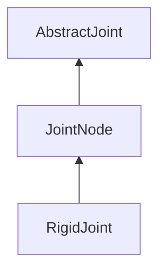

| public |
{:.api_label}

#### Inheritance Graph

## Description

## Public Functions

|
| ------: | ----------------- |
|  | |
|  | **[JointNode](#classMinSG_1_1JointNode_1acc212daa741e8d4363fc738141d2ce5e)**() |
|  | |
|  | **[JointNode](#classMinSG_1_1JointNode_1ac00ca05aacc4b0c91c324786f01fcd39)**(uint32_t _id, std::string _name) |
|  | |
| void | **[generateJointNodeMap](#classMinSG_1_1JointNode_1ae029adf078786d5b57a6f83fd508ce94)**(std::unordered_map< std::string, [AbstractJoint](classMinSG_1_1AbstractJoint) * > & jMap) |
|  | |
| void | **[catchJointNodes](#classMinSG_1_1JointNode_1a5e4f4c4464042bc602e1555d1c89cf83)**(std::deque< [JointNode](classMinSG_1_1JointNode) * > * nodes) |
{: .nohead .nowrap1 .api_section }

## Protected Functions

|
| ------: | ----------------- |
|  | |
|  | **[JointNode](#classMinSG_1_1JointNode_1aaf7a4d344aaf8e2fb57e3ffc6112b876)**(const [JointNode](classMinSG_1_1JointNode) & source) |
{: .nohead .nowrap1 .api_section }

-------------------------------------------------------------------

## Documentation

### <small>function</small>  MinSG::JointNode::JointNode {#classMinSG_1_1JointNode_1acc212daa741e8d4363fc738141d2ce5e}

| public | inline |
{:.api_label}

|
| ------: | ----------------- |
|  |
|  **[JointNode](#classMinSG_1_1JointNode_1acc212daa741e8d4363fc738141d2ce5e)**( |  ) |
{: .nohead .nowrap1 .api_doc }

Defined in `MinSG/Ext/SkeletalAnimation/Joints/JointNode.h:38`{:style="float: right"}

-------------------------------------------------------------------

### <small>function</small>  MinSG::JointNode::JointNode {#classMinSG_1_1JointNode_1ac00ca05aacc4b0c91c324786f01fcd39}

| public |
{:.api_label}

|
| ------: | ----------------- |
|  |
|  **[JointNode](#classMinSG_1_1JointNode_1ac00ca05aacc4b0c91c324786f01fcd39)**( | uint32_t | **_id**, |
| | std::string | **_name** |
|   ) |
{: .nohead .nowrap1 .api_doc }

Defined in `MinSG/Ext/SkeletalAnimation/Joints/JointNode.h:39`{:style="float: right"}

-------------------------------------------------------------------

### <small>function</small>  MinSG::JointNode::generateJointNodeMap {#classMinSG_1_1JointNode_1ae029adf078786d5b57a6f83fd508ce94}

| public | virtual |
{:.api_label}

|
| ------: | ----------------- |
|  |
| void **[generateJointNodeMap](#classMinSG_1_1JointNode_1ae029adf078786d5b57a6f83fd508ce94)**( | std::unordered_map< std::string, [AbstractJoint](classMinSG_1_1AbstractJoint) * > & | **jMap** ) |
{: .nohead .nowrap1 .api_doc }

Defined in `MinSG/Ext/SkeletalAnimation/Joints/JointNode.h:42`{:style="float: right"}

-------------------------------------------------------------------

### <small>function</small>  MinSG::JointNode::catchJointNodes {#classMinSG_1_1JointNode_1a5e4f4c4464042bc602e1555d1c89cf83}

| public |
{:.api_label}

|
| ------: | ----------------- |
|  |
| void **[catchJointNodes](#classMinSG_1_1JointNode_1a5e4f4c4464042bc602e1555d1c89cf83)**( | std::deque< [JointNode](classMinSG_1_1JointNode) * > * | **nodes** ) |
{: .nohead .nowrap1 .api_doc }

Defined in `MinSG/Ext/SkeletalAnimation/Joints/JointNode.h:44`{:style="float: right"}

-------------------------------------------------------------------

### <small>function</small>  MinSG::JointNode::JointNode {#classMinSG_1_1JointNode_1aaf7a4d344aaf8e2fb57e3ffc6112b876}

| protected |
{:.api_label}

|
| ------: | ----------------- |
|  |
|  **[JointNode](#classMinSG_1_1JointNode_1aaf7a4d344aaf8e2fb57e3ffc6112b876)**( | const [JointNode](classMinSG_1_1JointNode) & | **source** ) |
{: .nohead .nowrap1 .api_doc }

Defined in `MinSG/Ext/SkeletalAnimation/Joints/JointNode.h:54`{:style="float: right"}

-------------------------------------------------------------------

