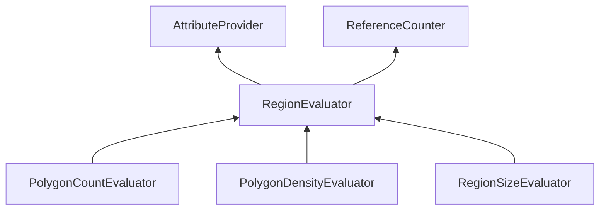

| public | abstract |
{:.api_label}

#### Inheritance Graph

## Description

## Classes

|
| ----- | -------------------------------------------------------------------------------------------------- | 
| class | [MinSG::MAR::RegionEvaluator::PrioSplit](classMinSG_1_1MAR_1_1RegionEvaluator_1_1PrioSplit)    | 
{: .nohead }

## Protected Types

|
| ------: | ----------------- |
|  | |
| typedef std::map< std::string, [RegionEvaluator](classMinSG_1_1MAR_1_1RegionEvaluator) * > | **[EvaluatorMap](#classMinSG_1_1MAR_1_1RegionEvaluator_1ad876315193be8c790ba5c6fe3ede395b)**  |
|  | |
| typedef std::set< [Region](classMinSG_1_1MAR_1_1Region) *, bool(*)(const [Region](classMinSG_1_1MAR_1_1Region) *, const [Region](classMinSG_1_1MAR_1_1Region) *)> | **[RegionPrioQueue](#classMinSG_1_1MAR_1_1RegionEvaluator_1a462d55b7787263d5c5d2ceaefdcb6c24)**  |
{: .nohead .nowrap1 .api_section }

## Protected Static Attributes

|
| ------: | ----------------- |
|  | |
| const [Util::Color4ub](classUtil_1_1Color4ub) | **[colorFinished](#classMinSG_1_1MAR_1_1RegionEvaluator_1a25ab59baabfe6a7d7fec05c0b9090aa1)**  |
|  | |
| const [Util::Color4ub](classUtil_1_1Color4ub) | **[colorScheduled](#classMinSG_1_1MAR_1_1RegionEvaluator_1afdadd126a9c20f6a4aade0cfe48bede4)**  |
|  | |
| const [Util::Color4ub](classUtil_1_1Color4ub) | **[colorActive](#classMinSG_1_1MAR_1_1RegionEvaluator_1a713117c7e14ace28d7716f87e0ca7d9d)**  |
{: .nohead .nowrap1 .api_section }

## Protected Attributes

|
| ------: | ----------------- |
|  | |
| [RegionPrioQueue](classMinSG_1_1MAR_1_1RegionEvaluator#classMinSG_1_1MAR_1_1RegionEvaluator_1a462d55b7787263d5c5d2ceaefdcb6c24) * | **[evalQueue](#classMinSG_1_1MAR_1_1RegionEvaluator_1a0832d8da2cb1946281f30d71090a015e)**  |
|  | |
| [Util::Reference](classUtil_1_1Reference) < [GroupNode](classMinSG_1_1GroupNode) > | **[sceneRoot](#classMinSG_1_1MAR_1_1RegionEvaluator_1a7bf6314de93620dbb2a7115c28063925)**  |
{: .nohead .nowrap1 .api_section }

## Protected Functions

|
| ------: | ----------------- |
|  | |
|  | **[RegionEvaluator](#classMinSG_1_1MAR_1_1RegionEvaluator_1a9ca44edf67a7e59852c58fc32ffa31e0)**() |
|  | |
| void | **[init](#classMinSG_1_1MAR_1_1RegionEvaluator_1a93cc3fb042f36d7e6baf1d85f2411f1c)**( [Region](classMinSG_1_1MAR_1_1Region) * region) |
|  | |
| void | **[evaluate](#classMinSG_1_1MAR_1_1RegionEvaluator_1a26a09ad900a1def0d820ed8cb82367ee)**( [Region](classMinSG_1_1MAR_1_1Region) * void) |
|  | |
| float | **[countPolygons](#classMinSG_1_1MAR_1_1RegionEvaluator_1a8efd97694306d3d1ad98a1463c2ce92b)**(const [Geometry::Box](namespaceGeometry#namespaceGeometry_1a02eb80497cc2daa40fba114c929f877a) & box) |
{: .nohead .nowrap1 .api_section }

## Public Functions

|
| ------: | ----------------- |
|  | |
|  | **[~RegionEvaluator](#classMinSG_1_1MAR_1_1RegionEvaluator_1aeabef7763fab9ef49f0a39e27fc568a0)**() |
|  | |
| void | **[init](#classMinSG_1_1MAR_1_1RegionEvaluator_1a4b5c2831ec927e1d7b7bc27591284dc7)**( [Region](classMinSG_1_1MAR_1_1Region) * region,  [GroupNode](classMinSG_1_1GroupNode) * scene,  [Util::GenericAttributeMap](classUtil_1_1GenericAttributeMap) * newProperties) |
|  | |
| uint32_t | **[next](#classMinSG_1_1MAR_1_1RegionEvaluator_1ad578fc92c9b454f47afa969023ce50c5)**(size_t count) |
{: .nohead .nowrap1 .api_section }

-------------------------------------------------------------------

## Documentation

### <small>typedef</small>  MinSG::MAR::RegionEvaluator::EvaluatorMap {#classMinSG_1_1MAR_1_1RegionEvaluator_1ad876315193be8c790ba5c6fe3ede395b}

| protected |
{:.api_label}

|
| ------: | ----------------- |
|  |
| typedef std::map< std::string, [RegionEvaluator](classMinSG_1_1MAR_1_1RegionEvaluator) * > **[EvaluatorMap](#classMinSG_1_1MAR_1_1RegionEvaluator_1ad876315193be8c790ba5c6fe3ede395b)**  |
{: .nohead .nowrap1 .api_doc }

Defined in `MinSG/Ext/MultiAlgoRendering/RegionEvaluator.h:62`{:style="float: right"}

-------------------------------------------------------------------

### <small>typedef</small>  MinSG::MAR::RegionEvaluator::RegionPrioQueue {#classMinSG_1_1MAR_1_1RegionEvaluator_1a462d55b7787263d5c5d2ceaefdcb6c24}

| protected |
{:.api_label}

|
| ------: | ----------------- |
|  |
| typedef std::set< [Region](classMinSG_1_1MAR_1_1Region) *, bool(*)(const [Region](classMinSG_1_1MAR_1_1Region) *, const [Region](classMinSG_1_1MAR_1_1Region) *)> **[RegionPrioQueue](#classMinSG_1_1MAR_1_1RegionEvaluator_1a462d55b7787263d5c5d2ceaefdcb6c24)**  |
{: .nohead .nowrap1 .api_doc }

Defined in `MinSG/Ext/MultiAlgoRendering/RegionEvaluator.h:63`{:style="float: right"}

-------------------------------------------------------------------

### <small>variable</small>  MinSG::MAR::RegionEvaluator::colorFinished {#classMinSG_1_1MAR_1_1RegionEvaluator_1a25ab59baabfe6a7d7fec05c0b9090aa1}

| protected | static |
{:.api_label}

|
| ------: | ----------------- |
|  |
| const [Util::Color4ub](classUtil_1_1Color4ub) **[colorFinished](#classMinSG_1_1MAR_1_1RegionEvaluator_1a25ab59baabfe6a7d7fec05c0b9090aa1)**  |
{: .nohead .nowrap1 .api_doc }

Defined in `MinSG/Ext/MultiAlgoRendering/RegionEvaluator.h:58`{:style="float: right"}

-------------------------------------------------------------------

### <small>variable</small>  MinSG::MAR::RegionEvaluator::colorScheduled {#classMinSG_1_1MAR_1_1RegionEvaluator_1afdadd126a9c20f6a4aade0cfe48bede4}

| protected | static |
{:.api_label}

|
| ------: | ----------------- |
|  |
| const [Util::Color4ub](classUtil_1_1Color4ub) **[colorScheduled](#classMinSG_1_1MAR_1_1RegionEvaluator_1afdadd126a9c20f6a4aade0cfe48bede4)**  |
{: .nohead .nowrap1 .api_doc }

Defined in `MinSG/Ext/MultiAlgoRendering/RegionEvaluator.h:59`{:style="float: right"}

-------------------------------------------------------------------

### <small>variable</small>  MinSG::MAR::RegionEvaluator::colorActive {#classMinSG_1_1MAR_1_1RegionEvaluator_1a713117c7e14ace28d7716f87e0ca7d9d}

| protected | static |
{:.api_label}

|
| ------: | ----------------- |
|  |
| const [Util::Color4ub](classUtil_1_1Color4ub) **[colorActive](#classMinSG_1_1MAR_1_1RegionEvaluator_1a713117c7e14ace28d7716f87e0ca7d9d)**  |
{: .nohead .nowrap1 .api_doc }

Defined in `MinSG/Ext/MultiAlgoRendering/RegionEvaluator.h:60`{:style="float: right"}

-------------------------------------------------------------------

### <small>variable</small>  MinSG::MAR::RegionEvaluator::evalQueue {#classMinSG_1_1MAR_1_1RegionEvaluator_1a0832d8da2cb1946281f30d71090a015e}

| protected |
{:.api_label}

|
| ------: | ----------------- |
|  |
| [RegionPrioQueue](classMinSG_1_1MAR_1_1RegionEvaluator#classMinSG_1_1MAR_1_1RegionEvaluator_1a462d55b7787263d5c5d2ceaefdcb6c24) * **[evalQueue](#classMinSG_1_1MAR_1_1RegionEvaluator_1a0832d8da2cb1946281f30d71090a015e)**  |
{: .nohead .nowrap1 .api_doc }

Defined in `MinSG/Ext/MultiAlgoRendering/RegionEvaluator.h:64`{:style="float: right"}

-------------------------------------------------------------------

### <small>variable</small>  MinSG::MAR::RegionEvaluator::sceneRoot {#classMinSG_1_1MAR_1_1RegionEvaluator_1a7bf6314de93620dbb2a7115c28063925}

| protected |
{:.api_label}

|
| ------: | ----------------- |
|  |
| [Util::Reference](classUtil_1_1Reference) < [GroupNode](classMinSG_1_1GroupNode) > **[sceneRoot](#classMinSG_1_1MAR_1_1RegionEvaluator_1a7bf6314de93620dbb2a7115c28063925)**  |
{: .nohead .nowrap1 .api_doc }

Defined in `MinSG/Ext/MultiAlgoRendering/RegionEvaluator.h:65`{:style="float: right"}

-------------------------------------------------------------------

### <small>function</small>  MinSG::MAR::RegionEvaluator::RegionEvaluator {#classMinSG_1_1MAR_1_1RegionEvaluator_1a9ca44edf67a7e59852c58fc32ffa31e0}

| protected | inline |
{:.api_label}

|
| ------: | ----------------- |
|  |
|  **[RegionEvaluator](#classMinSG_1_1MAR_1_1RegionEvaluator_1a9ca44edf67a7e59852c58fc32ffa31e0)**( |  ) |
{: .nohead .nowrap1 .api_doc }

Defined in `MinSG/Ext/MultiAlgoRendering/RegionEvaluator.h:67`{:style="float: right"}

-------------------------------------------------------------------

### <small>function</small>  MinSG::MAR::RegionEvaluator::init {#classMinSG_1_1MAR_1_1RegionEvaluator_1a93cc3fb042f36d7e6baf1d85f2411f1c}

| protected | virtual |
{:.api_label}

|
| ------: | ----------------- |
|  |
| void **[init](#classMinSG_1_1MAR_1_1RegionEvaluator_1a93cc3fb042f36d7e6baf1d85f2411f1c)**( |  [Region](classMinSG_1_1MAR_1_1Region) * | **region** ) |
{: .nohead .nowrap1 .api_doc }

Defined in `MinSG/Ext/MultiAlgoRendering/RegionEvaluator.h:71`{:style="float: right"}

-------------------------------------------------------------------

### <small>function</small>  MinSG::MAR::RegionEvaluator::evaluate {#classMinSG_1_1MAR_1_1RegionEvaluator_1a26a09ad900a1def0d820ed8cb82367ee}

| protected | virtual |
{:.api_label}

|
| ------: | ----------------- |
|  |
| void **[evaluate](#classMinSG_1_1MAR_1_1RegionEvaluator_1a26a09ad900a1def0d820ed8cb82367ee)**( |  [Region](classMinSG_1_1MAR_1_1Region) * | **void** ) |
{: .nohead .nowrap1 .api_doc }

Defined in `MinSG/Ext/MultiAlgoRendering/RegionEvaluator.h:72`{:style="float: right"}

-------------------------------------------------------------------

### <small>function</small>  MinSG::MAR::RegionEvaluator::countPolygons {#classMinSG_1_1MAR_1_1RegionEvaluator_1a8efd97694306d3d1ad98a1463c2ce92b}

| protected | inline |
{:.api_label}

|
| ------: | ----------------- |
|  |
| float **[countPolygons](#classMinSG_1_1MAR_1_1RegionEvaluator_1a8efd97694306d3d1ad98a1463c2ce92b)**( | const [Geometry::Box](namespaceGeometry#namespaceGeometry_1a02eb80497cc2daa40fba114c929f877a) & | **box** ) |
{: .nohead .nowrap1 .api_doc }

Defined in `MinSG/Ext/MultiAlgoRendering/RegionEvaluator.h:74`{:style="float: right"}

-------------------------------------------------------------------

### <small>function</small>  MinSG::MAR::RegionEvaluator::~RegionEvaluator {#classMinSG_1_1MAR_1_1RegionEvaluator_1aeabef7763fab9ef49f0a39e27fc568a0}

| public | inline | virtual |
{:.api_label}

|
| ------: | ----------------- |
|  |
|  **[~RegionEvaluator](#classMinSG_1_1MAR_1_1RegionEvaluator_1aeabef7763fab9ef49f0a39e27fc568a0)**( |  ) |
{: .nohead .nowrap1 .api_doc }

Defined in `MinSG/Ext/MultiAlgoRendering/RegionEvaluator.h:87`{:style="float: right"}

-------------------------------------------------------------------

### <small>function</small>  MinSG::MAR::RegionEvaluator::init {#classMinSG_1_1MAR_1_1RegionEvaluator_1a4b5c2831ec927e1d7b7bc27591284dc7}

| public | inline |
{:.api_label}

|
| ------: | ----------------- |
|  |
| void **[init](#classMinSG_1_1MAR_1_1RegionEvaluator_1a4b5c2831ec927e1d7b7bc27591284dc7)**( |  [Region](classMinSG_1_1MAR_1_1Region) * | **region**, |
| |  [GroupNode](classMinSG_1_1GroupNode) * | **scene**, |
| |  [Util::GenericAttributeMap](classUtil_1_1GenericAttributeMap) * | **newProperties** |
|   ) |
{: .nohead .nowrap1 .api_doc }

Defined in `MinSG/Ext/MultiAlgoRendering/RegionEvaluator.h:90`{:style="float: right"}

-------------------------------------------------------------------

### <small>function</small>  MinSG::MAR::RegionEvaluator::next {#classMinSG_1_1MAR_1_1RegionEvaluator_1ad578fc92c9b454f47afa969023ce50c5}

| public | inline |
{:.api_label}

|
| ------: | ----------------- |
|  |
| uint32_t **[next](#classMinSG_1_1MAR_1_1RegionEvaluator_1ad578fc92c9b454f47afa969023ce50c5)**( | size_t | **count** ) |
{: .nohead .nowrap1 .api_doc }

Defined in `MinSG/Ext/MultiAlgoRendering/RegionEvaluator.h:96`{:style="float: right"}

-------------------------------------------------------------------

