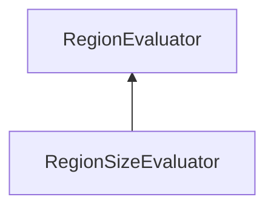

| public |
{:.api_label}

#### Inheritance Graph

## Description

## Public Static Functions

|
| ------: | ----------------- |
|  | |
| bool | **[compare](#classMinSG_1_1MAR_1_1RegionSizeEvaluator_1a8706f1aeb180d895b5099a3535b4da78)**(const [Region](classMinSG_1_1MAR_1_1Region) * a, const [Region](classMinSG_1_1MAR_1_1Region) * b) |
{: .nohead .nowrap1 .api_section }

## Public Functions

|
| ------: | ----------------- |
|  | |
|  | **[RegionSizeEvaluator](#classMinSG_1_1MAR_1_1RegionSizeEvaluator_1a7029b3ece0c01445eb37eca16b1c8309)**() |
{: .nohead .nowrap1 .api_section }

## Protected Functions

|
| ------: | ----------------- |
|  | |
| void | **[evaluate](#classMinSG_1_1MAR_1_1RegionSizeEvaluator_1aee433fe0a4da27d137d32ded7055e0bf)**( [Region](classMinSG_1_1MAR_1_1Region) * r) |
|  | |
| void | **[init](#classMinSG_1_1MAR_1_1RegionSizeEvaluator_1a46627d6c2010a5b752326299c91679e0)**( [Region](classMinSG_1_1MAR_1_1Region) * r) |
{: .nohead .nowrap1 .api_section }

-------------------------------------------------------------------

## Documentation

### <small>function</small>  MinSG::MAR::RegionSizeEvaluator::compare {#classMinSG_1_1MAR_1_1RegionSizeEvaluator_1a8706f1aeb180d895b5099a3535b4da78}

| public | static |
{:.api_label}

|
| ------: | ----------------- |
|  |
| bool **[compare](#classMinSG_1_1MAR_1_1RegionSizeEvaluator_1a8706f1aeb180d895b5099a3535b4da78)**( | const [Region](classMinSG_1_1MAR_1_1Region) * | **a**, |
| | const [Region](classMinSG_1_1MAR_1_1Region) * | **b** |
|   ) |
{: .nohead .nowrap1 .api_doc }

Defined in `MinSG/Ext/MultiAlgoRendering/RegionEvaluator.h:136`{:style="float: right"}

-------------------------------------------------------------------

### <small>function</small>  MinSG::MAR::RegionSizeEvaluator::RegionSizeEvaluator {#classMinSG_1_1MAR_1_1RegionSizeEvaluator_1a7029b3ece0c01445eb37eca16b1c8309}

| public | inline |
{:.api_label}

|
| ------: | ----------------- |
|  |
|  **[RegionSizeEvaluator](#classMinSG_1_1MAR_1_1RegionSizeEvaluator_1a7029b3ece0c01445eb37eca16b1c8309)**( |  ) |
{: .nohead .nowrap1 .api_doc }

Defined in `MinSG/Ext/MultiAlgoRendering/RegionEvaluator.h:138`{:style="float: right"}

-------------------------------------------------------------------

### <small>function</small>  MinSG::MAR::RegionSizeEvaluator::evaluate {#classMinSG_1_1MAR_1_1RegionSizeEvaluator_1aee433fe0a4da27d137d32ded7055e0bf}

| protected | virtual |
{:.api_label}

|
| ------: | ----------------- |
|  |
| void **[evaluate](#classMinSG_1_1MAR_1_1RegionSizeEvaluator_1aee433fe0a4da27d137d32ded7055e0bf)**( |  [Region](classMinSG_1_1MAR_1_1Region) * | **r** ) |
{: .nohead .nowrap1 .api_doc }

Defined in `MinSG/Ext/MultiAlgoRendering/RegionEvaluator.h:144`{:style="float: right"}

-------------------------------------------------------------------

### <small>function</small>  MinSG::MAR::RegionSizeEvaluator::init {#classMinSG_1_1MAR_1_1RegionSizeEvaluator_1a46627d6c2010a5b752326299c91679e0}

| protected | virtual |
{:.api_label}

|
| ------: | ----------------- |
|  |
| void **[init](#classMinSG_1_1MAR_1_1RegionSizeEvaluator_1a46627d6c2010a5b752326299c91679e0)**( |  [Region](classMinSG_1_1MAR_1_1Region) * | **r** ) |
{: .nohead .nowrap1 .api_doc }

Defined in `MinSG/Ext/MultiAlgoRendering/RegionEvaluator.h:145`{:style="float: right"}

-------------------------------------------------------------------

