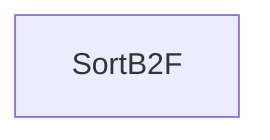

| private |
{:.api_label}

#### Inheritance Graph

## Description

## Public Functions

|
| ------: | ----------------- |
|  | |
|  | **[SortB2F](#classMinSG_1_1MAR_1_1Region_1_1SortB2F_1adf6e55bfaf8511c7d9a3efb2a26ae492)**(const [Geometry::Vec3f](namespaceGeometry#namespaceGeometry_1a5b269b6a82917f18e344231ecf8e6566) & _pos) |
|  | |
| bool | **[operator()](#classMinSG_1_1MAR_1_1Region_1_1SortB2F_1aecc8e5a7c52c908700cc20c920d30afe)**(const [Region](classMinSG_1_1MAR_1_1Region) * a, const [Region](classMinSG_1_1MAR_1_1Region) * b) const |
{: .nohead .nowrap1 .api_section }

-------------------------------------------------------------------

## Documentation

### <small>function</small>  MinSG::MAR::Region::SortB2F::SortB2F {#classMinSG_1_1MAR_1_1Region_1_1SortB2F_1adf6e55bfaf8511c7d9a3efb2a26ae492}

| public | inline |
{:.api_label}

|
| ------: | ----------------- |
|  |
|  **[SortB2F](#classMinSG_1_1MAR_1_1Region_1_1SortB2F_1adf6e55bfaf8511c7d9a3efb2a26ae492)**( | const [Geometry::Vec3f](namespaceGeometry#namespaceGeometry_1a5b269b6a82917f18e344231ecf8e6566) & | **_pos** ) |
{: .nohead .nowrap1 .api_doc }

Defined in `MinSG/Ext/MultiAlgoRendering/Region.h:40`{:style="float: right"}

-------------------------------------------------------------------

### <small>function</small>  MinSG::MAR::Region::SortB2F::operator() {#classMinSG_1_1MAR_1_1Region_1_1SortB2F_1aecc8e5a7c52c908700cc20c920d30afe}

| public | const | inline |
{:.api_label}

|
| ------: | ----------------- |
|  |
| bool **[operator()](#classMinSG_1_1MAR_1_1Region_1_1SortB2F_1aecc8e5a7c52c908700cc20c920d30afe)**( | const [Region](classMinSG_1_1MAR_1_1Region) * | **a**, |
| | const [Region](classMinSG_1_1MAR_1_1Region) * | **b** |
|   ) const |
{: .nohead .nowrap1 .api_doc }

Defined in `MinSG/Ext/MultiAlgoRendering/Region.h:43`{:style="float: right"}

-------------------------------------------------------------------

