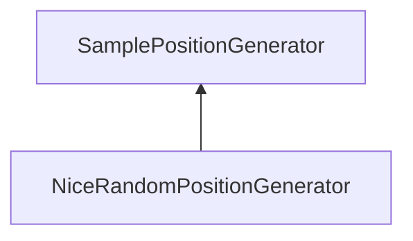

| public | abstract |
{:.api_label}

#### Inheritance Graph

## Description

sample position generators

## Public Functions

|
| ------: | ----------------- |
|  | |
| [Geometry::Vec3f](namespaceGeometry#namespaceGeometry_1a5b269b6a82917f18e344231ecf8e6566) | **[generateSamplePosition](#classMinSG_1_1MAR_1_1SamplePositionGenerator_1ac006a76626b023a45471b3b25b443971)**(const [SampleContext](classMinSG_1_1MAR_1_1SampleContext) * context,  [Geometry::Box](namespaceGeometry#namespaceGeometry_1a02eb80497cc2daa40fba114c929f877a)  bounds) |
|  | |
|  | **[~SamplePositionGenerator](#classMinSG_1_1MAR_1_1SamplePositionGenerator_1a6b74319ac14c327d1d22a913a1e0eb14)**() |
{: .nohead .nowrap1 .api_section }

-------------------------------------------------------------------

## Documentation

### <small>function</small>  MinSG::MAR::SamplePositionGenerator::generateSamplePosition {#classMinSG_1_1MAR_1_1SamplePositionGenerator_1ac006a76626b023a45471b3b25b443971}

| public | virtual |
{:.api_label}

|
| ------: | ----------------- |
|  |
| [Geometry::Vec3f](namespaceGeometry#namespaceGeometry_1a5b269b6a82917f18e344231ecf8e6566) **[generateSamplePosition](#classMinSG_1_1MAR_1_1SamplePositionGenerator_1ac006a76626b023a45471b3b25b443971)**( | const [SampleContext](classMinSG_1_1MAR_1_1SampleContext) * | **context**, |
| |  [Geometry::Box](namespaceGeometry#namespaceGeometry_1a02eb80497cc2daa40fba114c929f877a)  | **bounds** |
|   ) |
{: .nohead .nowrap1 .api_doc }

Defined in `MinSG/Ext/MultiAlgoRendering/SampleContext.h:43`{:style="float: right"}

-------------------------------------------------------------------

### <small>function</small>  MinSG::MAR::SamplePositionGenerator::~SamplePositionGenerator {#classMinSG_1_1MAR_1_1SamplePositionGenerator_1a6b74319ac14c327d1d22a913a1e0eb14}

| public | inline | virtual |
{:.api_label}

|
| ------: | ----------------- |
|  |
|  **[~SamplePositionGenerator](#classMinSG_1_1MAR_1_1SamplePositionGenerator_1a6b74319ac14c327d1d22a913a1e0eb14)**( |  ) |
{: .nohead .nowrap1 .api_doc }

Defined in `MinSG/Ext/MultiAlgoRendering/SampleContext.h:44`{:style="float: right"}

-------------------------------------------------------------------

