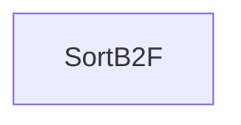

| public |
{:.api_label}

#### Inheritance Graph

## Description

## Public Functions

|
| ------: | ----------------- |
|  | |
|  | **[SortB2F](#classMinSG_1_1MAR_1_1SampleRegion_1_1SortB2F_1aae328a8199892e299974b9035aeaf77b)**( [Geometry::Vec3f](namespaceGeometry#namespaceGeometry_1a5b269b6a82917f18e344231ecf8e6566)  _pos) |
|  | |
| bool | **[operator()](#classMinSG_1_1MAR_1_1SampleRegion_1_1SortB2F_1a144684465b5cfa3c105f50bcf10dc843)**(const [ref_t](classUtil_1_1ReferenceCounter#classUtil_1_1ReferenceCounter_1a2304ad55888c59e0a1fc4493c3091c42) & a, const [ref_t](classUtil_1_1ReferenceCounter#classUtil_1_1ReferenceCounter_1a2304ad55888c59e0a1fc4493c3091c42) & b) const |
{: .nohead .nowrap1 .api_section }

-------------------------------------------------------------------

## Documentation

### <small>function</small>  MinSG::MAR::SampleRegion::SortB2F::SortB2F {#classMinSG_1_1MAR_1_1SampleRegion_1_1SortB2F_1aae328a8199892e299974b9035aeaf77b}

| public | inline |
{:.api_label}

|
| ------: | ----------------- |
|  |
|  **[SortB2F](#classMinSG_1_1MAR_1_1SampleRegion_1_1SortB2F_1aae328a8199892e299974b9035aeaf77b)**( |  [Geometry::Vec3f](namespaceGeometry#namespaceGeometry_1a5b269b6a82917f18e344231ecf8e6566)  | **_pos** ) |
{: .nohead .nowrap1 .api_doc }

Defined in `MinSG/Ext/MultiAlgoRendering/SampleRegion.h:71`{:style="float: right"}

-------------------------------------------------------------------

### <small>function</small>  MinSG::MAR::SampleRegion::SortB2F::operator() {#classMinSG_1_1MAR_1_1SampleRegion_1_1SortB2F_1a144684465b5cfa3c105f50bcf10dc843}

| public | const | inline |
{:.api_label}

|
| ------: | ----------------- |
|  |
| bool **[operator()](#classMinSG_1_1MAR_1_1SampleRegion_1_1SortB2F_1a144684465b5cfa3c105f50bcf10dc843)**( | const [ref_t](classUtil_1_1ReferenceCounter#classUtil_1_1ReferenceCounter_1a2304ad55888c59e0a1fc4493c3091c42) & | **a**, |
| | const [ref_t](classUtil_1_1ReferenceCounter#classUtil_1_1ReferenceCounter_1a2304ad55888c59e0a1fc4493c3091c42) & | **b** |
|   ) const |
{: .nohead .nowrap1 .api_doc }

Defined in `MinSG/Ext/MultiAlgoRendering/SampleRegion.h:72`{:style="float: right"}

-------------------------------------------------------------------

