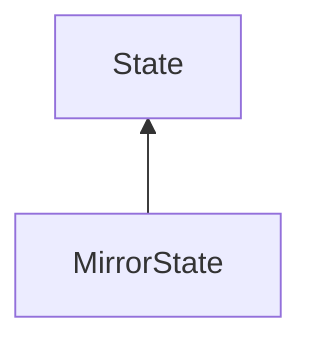

| public |
{:.api_label}

#### Inheritance Graph

## Description

 [State](classMinSG_1_1State) for the creation of a mirror texture for the [Node](classMinSG_1_1Node) it is attached to.

**Author**: Benjamin Eikel

**Date**: 2009-08-23

## Public Functions

|
| ------: | ----------------- |
|  | |
|  | **[MirrorState](#classMinSG_1_1MirrorState_1a9b580f9c7b9965d3801b75bf504ebcd4)**(uint16_t textureSize) |
|  | |
|  | **[~MirrorState](#classMinSG_1_1MirrorState_1adea5a921712c8d487bc506fbaf2095c7)**() |
|  | |
| [MirrorState](classMinSG_1_1MirrorState) * | **[clone](#classMinSG_1_1MirrorState_1aaa368da4901f4248b2eb5e0024f4a36a)**() const   Create a duplicate of this [State](classMinSG_1_1State) object. |
|  | |
| void | **[setRoot](#classMinSG_1_1MirrorState_1aceedb5d4c8122650be4aeb90c17b5c15)**( [GroupNode](classMinSG_1_1GroupNode) * newRoot) |
|  | |
| uint16_t | **[getTextureSize](#classMinSG_1_1MirrorState_1a1dc9a85c0f96a9d7f7ebe8295dc99762)**() const |
|  | |
| [Rendering::FBO](classRendering_1_1FBO) * | **[getFBO](#classMinSG_1_1MirrorState_1a34141151c2ab906ddbdb794cfd57ac60)**() const |
{: .nohead .nowrap1 .api_section }

-------------------------------------------------------------------

## Documentation

### <small>function</small>  MinSG::MirrorState::MirrorState {#classMinSG_1_1MirrorState_1a9b580f9c7b9965d3801b75bf504ebcd4}

| public |
{:.api_label}

|
| ------: | ----------------- |
|  |
|  **[MirrorState](#classMinSG_1_1MirrorState_1a9b580f9c7b9965d3801b75bf504ebcd4)**( | uint16_t | **textureSize** ) |
{: .nohead .nowrap1 .api_doc }

Defined in `MinSG/Ext/States/MirrorState.h:40`{:style="float: right"}

-------------------------------------------------------------------

### <small>function</small>  MinSG::MirrorState::~MirrorState {#classMinSG_1_1MirrorState_1adea5a921712c8d487bc506fbaf2095c7}

| public | virtual |
{:.api_label}

|
| ------: | ----------------- |
|  |
|  **[~MirrorState](#classMinSG_1_1MirrorState_1adea5a921712c8d487bc506fbaf2095c7)**( |  ) |
{: .nohead .nowrap1 .api_doc }

Defined in `MinSG/Ext/States/MirrorState.h:41`{:style="float: right"}

-------------------------------------------------------------------

### <small>function</small>  MinSG::MirrorState::clone {#classMinSG_1_1MirrorState_1aaa368da4901f4248b2eb5e0024f4a36a}

| public | const | virtual |
{:.api_label}

|
| ------: | ----------------- |
|  |
| [MirrorState](classMinSG_1_1MirrorState) * **[clone](#classMinSG_1_1MirrorState_1aaa368da4901f4248b2eb5e0024f4a36a)**( |  ) const |
{: .nohead .nowrap1 .api_doc }

Create a duplicate of this [State](classMinSG_1_1State) object.

Defined in `MinSG/Ext/States/MirrorState.h:43`{:style="float: right"}

-------------------------------------------------------------------

### <small>function</small>  MinSG::MirrorState::setRoot {#classMinSG_1_1MirrorState_1aceedb5d4c8122650be4aeb90c17b5c15}

| public | inline |
{:.api_label}

|
| ------: | ----------------- |
|  |
| void **[setRoot](#classMinSG_1_1MirrorState_1aceedb5d4c8122650be4aeb90c17b5c15)**( |  [GroupNode](classMinSG_1_1GroupNode) * | **newRoot** ) |
{: .nohead .nowrap1 .api_doc }

Defined in `MinSG/Ext/States/MirrorState.h:45`{:style="float: right"}

-------------------------------------------------------------------

### <small>function</small>  MinSG::MirrorState::getTextureSize {#classMinSG_1_1MirrorState_1a1dc9a85c0f96a9d7f7ebe8295dc99762}

| public | const | inline |
{:.api_label}

|
| ------: | ----------------- |
|  |
| uint16_t **[getTextureSize](#classMinSG_1_1MirrorState_1a1dc9a85c0f96a9d7f7ebe8295dc99762)**( |  ) const |
{: .nohead .nowrap1 .api_doc }

Defined in `MinSG/Ext/States/MirrorState.h:49`{:style="float: right"}

-------------------------------------------------------------------

### <small>function</small>  MinSG::MirrorState::getFBO {#classMinSG_1_1MirrorState_1a34141151c2ab906ddbdb794cfd57ac60}

| public | const | inline |
{:.api_label}

|
| ------: | ----------------- |
|  |
| [Rendering::FBO](classRendering_1_1FBO) * **[getFBO](#classMinSG_1_1MirrorState_1a34141151c2ab906ddbdb794cfd57ac60)**( |  ) const |
{: .nohead .nowrap1 .api_doc }

Defined in `MinSG/Ext/States/MirrorState.h:53`{:style="float: right"}

-------------------------------------------------------------------

