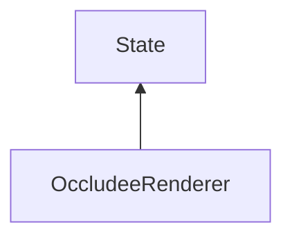

| public |
{:.api_label}

#### Inheritance Graph

## Description

Renderer that displays the scene using conservative occlusion culling first. After that the occluded objects are additionally displayed in front. The real work is not done by this class, but by using an occlusion culling renderer.

**Author**: Benjamin Eikel

**Date**: 2011-07-06

## Public Functions

|
| ------: | ----------------- |
|  | |
|  | **[OccludeeRenderer](#classMinSG_1_1OccludeeRenderer_1aadf9ba9d957e915dd83ab18abfefdd98)**() |
|  | |
|  | **[OccludeeRenderer](#classMinSG_1_1OccludeeRenderer_1af5c77249e309cce7f3d6ce41e58c8345)**(const [OccludeeRenderer](classMinSG_1_1OccludeeRenderer) & other) |
|  | |
|  | **[OccludeeRenderer](#classMinSG_1_1OccludeeRenderer_1a0861cd94d5c7e5f92b0baee6591dc021)**( [OccludeeRenderer](classMinSG_1_1OccludeeRenderer) && void) |
|  | |
|  | **[~OccludeeRenderer](#classMinSG_1_1OccludeeRenderer_1a78669e3a4594211932f93a51e1203a02)**() |
|  | |
| [OccludeeRenderer](classMinSG_1_1OccludeeRenderer) * | **[clone](#classMinSG_1_1OccludeeRenderer_1af5813c1e496f353fc8dac47a2e697c24)**() const   Create a duplicate of this [State](classMinSG_1_1State) object. |
|  | |
| void | **[setUseWireframe](#classMinSG_1_1OccludeeRenderer_1a4c8028fd85df5b72c1de20b64099c38d)**(bool b) |
|  | |
| bool | **[getUseWireframe](#classMinSG_1_1OccludeeRenderer_1a458c69082de2ea71db1712a1134a25d6)**() const |
|  | |
| void | **[setShowOriginal](#classMinSG_1_1OccludeeRenderer_1a38d22c999fd9196d0ee24584ad1a893b)**(bool b) |
|  | |
| bool | **[getShowOriginal](#classMinSG_1_1OccludeeRenderer_1a2ebfe7edb00906a82043e0d35f31e176)**() const |
{: .nohead .nowrap1 .api_section }

-------------------------------------------------------------------

## Documentation

### <small>function</small>  MinSG::OccludeeRenderer::OccludeeRenderer {#classMinSG_1_1OccludeeRenderer_1aadf9ba9d957e915dd83ab18abfefdd98}

| public |
{:.api_label}

|
| ------: | ----------------- |
|  |
|  **[OccludeeRenderer](#classMinSG_1_1OccludeeRenderer_1aadf9ba9d957e915dd83ab18abfefdd98)**( |  ) |
{: .nohead .nowrap1 .api_doc }

Defined in `MinSG/Ext/OcclusionCulling/OccludeeRenderer.h:32`{:style="float: right"}

-------------------------------------------------------------------

### <small>function</small>  MinSG::OccludeeRenderer::OccludeeRenderer {#classMinSG_1_1OccludeeRenderer_1af5c77249e309cce7f3d6ce41e58c8345}

| public |
{:.api_label}

|
| ------: | ----------------- |
|  |
|  **[OccludeeRenderer](#classMinSG_1_1OccludeeRenderer_1af5c77249e309cce7f3d6ce41e58c8345)**( | const [OccludeeRenderer](classMinSG_1_1OccludeeRenderer) & | **other** ) |
{: .nohead .nowrap1 .api_doc }

Defined in `MinSG/Ext/OcclusionCulling/OccludeeRenderer.h:33`{:style="float: right"}

-------------------------------------------------------------------

### <small>function</small>  MinSG::OccludeeRenderer::OccludeeRenderer {#classMinSG_1_1OccludeeRenderer_1a0861cd94d5c7e5f92b0baee6591dc021}

| public |
{:.api_label}

|
| ------: | ----------------- |
|  |
|  **[OccludeeRenderer](#classMinSG_1_1OccludeeRenderer_1a0861cd94d5c7e5f92b0baee6591dc021)**( |  [OccludeeRenderer](classMinSG_1_1OccludeeRenderer) && | **void** ) |
{: .nohead .nowrap1 .api_doc }

Defined in `MinSG/Ext/OcclusionCulling/OccludeeRenderer.h:34`{:style="float: right"}

-------------------------------------------------------------------

### <small>function</small>  MinSG::OccludeeRenderer::~OccludeeRenderer {#classMinSG_1_1OccludeeRenderer_1a78669e3a4594211932f93a51e1203a02}

| public | virtual |
{:.api_label}

|
| ------: | ----------------- |
|  |
|  **[~OccludeeRenderer](#classMinSG_1_1OccludeeRenderer_1a78669e3a4594211932f93a51e1203a02)**( |  ) |
{: .nohead .nowrap1 .api_doc }

Defined in `MinSG/Ext/OcclusionCulling/OccludeeRenderer.h:35`{:style="float: right"}

-------------------------------------------------------------------

### <small>function</small>  MinSG::OccludeeRenderer::clone {#classMinSG_1_1OccludeeRenderer_1af5813c1e496f353fc8dac47a2e697c24}

| public | const | virtual |
{:.api_label}

|
| ------: | ----------------- |
|  |
| [OccludeeRenderer](classMinSG_1_1OccludeeRenderer) * **[clone](#classMinSG_1_1OccludeeRenderer_1af5813c1e496f353fc8dac47a2e697c24)**( |  ) const |
{: .nohead .nowrap1 .api_doc }

Create a duplicate of this [State](classMinSG_1_1State) object.

Defined in `MinSG/Ext/OcclusionCulling/OccludeeRenderer.h:37`{:style="float: right"}

-------------------------------------------------------------------

### <small>function</small>  MinSG::OccludeeRenderer::setUseWireframe {#classMinSG_1_1OccludeeRenderer_1a4c8028fd85df5b72c1de20b64099c38d}

| public | inline |
{:.api_label}

|
| ------: | ----------------- |
|  |
| void **[setUseWireframe](#classMinSG_1_1OccludeeRenderer_1a4c8028fd85df5b72c1de20b64099c38d)**( | bool | **b** ) |
{: .nohead .nowrap1 .api_doc }

Defined in `MinSG/Ext/OcclusionCulling/OccludeeRenderer.h:39`{:style="float: right"}

-------------------------------------------------------------------

### <small>function</small>  MinSG::OccludeeRenderer::getUseWireframe {#classMinSG_1_1OccludeeRenderer_1a458c69082de2ea71db1712a1134a25d6}

| public | const | inline |
{:.api_label}

|
| ------: | ----------------- |
|  |
| bool **[getUseWireframe](#classMinSG_1_1OccludeeRenderer_1a458c69082de2ea71db1712a1134a25d6)**( |  ) const |
{: .nohead .nowrap1 .api_doc }

Defined in `MinSG/Ext/OcclusionCulling/OccludeeRenderer.h:40`{:style="float: right"}

-------------------------------------------------------------------

### <small>function</small>  MinSG::OccludeeRenderer::setShowOriginal {#classMinSG_1_1OccludeeRenderer_1a38d22c999fd9196d0ee24584ad1a893b}

| public | inline |
{:.api_label}

|
| ------: | ----------------- |
|  |
| void **[setShowOriginal](#classMinSG_1_1OccludeeRenderer_1a38d22c999fd9196d0ee24584ad1a893b)**( | bool | **b** ) |
{: .nohead .nowrap1 .api_doc }

Defined in `MinSG/Ext/OcclusionCulling/OccludeeRenderer.h:42`{:style="float: right"}

-------------------------------------------------------------------

### <small>function</small>  MinSG::OccludeeRenderer::getShowOriginal {#classMinSG_1_1OccludeeRenderer_1a2ebfe7edb00906a82043e0d35f31e176}

| public | const | inline |
{:.api_label}

|
| ------: | ----------------- |
|  |
| bool **[getShowOriginal](#classMinSG_1_1OccludeeRenderer_1a2ebfe7edb00906a82043e0d35f31e176)**( |  ) const |
{: .nohead .nowrap1 .api_doc }

Defined in `MinSG/Ext/OcclusionCulling/OccludeeRenderer.h:43`{:style="float: right"}

-------------------------------------------------------------------

