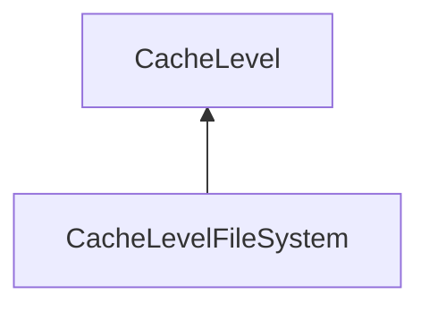

| public |
{:.api_label}

#### Inheritance Graph

## Description

Specialized cache level for file system or network read-only access. It supports all file systems that are provided by [Util::FileUtils](structUtil_1_1FileUtils) .

**Author**: Benjamin Eikel

**Date**: 2011-02-23

## Public Functions

|
| ------: | ----------------- |
|  | |
|  | **[CacheLevelFileSystem](#classMinSG_1_1OutOfCore_1_1CacheLevelFileSystem_1a47fb0b1c8957d9296e760a6d6850c013)**( [CacheContext](classMinSG_1_1OutOfCore_1_1CacheContext) & cacheContext) |
|  | |
|  | **[~CacheLevelFileSystem](#classMinSG_1_1OutOfCore_1_1CacheLevelFileSystem_1adbbbed51905def62e6b40abe8819faa5)**() |
{: .nohead .nowrap1 .api_section }

-------------------------------------------------------------------

## Documentation

### <small>function</small>  MinSG::OutOfCore::CacheLevelFileSystem::CacheLevelFileSystem {#classMinSG_1_1OutOfCore_1_1CacheLevelFileSystem_1a47fb0b1c8957d9296e760a6d6850c013}

| public |
{:.api_label}

|
| ------: | ----------------- |
|  |
|  **[CacheLevelFileSystem](#classMinSG_1_1OutOfCore_1_1CacheLevelFileSystem_1a47fb0b1c8957d9296e760a6d6850c013)**( |  [CacheContext](classMinSG_1_1OutOfCore_1_1CacheContext) & | **cacheContext** ) |
{: .nohead .nowrap1 .api_doc }

Defined in `MinSG/Ext/OutOfCore/CacheLevelFileSystem.h:61`{:style="float: right"}

-------------------------------------------------------------------

### <small>function</small>  MinSG::OutOfCore::CacheLevelFileSystem::~CacheLevelFileSystem {#classMinSG_1_1OutOfCore_1_1CacheLevelFileSystem_1adbbbed51905def62e6b40abe8819faa5}

| public | virtual |
{:.api_label}

|
| ------: | ----------------- |
|  |
|  **[~CacheLevelFileSystem](#classMinSG_1_1OutOfCore_1_1CacheLevelFileSystem_1adbbbed51905def62e6b40abe8819faa5)**( |  ) |
{: .nohead .nowrap1 .api_doc }

Defined in `MinSG/Ext/OutOfCore/CacheLevelFileSystem.h:62`{:style="float: right"}

-------------------------------------------------------------------

