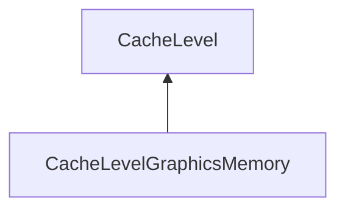

| public |
{:.api_label}

#### Inheritance Graph

## Description

Specialized cache level for storing cache objects in and retrieving cache objects from graphics memory (GPU memory).

**Author**: Benjamin Eikel

**Date**: 2011-02-24

## Public Functions

|
| ------: | ----------------- |
|  | |
|  | **[CacheLevelGraphicsMemory](#classMinSG_1_1OutOfCore_1_1CacheLevelGraphicsMemory_1ac108851bedf89b27dba3a657a0c01f15)**(uint64_t cacheSize,  [CacheContext](classMinSG_1_1OutOfCore_1_1CacheContext) & cacheContext) |
|  | |
|  | **[~CacheLevelGraphicsMemory](#classMinSG_1_1OutOfCore_1_1CacheLevelGraphicsMemory_1ad1ac2289b25c34207bd2b5764e91eb73)**() |
{: .nohead .nowrap1 .api_section }

-------------------------------------------------------------------

## Documentation

### <small>function</small>  MinSG::OutOfCore::CacheLevelGraphicsMemory::CacheLevelGraphicsMemory {#classMinSG_1_1OutOfCore_1_1CacheLevelGraphicsMemory_1ac108851bedf89b27dba3a657a0c01f15}

| public |
{:.api_label}

|
| ------: | ----------------- |
|  |
|  **[CacheLevelGraphicsMemory](#classMinSG_1_1OutOfCore_1_1CacheLevelGraphicsMemory_1ac108851bedf89b27dba3a657a0c01f15)**( | uint64_t | **cacheSize**, |
| |  [CacheContext](classMinSG_1_1OutOfCore_1_1CacheContext) & | **cacheContext** |
|   ) |
{: .nohead .nowrap1 .api_doc }

Defined in `MinSG/Ext/OutOfCore/CacheLevelGraphicsMemory.h:54`{:style="float: right"}

-------------------------------------------------------------------

### <small>function</small>  MinSG::OutOfCore::CacheLevelGraphicsMemory::~CacheLevelGraphicsMemory {#classMinSG_1_1OutOfCore_1_1CacheLevelGraphicsMemory_1ad1ac2289b25c34207bd2b5764e91eb73}

| public | virtual |
{:.api_label}

|
| ------: | ----------------- |
|  |
|  **[~CacheLevelGraphicsMemory](#classMinSG_1_1OutOfCore_1_1CacheLevelGraphicsMemory_1ad1ac2289b25c34207bd2b5764e91eb73)**( |  ) |
{: .nohead .nowrap1 .api_doc }

Defined in `MinSG/Ext/OutOfCore/CacheLevelGraphicsMemory.h:55`{:style="float: right"}

-------------------------------------------------------------------

