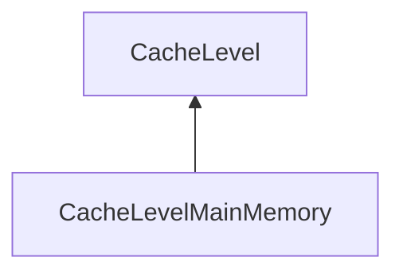

| public |
{:.api_label}

#### Inheritance Graph

## Description

Specialized cache level for storing cache objects in and retrieving cache objects from main memory (CPU memory).

**Author**: Benjamin Eikel

**Date**: 2011-02-23

## Public Functions

|
| ------: | ----------------- |
|  | |
|  | **[CacheLevelMainMemory](#classMinSG_1_1OutOfCore_1_1CacheLevelMainMemory_1a6764569f774b19d5c526fdacfd18072b)**(uint64_t cacheSize,  [CacheContext](classMinSG_1_1OutOfCore_1_1CacheContext) & cacheContext) |
|  | |
|  | **[~CacheLevelMainMemory](#classMinSG_1_1OutOfCore_1_1CacheLevelMainMemory_1a79ff4c5627cdc255b8934d2dd72390c7)**() |
|  | |
| void | **[init](#classMinSG_1_1OutOfCore_1_1CacheLevelMainMemory_1ab9d5c085f57888430633dca5fdd9392b)**()   Start the worker thread. |
{: .nohead .nowrap1 .api_section }

-------------------------------------------------------------------

## Documentation

### <small>function</small>  MinSG::OutOfCore::CacheLevelMainMemory::CacheLevelMainMemory {#classMinSG_1_1OutOfCore_1_1CacheLevelMainMemory_1a6764569f774b19d5c526fdacfd18072b}

| public |
{:.api_label}

|
| ------: | ----------------- |
|  |
|  **[CacheLevelMainMemory](#classMinSG_1_1OutOfCore_1_1CacheLevelMainMemory_1a6764569f774b19d5c526fdacfd18072b)**( | uint64_t | **cacheSize**, |
| |  [CacheContext](classMinSG_1_1OutOfCore_1_1CacheContext) & | **cacheContext** |
|   ) |
{: .nohead .nowrap1 .api_doc }

Defined in `MinSG/Ext/OutOfCore/CacheLevelMainMemory.h:69`{:style="float: right"}

-------------------------------------------------------------------

### <small>function</small>  MinSG::OutOfCore::CacheLevelMainMemory::~CacheLevelMainMemory {#classMinSG_1_1OutOfCore_1_1CacheLevelMainMemory_1a79ff4c5627cdc255b8934d2dd72390c7}

| public | virtual |
{:.api_label}

|
| ------: | ----------------- |
|  |
|  **[~CacheLevelMainMemory](#classMinSG_1_1OutOfCore_1_1CacheLevelMainMemory_1a79ff4c5627cdc255b8934d2dd72390c7)**( |  ) |
{: .nohead .nowrap1 .api_doc }

Defined in `MinSG/Ext/OutOfCore/CacheLevelMainMemory.h:70`{:style="float: right"}

-------------------------------------------------------------------

### <small>function</small>  MinSG::OutOfCore::CacheLevelMainMemory::init {#classMinSG_1_1OutOfCore_1_1CacheLevelMainMemory_1ab9d5c085f57888430633dca5fdd9392b}

| public | virtual |
{:.api_label}

|
| ------: | ----------------- |
|  |
| void **[init](#classMinSG_1_1OutOfCore_1_1CacheLevelMainMemory_1ab9d5c085f57888430633dca5fdd9392b)**( |  ) |
{: .nohead .nowrap1 .api_doc }

Start the worker thread.

Defined in `MinSG/Ext/OutOfCore/CacheLevelMainMemory.h:73`{:style="float: right"}

-------------------------------------------------------------------

