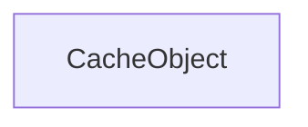

| public |
{:.api_label}

#### Inheritance Graph

## Description

Capsule for a Mesh that is handled inside a cache system. The cache system may be extended by allowing capsules with other content here.

**Author**: Benjamin Eikel

**Date**: 2011-02-21

## Public Functions

|
| ------: | ----------------- |
|  | |
|  | **[CacheObject](#classMinSG_1_1OutOfCore_1_1CacheObject_1a1341e3adeaddab840890c8a601a0243f)**( [Rendering::Mesh](classRendering_1_1Mesh) * mesh) |
|  | |
|  | **[~CacheObject](#classMinSG_1_1OutOfCore_1_1CacheObject_1a6db46400b43f03dcd2cb1eded04dd2aa)**() |
{: .nohead .nowrap1 .api_section }

-------------------------------------------------------------------

## Documentation

### <small>function</small>  MinSG::OutOfCore::CacheObject::CacheObject {#classMinSG_1_1OutOfCore_1_1CacheObject_1a1341e3adeaddab840890c8a601a0243f}

| public |
{:.api_label}

|
| ------: | ----------------- |
|  |
|  **[CacheObject](#classMinSG_1_1OutOfCore_1_1CacheObject_1a1341e3adeaddab840890c8a601a0243f)**( |  [Rendering::Mesh](classRendering_1_1Mesh) * | **mesh** ) |
{: .nohead .nowrap1 .api_doc }

Defined in `MinSG/Ext/OutOfCore/CacheObject.h:81`{:style="float: right"}

-------------------------------------------------------------------

### <small>function</small>  MinSG::OutOfCore::CacheObject::~CacheObject {#classMinSG_1_1OutOfCore_1_1CacheObject_1a6db46400b43f03dcd2cb1eded04dd2aa}

| public |
{:.api_label}

|
| ------: | ----------------- |
|  |
|  **[~CacheObject](#classMinSG_1_1OutOfCore_1_1CacheObject_1a6db46400b43f03dcd2cb1eded04dd2aa)**( |  ) |
{: .nohead .nowrap1 .api_doc }

Defined in `MinSG/Ext/OutOfCore/CacheObject.h:83`{:style="float: right"}

-------------------------------------------------------------------

