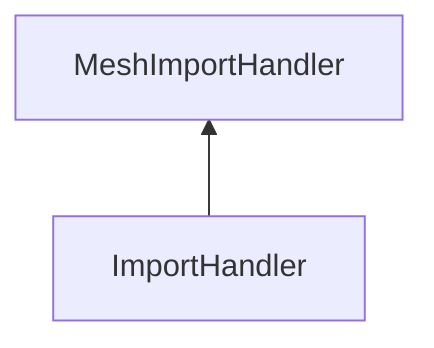

| public |
{:.api_label}

#### Inheritance Graph

## Description

Class that registers itself at the SceneManager and then takes notice whenever a new mesh is to be loaded.

**Author**: Benjamin Eikel

**Date**: 2011-02-18

## Public Functions

|
| ------: | ----------------- |
|  | |
|  | **[~ImportHandler](#classMinSG_1_1OutOfCore_1_1ImportHandler_1a338685893f873f1f79635484e2af631d)**() |
|  | |
| [Node](classMinSG_1_1Node) * | **[handleImport](#classMinSG_1_1OutOfCore_1_1ImportHandler_1aafec6c812ee5f1168ccdaecd313dcf15)**(const [Util::FileLocator](classUtil_1_1FileLocator) & locator, const std::string & url, const [SceneManagement::DescriptionMap](namespaceMinSG_1_1SceneManagement#namespaceMinSG_1_1SceneManagement_1a8c43b9723e098db2875d6940e84350d1) * description) |
{: .nohead .nowrap1 .api_section }

-------------------------------------------------------------------

## Documentation

### <small>function</small>  MinSG::OutOfCore::ImportHandler::~ImportHandler {#classMinSG_1_1OutOfCore_1_1ImportHandler_1a338685893f873f1f79635484e2af631d}

| public | inline | virtual |
{:.api_label}

|
| ------: | ----------------- |
|  |
|  **[~ImportHandler](#classMinSG_1_1OutOfCore_1_1ImportHandler_1a338685893f873f1f79635484e2af631d)**( |  ) |
{: .nohead .nowrap1 .api_doc }

Defined in `MinSG/Ext/OutOfCore/ImportHandler.h:31`{:style="float: right"}

-------------------------------------------------------------------

### <small>function</small>  MinSG::OutOfCore::ImportHandler::handleImport {#classMinSG_1_1OutOfCore_1_1ImportHandler_1aafec6c812ee5f1168ccdaecd313dcf15}

| public | virtual |
{:.api_label}

|
| ------: | ----------------- |
|  |
| [Node](classMinSG_1_1Node) * **[handleImport](#classMinSG_1_1OutOfCore_1_1ImportHandler_1aafec6c812ee5f1168ccdaecd313dcf15)**( | const [Util::FileLocator](classUtil_1_1FileLocator) & | **locator**, |
| | const std::string & | **url**, |
| | const [SceneManagement::DescriptionMap](namespaceMinSG_1_1SceneManagement#namespaceMinSG_1_1SceneManagement_1a8c43b9723e098db2875d6940e84350d1) * | **description** |
|   ) |
{: .nohead .nowrap1 .api_doc }

Add a new cache object that is a representative for the mesh. Only meshes from ".mmf" and ".ply" files are supported by this class. Other meshes will be loaded with the function of the superclass. This function is called by the StdImporter when a Mesh has to be loaded form a file system or network location.

#### Parameters
**url**
:  Location of the mesh file.

**description**
:  Description of the [Node](classMinSG_1_1Node) to which the mesh belongs.

#### Returns
Arbitrary node or tree of nodes that represents the mesh inside the scene graph.

Defined in `MinSG/Ext/OutOfCore/ImportHandler.h:44`{:style="float: right"}

-------------------------------------------------------------------

