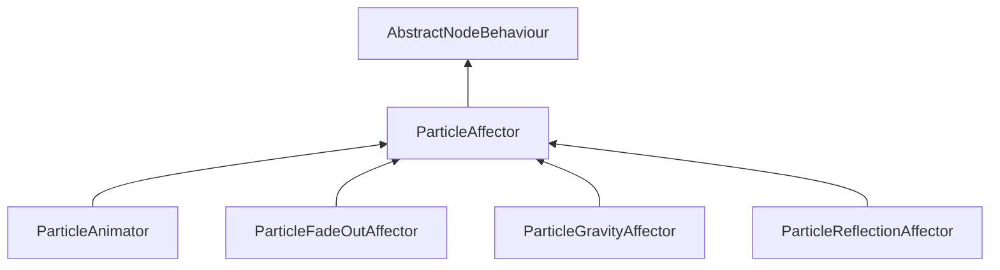

| public |
{:.api_label}

#### Inheritance Graph

## Description

An affector (most likely created using ParticleSystemNode::createAffector) is used to affect existing particles. After creating the affector is has to be registered with an behavior manager.

 [ParticleAffector](classMinSG_1_1ParticleAffector) |> [AbstractNodeBehaviour](classMinSG_1_1AbstractNodeBehaviour) 

**Author**: Jan Krems

**Date**: 2010-06-15

## Public Functions

|
| ------: | ----------------- |
|  | |
|  | **[ParticleAffector](#classMinSG_1_1ParticleAffector_1ab860fae854063be5e652c3fe9f8a82a0)**( [ParticleSystemNode](classMinSG_1_1ParticleSystemNode) * node) |
|  | |
|  | **[~ParticleAffector](#classMinSG_1_1ParticleAffector_1a24371a1cebc6e90559f4669712393756)**() |
{: .nohead .nowrap1 .api_section }

-------------------------------------------------------------------

## Documentation

### <small>function</small>  MinSG::ParticleAffector::ParticleAffector {#classMinSG_1_1ParticleAffector_1ab860fae854063be5e652c3fe9f8a82a0}

| public |
{:.api_label}

|
| ------: | ----------------- |
|  |
|  **[ParticleAffector](#classMinSG_1_1ParticleAffector_1ab860fae854063be5e652c3fe9f8a82a0)**( |  [ParticleSystemNode](classMinSG_1_1ParticleSystemNode) * | **node** ) |
{: .nohead .nowrap1 .api_doc }

Just passes the node to [AbstractNodeBehaviour](classMinSG_1_1AbstractNodeBehaviour) 

Defined in `MinSG/Ext/ParticleSystem/ParticleAffectors.h:48`{:style="float: right"}

-------------------------------------------------------------------

### <small>function</small>  MinSG::ParticleAffector::~ParticleAffector {#classMinSG_1_1ParticleAffector_1a24371a1cebc6e90559f4669712393756}

| public | virtual |
{:.api_label}

|
| ------: | ----------------- |
|  |
|  **[~ParticleAffector](#classMinSG_1_1ParticleAffector_1a24371a1cebc6e90559f4669712393756)**( |  ) |
{: .nohead .nowrap1 .api_doc }

Defined in `MinSG/Ext/ParticleSystem/ParticleAffectors.h:50`{:style="float: right"}

-------------------------------------------------------------------

