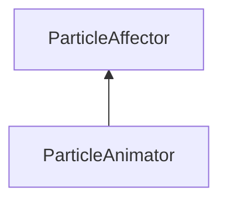

| public |
{:.api_label}

#### Inheritance Graph

## Description

This is the most important affector. Without it, the particle system won't do anything.

## Public Functions

|
| ------: | ----------------- |
|  | |
|  | **[ParticleAnimator](#classMinSG_1_1ParticleAnimator_1a0d5e6df2192703deeda722c331d9b81b)**( [ParticleSystemNode](classMinSG_1_1ParticleSystemNode) * node) |
|  | |
|  | **[~ParticleAnimator](#classMinSG_1_1ParticleAnimator_1a4ed541c2388e5ea0ce8845f4df46d404)**() |
|  | |
| [AbstractBehaviour::behaviourResult_t](classMinSG_1_1Behavior#classMinSG_1_1Behavior_1afbd60a8df73dc581d2d00a1483f630ef) | **[doExecute](#classMinSG_1_1ParticleAnimator_1a7689263050da97d8aa23188f5269a4e4)**() |
{: .nohead .nowrap1 .api_section }

-------------------------------------------------------------------

## Documentation

### <small>function</small>  MinSG::ParticleAnimator::ParticleAnimator {#classMinSG_1_1ParticleAnimator_1a0d5e6df2192703deeda722c331d9b81b}

| public |
{:.api_label}

|
| ------: | ----------------- |
|  |
|  **[ParticleAnimator](#classMinSG_1_1ParticleAnimator_1a0d5e6df2192703deeda722c331d9b81b)**( |  [ParticleSystemNode](classMinSG_1_1ParticleSystemNode) * | **node** ) |
{: .nohead .nowrap1 .api_doc }

empty

Defined in `MinSG/Ext/ParticleSystem/ParticleAffectors.h:63`{:style="float: right"}

-------------------------------------------------------------------

### <small>function</small>  MinSG::ParticleAnimator::~ParticleAnimator {#classMinSG_1_1ParticleAnimator_1a4ed541c2388e5ea0ce8845f4df46d404}

| public | virtual |
{:.api_label}

|
| ------: | ----------------- |
|  |
|  **[~ParticleAnimator](#classMinSG_1_1ParticleAnimator_1a4ed541c2388e5ea0ce8845f4df46d404)**( |  ) |
{: .nohead .nowrap1 .api_doc }

empty

Defined in `MinSG/Ext/ParticleSystem/ParticleAffectors.h:65`{:style="float: right"}

-------------------------------------------------------------------

### <small>function</small>  MinSG::ParticleAnimator::doExecute {#classMinSG_1_1ParticleAnimator_1a7689263050da97d8aa23188f5269a4e4}

| public | virtual |
{:.api_label}

|
| ------: | ----------------- |
|  |
| [AbstractBehaviour::behaviourResult_t](classMinSG_1_1Behavior#classMinSG_1_1Behavior_1afbd60a8df73dc581d2d00a1483f630ef) **[doExecute](#classMinSG_1_1ParticleAnimator_1a7689263050da97d8aa23188f5269a4e4)**( |  ) |
{: .nohead .nowrap1 .api_doc }

Just calls the animate & collect particles function of the particle system.

Defined in `MinSG/Ext/ParticleSystem/ParticleAffectors.h:71`{:style="float: right"}

-------------------------------------------------------------------

