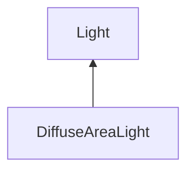

| public |
{:.api_label}

#### Inheritance Graph

## Description

## Public Functions

|
| ------: | ----------------- |
|  | |
|  | **[DiffuseAreaLight](#classMinSG_1_1PathTracing_1_1DiffuseAreaLight_1a0c8f3264dcf7fefe410d3aaa9b38aa3f)**( [GeometryNode](classMinSG_1_1GeometryNode) * node,  [Util::Color4f](classUtil_1_1Color4f)  emission) |
|  | |
| [SampleResult](structMinSG_1_1PathTracing_1_1Light_1_1SampleResult) | **[sampleIncidentRadiance](#classMinSG_1_1PathTracing_1_1DiffuseAreaLight_1a1a07cb51cc1192506f6c3c36eeddc857)**(const [SurfacePoint](classMinSG_1_1PathTracing_1_1SurfacePoint) & surface, const [Geometry::Vec3](namespaceGeometry#namespaceGeometry_1ab29e4544da9b15b5bf224cbf5b691313) & sample) const |
{: .nohead .nowrap1 .api_section }

-------------------------------------------------------------------

## Documentation

### <small>function</small>  MinSG::PathTracing::DiffuseAreaLight::DiffuseAreaLight {#classMinSG_1_1PathTracing_1_1DiffuseAreaLight_1a0c8f3264dcf7fefe410d3aaa9b38aa3f}

| public |
{:.api_label}

|
| ------: | ----------------- |
|  |
|  **[DiffuseAreaLight](#classMinSG_1_1PathTracing_1_1DiffuseAreaLight_1a0c8f3264dcf7fefe410d3aaa9b38aa3f)**( |  [GeometryNode](classMinSG_1_1GeometryNode) * | **node**, |
| |  [Util::Color4f](classUtil_1_1Color4f)  | **emission** |
|   ) |
{: .nohead .nowrap1 .api_doc }

Defined in `MinSG/Ext/PathTracing/Light.h:61`{:style="float: right"}

-------------------------------------------------------------------

### <small>function</small>  MinSG::PathTracing::DiffuseAreaLight::sampleIncidentRadiance {#classMinSG_1_1PathTracing_1_1DiffuseAreaLight_1a1a07cb51cc1192506f6c3c36eeddc857}

| public | const | virtual |
{:.api_label}

|
| ------: | ----------------- |
|  |
| [SampleResult](structMinSG_1_1PathTracing_1_1Light_1_1SampleResult) **[sampleIncidentRadiance](#classMinSG_1_1PathTracing_1_1DiffuseAreaLight_1a1a07cb51cc1192506f6c3c36eeddc857)**( | const [SurfacePoint](classMinSG_1_1PathTracing_1_1SurfacePoint) & | **surface**, |
| | const [Geometry::Vec3](namespaceGeometry#namespaceGeometry_1ab29e4544da9b15b5bf224cbf5b691313) & | **sample** |
|   ) const |
{: .nohead .nowrap1 .api_doc }

Defined in `MinSG/Ext/PathTracing/Light.h:63`{:style="float: right"}

-------------------------------------------------------------------

