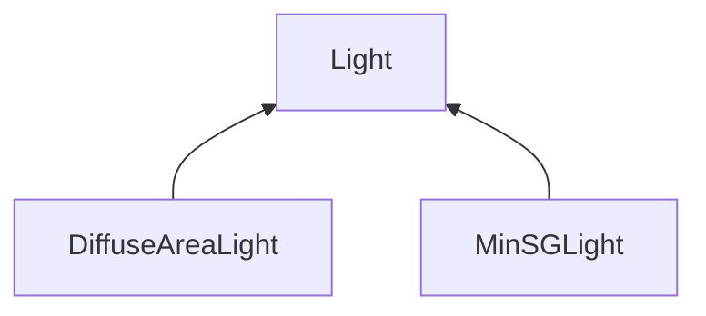

| public | abstract |
{:.api_label}

#### Inheritance Graph

## Description

## Classes

|
| ------ | ----------------------------------------------------------------------------------------------------- | 
| struct | [MinSG::PathTracing::Light::SampleResult](structMinSG_1_1PathTracing_1_1Light_1_1SampleResult)    | 
{: .nohead }

## Public Functions

|
| ------: | ----------------- |
|  | |
|  | **[~Light](#classMinSG_1_1PathTracing_1_1Light_1aae0cfbe31342a4bea0ddb7a0de49495d)**() |
|  | |
| [SampleResult](structMinSG_1_1PathTracing_1_1Light_1_1SampleResult) | **[sampleIncidentRadiance](#classMinSG_1_1PathTracing_1_1Light_1a2f98cd820587a2d553f2d8ff9974fb9e)**(const [SurfacePoint](classMinSG_1_1PathTracing_1_1SurfacePoint) & surface, const [Geometry::Vec3](namespaceGeometry#namespaceGeometry_1ab29e4544da9b15b5bf224cbf5b691313) & sample) const |
|  | |
| bool | **[isDeltaLight](#classMinSG_1_1PathTracing_1_1Light_1a08b6a952a70a650092ac17144ac287e9)**() const |
{: .nohead .nowrap1 .api_section }

-------------------------------------------------------------------

## Documentation

### <small>function</small>  MinSG::PathTracing::Light::~Light {#classMinSG_1_1PathTracing_1_1Light_1aae0cfbe31342a4bea0ddb7a0de49495d}

| public | virtual |
{:.api_label}

|
| ------: | ----------------- |
|  |
|  **[~Light](#classMinSG_1_1PathTracing_1_1Light_1aae0cfbe31342a4bea0ddb7a0de49495d)**( |  ) |
{: .nohead .nowrap1 .api_doc }

Defined in `MinSG/Ext/PathTracing/Light.h:43`{:style="float: right"}

-------------------------------------------------------------------

### <small>function</small>  MinSG::PathTracing::Light::sampleIncidentRadiance {#classMinSG_1_1PathTracing_1_1Light_1a2f98cd820587a2d553f2d8ff9974fb9e}

| public | const | virtual |
{:.api_label}

|
| ------: | ----------------- |
|  |
| [SampleResult](structMinSG_1_1PathTracing_1_1Light_1_1SampleResult) **[sampleIncidentRadiance](#classMinSG_1_1PathTracing_1_1Light_1a2f98cd820587a2d553f2d8ff9974fb9e)**( | const [SurfacePoint](classMinSG_1_1PathTracing_1_1SurfacePoint) & | **surface**, |
| | const [Geometry::Vec3](namespaceGeometry#namespaceGeometry_1ab29e4544da9b15b5bf224cbf5b691313) & | **sample** |
|   ) const |
{: .nohead .nowrap1 .api_doc }

Defined in `MinSG/Ext/PathTracing/Light.h:45`{:style="float: right"}

-------------------------------------------------------------------

### <small>function</small>  MinSG::PathTracing::Light::isDeltaLight {#classMinSG_1_1PathTracing_1_1Light_1a08b6a952a70a650092ac17144ac287e9}

| public | const | inline | virtual |
{:.api_label}

|
| ------: | ----------------- |
|  |
| bool **[isDeltaLight](#classMinSG_1_1PathTracing_1_1Light_1a08b6a952a70a650092ac17144ac287e9)**( |  ) const |
{: .nohead .nowrap1 .api_doc }

Defined in `MinSG/Ext/PathTracing/Light.h:46`{:style="float: right"}

-------------------------------------------------------------------

