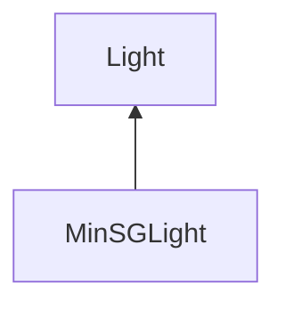

| public |
{:.api_label}

#### Inheritance Graph

## Description

## Public Functions

|
| ------: | ----------------- |
|  | |
|  | **[MinSGLight](#classMinSG_1_1PathTracing_1_1MinSGLight_1adb05d57e12bd460702fe2ef9102033b7)**( [LightNode](classMinSG_1_1LightNode) * node) |
|  | |
| [SampleResult](structMinSG_1_1PathTracing_1_1Light_1_1SampleResult) | **[sampleIncidentRadiance](#classMinSG_1_1PathTracing_1_1MinSGLight_1a1c3f6644083f3ba627952114f8f5ec7c)**(const [SurfacePoint](classMinSG_1_1PathTracing_1_1SurfacePoint) & surface, const [Geometry::Vec3](namespaceGeometry#namespaceGeometry_1ab29e4544da9b15b5bf224cbf5b691313) & sample) const |
|  | |
| bool | **[isDeltaLight](#classMinSG_1_1PathTracing_1_1MinSGLight_1a5326fbe732a952aba012faeb0f67c434)**() const |
{: .nohead .nowrap1 .api_section }

-------------------------------------------------------------------

## Documentation

### <small>function</small>  MinSG::PathTracing::MinSGLight::MinSGLight {#classMinSG_1_1PathTracing_1_1MinSGLight_1adb05d57e12bd460702fe2ef9102033b7}

| public |
{:.api_label}

|
| ------: | ----------------- |
|  |
|  **[MinSGLight](#classMinSG_1_1PathTracing_1_1MinSGLight_1adb05d57e12bd460702fe2ef9102033b7)**( |  [LightNode](classMinSG_1_1LightNode) * | **node** ) |
{: .nohead .nowrap1 .api_doc }

Defined in `MinSG/Ext/PathTracing/Light.h:51`{:style="float: right"}

-------------------------------------------------------------------

### <small>function</small>  MinSG::PathTracing::MinSGLight::sampleIncidentRadiance {#classMinSG_1_1PathTracing_1_1MinSGLight_1a1c3f6644083f3ba627952114f8f5ec7c}

| public | const | virtual |
{:.api_label}

|
| ------: | ----------------- |
|  |
| [SampleResult](structMinSG_1_1PathTracing_1_1Light_1_1SampleResult) **[sampleIncidentRadiance](#classMinSG_1_1PathTracing_1_1MinSGLight_1a1c3f6644083f3ba627952114f8f5ec7c)**( | const [SurfacePoint](classMinSG_1_1PathTracing_1_1SurfacePoint) & | **surface**, |
| | const [Geometry::Vec3](namespaceGeometry#namespaceGeometry_1ab29e4544da9b15b5bf224cbf5b691313) & | **sample** |
|   ) const |
{: .nohead .nowrap1 .api_doc }

Defined in `MinSG/Ext/PathTracing/Light.h:53`{:style="float: right"}

-------------------------------------------------------------------

### <small>function</small>  MinSG::PathTracing::MinSGLight::isDeltaLight {#classMinSG_1_1PathTracing_1_1MinSGLight_1a5326fbe732a952aba012faeb0f67c434}

| public | const | inline | virtual |
{:.api_label}

|
| ------: | ----------------- |
|  |
| bool **[isDeltaLight](#classMinSG_1_1PathTracing_1_1MinSGLight_1a5326fbe732a952aba012faeb0f67c434)**( |  ) const |
{: .nohead .nowrap1 .api_doc }

Defined in `MinSG/Ext/PathTracing/Light.h:54`{:style="float: right"}

-------------------------------------------------------------------

