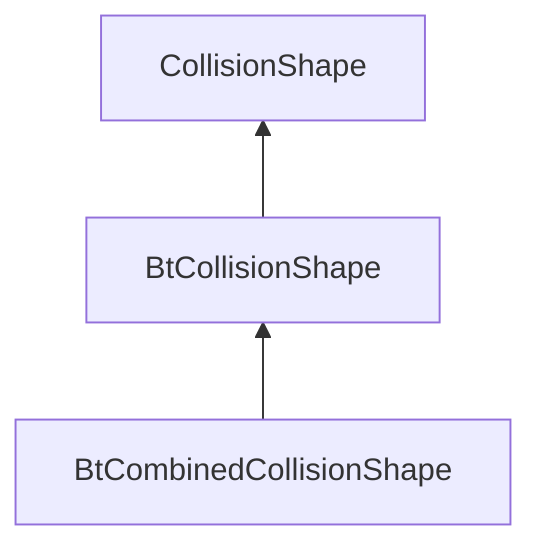

| public |
{:.api_label}

#### Inheritance Graph

## Description

## Public Functions

|
| ------: | ----------------- |
|  | |
|  | **[BtCollisionShape](#classMinSG_1_1Physics_1_1BtCollisionShape_1ad2577cf8408f05b7f327df5f66ca502c)**(btCollisionShape * _shape) |
|  | |
|  | **[BtCollisionShape](#classMinSG_1_1Physics_1_1BtCollisionShape_1a2cc8a6dbe7e83f0f2744b07a85aebdfb)**(const [BtCollisionShape](classMinSG_1_1Physics_1_1BtCollisionShape) & void) |
|  | |
|  | **[BtCollisionShape](#classMinSG_1_1Physics_1_1BtCollisionShape_1a78237e5caec0d845694f5b4b73034897)**( [BtCollisionShape](classMinSG_1_1Physics_1_1BtCollisionShape) && void) |
|  | |
|  | **[~BtCollisionShape](#classMinSG_1_1Physics_1_1BtCollisionShape_1ae8a149bf69576c3b81aca5ba0bf0f9b5)**() |
|  | |
| btCollisionShape * | **[getShape](#classMinSG_1_1Physics_1_1BtCollisionShape_1a13da5abf4626dc3673aef4ae8f789717)**() const |
{: .nohead .nowrap1 .api_section }

-------------------------------------------------------------------

## Documentation

### <small>function</small>  MinSG::Physics::BtCollisionShape::BtCollisionShape {#classMinSG_1_1Physics_1_1BtCollisionShape_1ad2577cf8408f05b7f327df5f66ca502c}

| public | inline |
{:.api_label}

|
| ------: | ----------------- |
|  |
|  **[BtCollisionShape](#classMinSG_1_1Physics_1_1BtCollisionShape_1ad2577cf8408f05b7f327df5f66ca502c)**( | btCollisionShape * | **_shape** ) |
{: .nohead .nowrap1 .api_doc }

Defined in `MinSG/Ext/Physics/Bullet/BtCollisionShape.h:29`{:style="float: right"}

-------------------------------------------------------------------

### <small>function</small>  MinSG::Physics::BtCollisionShape::BtCollisionShape {#classMinSG_1_1Physics_1_1BtCollisionShape_1a2cc8a6dbe7e83f0f2744b07a85aebdfb}

| public |
{:.api_label}

|
| ------: | ----------------- |
|  |
|  **[BtCollisionShape](#classMinSG_1_1Physics_1_1BtCollisionShape_1a2cc8a6dbe7e83f0f2744b07a85aebdfb)**( | const [BtCollisionShape](classMinSG_1_1Physics_1_1BtCollisionShape) & | **void** ) |
{: .nohead .nowrap1 .api_doc }

Defined in `MinSG/Ext/Physics/Bullet/BtCollisionShape.h:30`{:style="float: right"}

-------------------------------------------------------------------

### <small>function</small>  MinSG::Physics::BtCollisionShape::BtCollisionShape {#classMinSG_1_1Physics_1_1BtCollisionShape_1a78237e5caec0d845694f5b4b73034897}

| public |
{:.api_label}

|
| ------: | ----------------- |
|  |
|  **[BtCollisionShape](#classMinSG_1_1Physics_1_1BtCollisionShape_1a78237e5caec0d845694f5b4b73034897)**( |  [BtCollisionShape](classMinSG_1_1Physics_1_1BtCollisionShape) && | **void** ) |
{: .nohead .nowrap1 .api_doc }

Defined in `MinSG/Ext/Physics/Bullet/BtCollisionShape.h:31`{:style="float: right"}

-------------------------------------------------------------------

### <small>function</small>  MinSG::Physics::BtCollisionShape::~BtCollisionShape {#classMinSG_1_1Physics_1_1BtCollisionShape_1ae8a149bf69576c3b81aca5ba0bf0f9b5}

| public | inline | virtual |
{:.api_label}

|
| ------: | ----------------- |
|  |
|  **[~BtCollisionShape](#classMinSG_1_1Physics_1_1BtCollisionShape_1ae8a149bf69576c3b81aca5ba0bf0f9b5)**( |  ) |
{: .nohead .nowrap1 .api_doc }

Defined in `MinSG/Ext/Physics/Bullet/BtCollisionShape.h:32`{:style="float: right"}

-------------------------------------------------------------------

### <small>function</small>  MinSG::Physics::BtCollisionShape::getShape {#classMinSG_1_1Physics_1_1BtCollisionShape_1a13da5abf4626dc3673aef4ae8f789717}

| public | const | inline |
{:.api_label}

|
| ------: | ----------------- |
|  |
| btCollisionShape * **[getShape](#classMinSG_1_1Physics_1_1BtCollisionShape_1a13da5abf4626dc3673aef4ae8f789717)**( |  ) const |
{: .nohead .nowrap1 .api_doc }

Defined in `MinSG/Ext/Physics/Bullet/BtCollisionShape.h:33`{:style="float: right"}

-------------------------------------------------------------------

