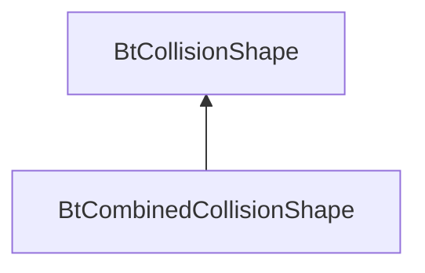

| public |
{:.api_label}

#### Inheritance Graph

## Description

## Public Functions

|
| ------: | ----------------- |
|  | |
|  | **[BtCombinedCollisionShape](#classMinSG_1_1Physics_1_1BtCombinedCollisionShape_1a7604730f80fef78ad71118af336389a9)**(btCollisionShape * _shape, std::vector< [Util::Reference](classUtil_1_1Reference) < [CollisionShape](classMinSG_1_1Physics_1_1CollisionShape) >> _children) |
|  | |
|  | **[~BtCombinedCollisionShape](#classMinSG_1_1Physics_1_1BtCombinedCollisionShape_1ad3197e4b2fbfeb0bb0fc780da7eefb3b)**() |
{: .nohead .nowrap1 .api_section }

-------------------------------------------------------------------

## Documentation

### <small>function</small>  MinSG::Physics::BtCombinedCollisionShape::BtCombinedCollisionShape {#classMinSG_1_1Physics_1_1BtCombinedCollisionShape_1a7604730f80fef78ad71118af336389a9}

| public | inline |
{:.api_label}

|
| ------: | ----------------- |
|  |
|  **[BtCombinedCollisionShape](#classMinSG_1_1Physics_1_1BtCombinedCollisionShape_1a7604730f80fef78ad71118af336389a9)**( | btCollisionShape * | **_shape**, |
| | std::vector< [Util::Reference](classUtil_1_1Reference) < [CollisionShape](classMinSG_1_1Physics_1_1CollisionShape) >> | **_children** |
|   ) |
{: .nohead .nowrap1 .api_doc }

Defined in `MinSG/Ext/Physics/Bullet/BtCollisionShape.h:40`{:style="float: right"}

-------------------------------------------------------------------

### <small>function</small>  MinSG::Physics::BtCombinedCollisionShape::~BtCombinedCollisionShape {#classMinSG_1_1Physics_1_1BtCombinedCollisionShape_1ad3197e4b2fbfeb0bb0fc780da7eefb3b}

| public | inline | virtual |
{:.api_label}

|
| ------: | ----------------- |
|  |
|  **[~BtCombinedCollisionShape](#classMinSG_1_1Physics_1_1BtCombinedCollisionShape_1ad3197e4b2fbfeb0bb0fc780da7eefb3b)**( |  ) |
{: .nohead .nowrap1 .api_doc }

Defined in `MinSG/Ext/Physics/Bullet/BtCollisionShape.h:42`{:style="float: right"}

-------------------------------------------------------------------

