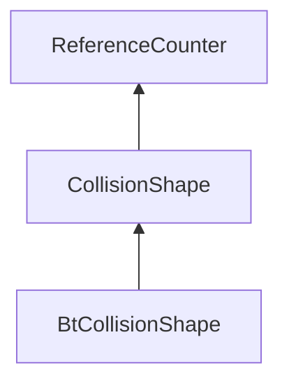

| public |
{:.api_label}

#### Inheritance Graph

## Description

## Public Functions

|
| ------: | ----------------- |
|  | |
|  | **[CollisionShape](#classMinSG_1_1Physics_1_1CollisionShape_1af85e2bb46294d6b0bc1990d8ca7cb902)**() |
|  | |
|  | **[CollisionShape](#classMinSG_1_1Physics_1_1CollisionShape_1a432cae3f31c9d899e575d73de294ecc4)**( [CollisionShape](classMinSG_1_1Physics_1_1CollisionShape) && void) |
|  | |
|  | **[~CollisionShape](#classMinSG_1_1Physics_1_1CollisionShape_1a7de07a362bc8c4233e79ecf8f5ec79ed)**() |
{: .nohead .nowrap1 .api_section }

-------------------------------------------------------------------

## Documentation

### <small>function</small>  MinSG::Physics::CollisionShape::CollisionShape {#classMinSG_1_1Physics_1_1CollisionShape_1af85e2bb46294d6b0bc1990d8ca7cb902}

| public |
{:.api_label}

|
| ------: | ----------------- |
|  |
|  **[CollisionShape](#classMinSG_1_1Physics_1_1CollisionShape_1af85e2bb46294d6b0bc1990d8ca7cb902)**( |  ) |
{: .nohead .nowrap1 .api_doc }

Defined in `MinSG/Ext/Physics/CollisionShape.h:21`{:style="float: right"}

-------------------------------------------------------------------

### <small>function</small>  MinSG::Physics::CollisionShape::CollisionShape {#classMinSG_1_1Physics_1_1CollisionShape_1a432cae3f31c9d899e575d73de294ecc4}

| public |
{:.api_label}

|
| ------: | ----------------- |
|  |
|  **[CollisionShape](#classMinSG_1_1Physics_1_1CollisionShape_1a432cae3f31c9d899e575d73de294ecc4)**( |  [CollisionShape](classMinSG_1_1Physics_1_1CollisionShape) && | **void** ) |
{: .nohead .nowrap1 .api_doc }

Defined in `MinSG/Ext/Physics/CollisionShape.h:22`{:style="float: right"}

-------------------------------------------------------------------

### <small>function</small>  MinSG::Physics::CollisionShape::~CollisionShape {#classMinSG_1_1Physics_1_1CollisionShape_1a7de07a362bc8c4233e79ecf8f5ec79ed}

| public | inline | virtual |
{:.api_label}

|
| ------: | ----------------- |
|  |
|  **[~CollisionShape](#classMinSG_1_1Physics_1_1CollisionShape_1a7de07a362bc8c4233e79ecf8f5ec79ed)**( |  ) |
{: .nohead .nowrap1 .api_doc }

Defined in `MinSG/Ext/Physics/CollisionShape.h:23`{:style="float: right"}

-------------------------------------------------------------------

