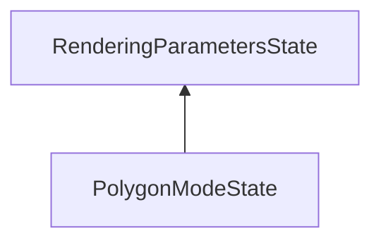

| public |
{:.api_label}

#### Inheritance Graph

## Description

## Public Functions

|
| ------: | ----------------- |
|  | |
|  | **[PolygonModeState](#classMinSG_1_1PolygonModeState_1afa4bcfee4d475c6aff464b03cb533209)**() |
|  | |
|  | **[PolygonModeState](#classMinSG_1_1PolygonModeState_1ad356fe3700826068fdab0ba853c9cdeb)**(const [Rendering::PolygonModeParameters](classRendering_1_1PolygonModeParameters) & newParameter) |
|  | |
|  | **[PolygonModeState](#classMinSG_1_1PolygonModeState_1add7c4eca7c69f749b1fe01dfc3009c97)**(const [PolygonModeState](classMinSG_1_1PolygonModeState) & other) |
|  | |
|  | **[~PolygonModeState](#classMinSG_1_1PolygonModeState_1af201127a6f78c6d122f14d6dc99ce4b3)**() |
|  | |
| [PolygonModeState](classMinSG_1_1PolygonModeState) * | **[clone](#classMinSG_1_1PolygonModeState_1a13d559998fcf6da60a6f7280fe892935)**() const   Create a duplicate of this [State](classMinSG_1_1State) object. |
{: .nohead .nowrap1 .api_section }

-------------------------------------------------------------------

## Documentation

### <small>function</small>  MinSG::PolygonModeState::PolygonModeState {#classMinSG_1_1PolygonModeState_1afa4bcfee4d475c6aff464b03cb533209}

| public | inline |
{:.api_label}

|
| ------: | ----------------- |
|  |
|  **[PolygonModeState](#classMinSG_1_1PolygonModeState_1afa4bcfee4d475c6aff464b03cb533209)**( |  ) |
{: .nohead .nowrap1 .api_doc }

Defined in `MinSG/Core/States/PolygonModeState.h:23`{:style="float: right"}

-------------------------------------------------------------------

### <small>function</small>  MinSG::PolygonModeState::PolygonModeState {#classMinSG_1_1PolygonModeState_1ad356fe3700826068fdab0ba853c9cdeb}

| public | inline | explicit |
{:.api_label}

|
| ------: | ----------------- |
|  |
|  **[PolygonModeState](#classMinSG_1_1PolygonModeState_1ad356fe3700826068fdab0ba853c9cdeb)**( | const [Rendering::PolygonModeParameters](classRendering_1_1PolygonModeParameters) & | **newParameter** ) |
{: .nohead .nowrap1 .api_doc }

Defined in `MinSG/Core/States/PolygonModeState.h:25`{:style="float: right"}

-------------------------------------------------------------------

### <small>function</small>  MinSG::PolygonModeState::PolygonModeState {#classMinSG_1_1PolygonModeState_1add7c4eca7c69f749b1fe01dfc3009c97}

| public | inline |
{:.api_label}

|
| ------: | ----------------- |
|  |
|  **[PolygonModeState](#classMinSG_1_1PolygonModeState_1add7c4eca7c69f749b1fe01dfc3009c97)**( | const [PolygonModeState](classMinSG_1_1PolygonModeState) & | **other** ) |
{: .nohead .nowrap1 .api_doc }

Defined in `MinSG/Core/States/PolygonModeState.h:27`{:style="float: right"}

-------------------------------------------------------------------

### <small>function</small>  MinSG::PolygonModeState::~PolygonModeState {#classMinSG_1_1PolygonModeState_1af201127a6f78c6d122f14d6dc99ce4b3}

| public | inline | virtual |
{:.api_label}

|
| ------: | ----------------- |
|  |
|  **[~PolygonModeState](#classMinSG_1_1PolygonModeState_1af201127a6f78c6d122f14d6dc99ce4b3)**( |  ) |
{: .nohead .nowrap1 .api_doc }

Defined in `MinSG/Core/States/PolygonModeState.h:29`{:style="float: right"}

-------------------------------------------------------------------

### <small>function</small>  MinSG::PolygonModeState::clone {#classMinSG_1_1PolygonModeState_1a13d559998fcf6da60a6f7280fe892935}

| public | const | inline | virtual |
{:.api_label}

|
| ------: | ----------------- |
|  |
| [PolygonModeState](classMinSG_1_1PolygonModeState) * **[clone](#classMinSG_1_1PolygonModeState_1a13d559998fcf6da60a6f7280fe892935)**( |  ) const |
{: .nohead .nowrap1 .api_doc }

Create a duplicate of this [State](classMinSG_1_1State) object.

Defined in `MinSG/Core/States/PolygonModeState.h:31`{:style="float: right"}

-------------------------------------------------------------------

