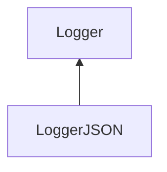

| public |
{:.api_label}

#### Inheritance Graph

## Description

[Logger](classMinSG_1_1Profiling_1_1Logger) for JSON formatted data.

## Public Functions

|
| ------: | ----------------- |
|  | |
|  | **[LoggerJSON](#classMinSG_1_1Profiling_1_1LoggerJSON_1a88484e2f67c6fc1107f4af4c5a616576)**(std::ostream & outputStream) |
|  | |
|  | **[~LoggerJSON](#classMinSG_1_1Profiling_1_1LoggerJSON_1a0a1b001181ad84930c2976d03975d5fb)**() |
|  | |
| void | **[log](#classMinSG_1_1Profiling_1_1LoggerJSON_1a387fd2dd569d3c6b6f78a2d9a1d9a9a5)**(const [Action](namespaceMinSG_1_1Profiling#namespaceMinSG_1_1Profiling_1a2610f94fd11c50fc69d1dd2f977c63d7) & action)   Create formatted output for the given action. |
{: .nohead .nowrap1 .api_section }

-------------------------------------------------------------------

## Documentation

### <small>function</small>  MinSG::Profiling::LoggerJSON::LoggerJSON {#classMinSG_1_1Profiling_1_1LoggerJSON_1a88484e2f67c6fc1107f4af4c5a616576}

| public |
{:.api_label}

|
| ------: | ----------------- |
|  |
|  **[LoggerJSON](#classMinSG_1_1Profiling_1_1LoggerJSON_1a88484e2f67c6fc1107f4af4c5a616576)**( | std::ostream & | **outputStream** ) |
{: .nohead .nowrap1 .api_doc }

Defined in `MinSG/Ext/Profiling/Logger.h:41`{:style="float: right"}

-------------------------------------------------------------------

### <small>function</small>  MinSG::Profiling::LoggerJSON::~LoggerJSON {#classMinSG_1_1Profiling_1_1LoggerJSON_1a0a1b001181ad84930c2976d03975d5fb}

| public | virtual |
{:.api_label}

|
| ------: | ----------------- |
|  |
|  **[~LoggerJSON](#classMinSG_1_1Profiling_1_1LoggerJSON_1a0a1b001181ad84930c2976d03975d5fb)**( |  ) |
{: .nohead .nowrap1 .api_doc }

Defined in `MinSG/Ext/Profiling/Logger.h:42`{:style="float: right"}

-------------------------------------------------------------------

### <small>function</small>  MinSG::Profiling::LoggerJSON::log {#classMinSG_1_1Profiling_1_1LoggerJSON_1a387fd2dd569d3c6b6f78a2d9a1d9a9a5}

| public | virtual |
{:.api_label}

|
| ------: | ----------------- |
|  |
| void **[log](#classMinSG_1_1Profiling_1_1LoggerJSON_1a387fd2dd569d3c6b6f78a2d9a1d9a9a5)**( | const [Action](namespaceMinSG_1_1Profiling#namespaceMinSG_1_1Profiling_1a2610f94fd11c50fc69d1dd2f977c63d7) & | **action** ) |
{: .nohead .nowrap1 .api_doc }

Create formatted output for the given action.

Defined in `MinSG/Ext/Profiling/Logger.h:44`{:style="float: right"}

-------------------------------------------------------------------

