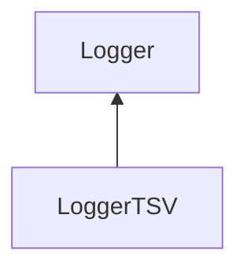

| public |
{:.api_label}

#### Inheritance Graph

## Description

[Logger](classMinSG_1_1Profiling_1_1Logger) for tab-separated values.

## Public Functions

|
| ------: | ----------------- |
|  | |
|  | **[LoggerTSV](#classMinSG_1_1Profiling_1_1LoggerTSV_1a21ff57061c291d4cbeb690fde0a9a125)**(std::ostream & outputStream) |
|  | |
|  | **[~LoggerTSV](#classMinSG_1_1Profiling_1_1LoggerTSV_1a29a53ef5b68ac88f108a6c766b2813a7)**() |
|  | |
| void | **[addColumn](#classMinSG_1_1Profiling_1_1LoggerTSV_1ad5d28504b2ce78871b15b12452b6b711)**(const [Util::StringIdentifier](classUtil_1_1StringIdentifier) & columnName) |
|  | |
| void | **[log](#classMinSG_1_1Profiling_1_1LoggerTSV_1a8dcfd731a25986133e8bfeabcfe7d996)**(const [Action](namespaceMinSG_1_1Profiling#namespaceMinSG_1_1Profiling_1a2610f94fd11c50fc69d1dd2f977c63d7) & action)   Create formatted output for the given action. |
{: .nohead .nowrap1 .api_section }

-------------------------------------------------------------------

## Documentation

### <small>function</small>  MinSG::Profiling::LoggerTSV::LoggerTSV {#classMinSG_1_1Profiling_1_1LoggerTSV_1a21ff57061c291d4cbeb690fde0a9a125}

| public |
{:.api_label}

|
| ------: | ----------------- |
|  |
|  **[LoggerTSV](#classMinSG_1_1Profiling_1_1LoggerTSV_1a21ff57061c291d4cbeb690fde0a9a125)**( | std::ostream & | **outputStream** ) |
{: .nohead .nowrap1 .api_doc }

Create a new logger for tab-separated values. All entries in the output file will be formatted by means of a predefined set of columns. Before logging any actions, the default set can be extended (see [addColumn()](classMinSG_1_1Profiling_1_1LoggerTSV#classMinSG_1_1Profiling_1_1LoggerTSV_1ad5d28504b2ce78871b15b12452b6b711) ). At the beginning, the default columns are ATTR_description, ATTR_memoryBegin ATTR_memoryEnd, ATTR_timeBegin, and ATTR_timeEnd.

Defined in `MinSG/Ext/Profiling/Logger.h:72`{:style="float: right"}

-------------------------------------------------------------------

### <small>function</small>  MinSG::Profiling::LoggerTSV::~LoggerTSV {#classMinSG_1_1Profiling_1_1LoggerTSV_1a29a53ef5b68ac88f108a6c766b2813a7}

| public | virtual |
{:.api_label}

|
| ------: | ----------------- |
|  |
|  **[~LoggerTSV](#classMinSG_1_1Profiling_1_1LoggerTSV_1a29a53ef5b68ac88f108a6c766b2813a7)**( |  ) |
{: .nohead .nowrap1 .api_doc }

Defined in `MinSG/Ext/Profiling/Logger.h:73`{:style="float: right"}

-------------------------------------------------------------------

### <small>function</small>  MinSG::Profiling::LoggerTSV::addColumn {#classMinSG_1_1Profiling_1_1LoggerTSV_1ad5d28504b2ce78871b15b12452b6b711}

| public |
{:.api_label}

|
| ------: | ----------------- |
|  |
| void **[addColumn](#classMinSG_1_1Profiling_1_1LoggerTSV_1ad5d28504b2ce78871b15b12452b6b711)**( | const [Util::StringIdentifier](classUtil_1_1StringIdentifier) & | **columnName** ) |
{: .nohead .nowrap1 .api_doc }

Add a column to the set of columns used for formatting the actions that are logged.

#### Parameters
**columnName**
:  String identifier that is used in actions later on

Defined in `MinSG/Ext/Profiling/Logger.h:81`{:style="float: right"}

-------------------------------------------------------------------

### <small>function</small>  MinSG::Profiling::LoggerTSV::log {#classMinSG_1_1Profiling_1_1LoggerTSV_1a8dcfd731a25986133e8bfeabcfe7d996}

| public | virtual |
{:.api_label}

|
| ------: | ----------------- |
|  |
| void **[log](#classMinSG_1_1Profiling_1_1LoggerTSV_1a8dcfd731a25986133e8bfeabcfe7d996)**( | const [Action](namespaceMinSG_1_1Profiling#namespaceMinSG_1_1Profiling_1a2610f94fd11c50fc69d1dd2f977c63d7) & | **action** ) |
{: .nohead .nowrap1 .api_doc }

Create formatted output for the given action.

Defined in `MinSG/Ext/Profiling/Logger.h:83`{:style="float: right"}

-------------------------------------------------------------------

