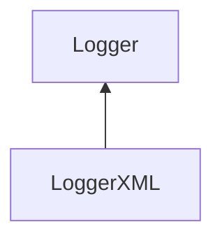

| public |
{:.api_label}

#### Inheritance Graph

## Description

[Logger](classMinSG_1_1Profiling_1_1Logger) for XML formatted data.

## Public Functions

|
| ------: | ----------------- |
|  | |
|  | **[LoggerXML](#classMinSG_1_1Profiling_1_1LoggerXML_1ab0fb09d89a55e00a71bc4e97e57dcae0)**(std::ostream & outputStream) |
|  | |
|  | **[~LoggerXML](#classMinSG_1_1Profiling_1_1LoggerXML_1a820231af9459020a0a7fb29938a96a67)**() |
|  | |
| void | **[log](#classMinSG_1_1Profiling_1_1LoggerXML_1ad54eeeb038bceff1891207f9ac582d3c)**(const [Action](namespaceMinSG_1_1Profiling#namespaceMinSG_1_1Profiling_1a2610f94fd11c50fc69d1dd2f977c63d7) & action)   Create formatted output for the given action. |
{: .nohead .nowrap1 .api_section }

-------------------------------------------------------------------

## Documentation

### <small>function</small>  MinSG::Profiling::LoggerXML::LoggerXML {#classMinSG_1_1Profiling_1_1LoggerXML_1ab0fb09d89a55e00a71bc4e97e57dcae0}

| public |
{:.api_label}

|
| ------: | ----------------- |
|  |
|  **[LoggerXML](#classMinSG_1_1Profiling_1_1LoggerXML_1ab0fb09d89a55e00a71bc4e97e57dcae0)**( | std::ostream & | **outputStream** ) |
{: .nohead .nowrap1 .api_doc }

Defined in `MinSG/Ext/Profiling/Logger.h:89`{:style="float: right"}

-------------------------------------------------------------------

### <small>function</small>  MinSG::Profiling::LoggerXML::~LoggerXML {#classMinSG_1_1Profiling_1_1LoggerXML_1a820231af9459020a0a7fb29938a96a67}

| public | virtual |
{:.api_label}

|
| ------: | ----------------- |
|  |
|  **[~LoggerXML](#classMinSG_1_1Profiling_1_1LoggerXML_1a820231af9459020a0a7fb29938a96a67)**( |  ) |
{: .nohead .nowrap1 .api_doc }

Defined in `MinSG/Ext/Profiling/Logger.h:90`{:style="float: right"}

-------------------------------------------------------------------

### <small>function</small>  MinSG::Profiling::LoggerXML::log {#classMinSG_1_1Profiling_1_1LoggerXML_1ad54eeeb038bceff1891207f9ac582d3c}

| public | virtual |
{:.api_label}

|
| ------: | ----------------- |
|  |
| void **[log](#classMinSG_1_1Profiling_1_1LoggerXML_1ad54eeeb038bceff1891207f9ac582d3c)**( | const [Action](namespaceMinSG_1_1Profiling#namespaceMinSG_1_1Profiling_1a2610f94fd11c50fc69d1dd2f977c63d7) & | **action** ) |
{: .nohead .nowrap1 .api_doc }

Create formatted output for the given action.

Defined in `MinSG/Ext/Profiling/Logger.h:92`{:style="float: right"}

-------------------------------------------------------------------

