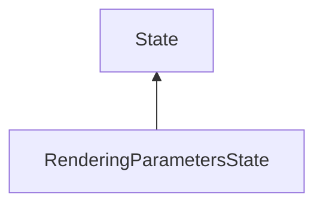

| public |
{:.api_label}

#### Inheritance Graph

## Description

Base class for states that change rendering parameters.

Abstract base class for states that hold rendering parameters. These states change the rendering parameters when enabled, and revert the change when disabled.

**Author**: Benjamin Eikel

**Date**: 2012-02-21

## Public Functions

|
| ------: | ----------------- |
|  | |
|  | **[RenderingParametersState](#classMinSG_1_1RenderingParametersState_1a1896bdc05cc5a0c33a9dca9877dd6957)**() |
|  | |
|  | **[RenderingParametersState](#classMinSG_1_1RenderingParametersState_1a03c9405b5d973833b5ce6e55c912a598)**(RenderingParameters newParameters) |
|  | |
|  | **[RenderingParametersState](#classMinSG_1_1RenderingParametersState_1a7672096cf13af7b1e141c610f3369cdf)**(const [RenderingParametersState](classMinSG_1_1RenderingParametersState) & other) |
|  | |
|  | **[~RenderingParametersState](#classMinSG_1_1RenderingParametersState_1a7e5471cd0882c915037f5e511741e400)**() |
|  | |
| RenderingParameters & | **[changeParameters](#classMinSG_1_1RenderingParametersState_1a9f99e77623b61900f73bed81992f16d4)**() |
|  | |
| const RenderingParameters & | **[getParameters](#classMinSG_1_1RenderingParametersState_1abc0891cd567b279a86f85f978452b010)**() const |
|  | |
| void | **[setParameters](#classMinSG_1_1RenderingParametersState_1a4e9f8bfdd58c370bb046aef0945335c4)**(const RenderingParameters & newParameters) |
{: .nohead .nowrap1 .api_section }

-------------------------------------------------------------------

## Documentation

### <small>function</small>  MinSG::RenderingParametersState::RenderingParametersState {#classMinSG_1_1RenderingParametersState_1a1896bdc05cc5a0c33a9dca9877dd6957}

| public | inline |
{:.api_label}

|
| ------: | ----------------- |
|  |
|  **[RenderingParametersState](#classMinSG_1_1RenderingParametersState_1a1896bdc05cc5a0c33a9dca9877dd6957)**( |  ) |
{: .nohead .nowrap1 .api_doc }

Defined in `MinSG/Core/States/RenderingParametersState.h:36`{:style="float: right"}

-------------------------------------------------------------------

### <small>function</small>  MinSG::RenderingParametersState::RenderingParametersState {#classMinSG_1_1RenderingParametersState_1a03c9405b5d973833b5ce6e55c912a598}

| public | inline | explicit |
{:.api_label}

|
| ------: | ----------------- |
|  |
|  **[RenderingParametersState](#classMinSG_1_1RenderingParametersState_1a03c9405b5d973833b5ce6e55c912a598)**( | RenderingParameters | **newParameters** ) |
{: .nohead .nowrap1 .api_doc }

Defined in `MinSG/Core/States/RenderingParametersState.h:38`{:style="float: right"}

-------------------------------------------------------------------

### <small>function</small>  MinSG::RenderingParametersState::RenderingParametersState {#classMinSG_1_1RenderingParametersState_1a7672096cf13af7b1e141c610f3369cdf}

| public | inline |
{:.api_label}

|
| ------: | ----------------- |
|  |
|  **[RenderingParametersState](#classMinSG_1_1RenderingParametersState_1a7672096cf13af7b1e141c610f3369cdf)**( | const [RenderingParametersState](classMinSG_1_1RenderingParametersState) & | **other** ) |
{: .nohead .nowrap1 .api_doc }

Defined in `MinSG/Core/States/RenderingParametersState.h:40`{:style="float: right"}

-------------------------------------------------------------------

### <small>function</small>  MinSG::RenderingParametersState::~RenderingParametersState {#classMinSG_1_1RenderingParametersState_1a7e5471cd0882c915037f5e511741e400}

| public | inline | virtual |
{:.api_label}

|
| ------: | ----------------- |
|  |
|  **[~RenderingParametersState](#classMinSG_1_1RenderingParametersState_1a7e5471cd0882c915037f5e511741e400)**( |  ) |
{: .nohead .nowrap1 .api_doc }

Defined in `MinSG/Core/States/RenderingParametersState.h:42`{:style="float: right"}

-------------------------------------------------------------------

### <small>function</small>  MinSG::RenderingParametersState::changeParameters {#classMinSG_1_1RenderingParametersState_1a9f99e77623b61900f73bed81992f16d4}

| public | inline |
{:.api_label}

|
| ------: | ----------------- |
|  |
| RenderingParameters & **[changeParameters](#classMinSG_1_1RenderingParametersState_1a9f99e77623b61900f73bed81992f16d4)**( |  ) |
{: .nohead .nowrap1 .api_doc }

Defined in `MinSG/Core/States/RenderingParametersState.h:45`{:style="float: right"}

-------------------------------------------------------------------

### <small>function</small>  MinSG::RenderingParametersState::getParameters {#classMinSG_1_1RenderingParametersState_1abc0891cd567b279a86f85f978452b010}

| public | const | inline |
{:.api_label}

|
| ------: | ----------------- |
|  |
| const RenderingParameters & **[getParameters](#classMinSG_1_1RenderingParametersState_1abc0891cd567b279a86f85f978452b010)**( |  ) const |
{: .nohead .nowrap1 .api_doc }

Defined in `MinSG/Core/States/RenderingParametersState.h:48`{:style="float: right"}

-------------------------------------------------------------------

### <small>function</small>  MinSG::RenderingParametersState::setParameters {#classMinSG_1_1RenderingParametersState_1a4e9f8bfdd58c370bb046aef0945335c4}

| public | inline |
{:.api_label}

|
| ------: | ----------------- |
|  |
| void **[setParameters](#classMinSG_1_1RenderingParametersState_1a4e9f8bfdd58c370bb046aef0945335c4)**( | const RenderingParameters & | **newParameters** ) |
{: .nohead .nowrap1 .api_doc }

Defined in `MinSG/Core/States/RenderingParametersState.h:51`{:style="float: right"}

-------------------------------------------------------------------

