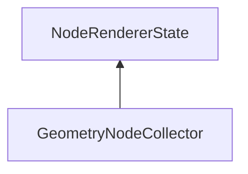

| public |
{:.api_label}

#### Inheritance Graph

## Description

 [State](classMinSG_1_1State) to collect the GeometryNodes that are going through a rendering channel. The set of collected nodes can be retrieved at any time. It is cleared when the state is activated. If combined with a culling renderer, this state can be used to collect the potentially visible set (PVS) that is created by the culling renderer.

**Author**: Benjamin Eikel

**Date**: 2013-06-26

## Protected Functions

|
| ------: | ----------------- |
|  | |
| [stateResult_t](classMinSG_1_1State#classMinSG_1_1State_1a845dea0cc4734d4e6e1ddad95d29e6c1) | **[doEnableState](#classMinSG_1_1SVS_1_1GeometryNodeCollector_1a3277caf6d647d129f126ab37dd87caa7)**( [FrameContext](classMinSG_1_1FrameContext) & context,  [Node](classMinSG_1_1Node) * node, const [RenderParam](classMinSG_1_1RenderParam) & rp)   Clear the set of collected nodes. |
{: .nohead .nowrap1 .api_section }

## Public Functions

|
| ------: | ----------------- |
|  | |
|  | **[GeometryNodeCollector](#classMinSG_1_1SVS_1_1GeometryNodeCollector_1ad58bd105f94a13e4488959b45a184661)**() |
|  | |
| [GeometryNodeCollector](classMinSG_1_1SVS_1_1GeometryNodeCollector) * | **[clone](#classMinSG_1_1SVS_1_1GeometryNodeCollector_1a3169556409d386d9ecd6bd9da93c19db)**() const   Create a duplicate of this [State](classMinSG_1_1State) object. |
|  | |
| const std::unordered_set< [GeometryNode](classMinSG_1_1GeometryNode) * > & | **[getCollectedNodes](#classMinSG_1_1SVS_1_1GeometryNodeCollector_1ad76a0260c82631b785cedc2bbefed1f2)**() const   Read the set of collected nodes. |
{: .nohead .nowrap1 .api_section }

-------------------------------------------------------------------

## Documentation

### <small>function</small>  MinSG::SVS::GeometryNodeCollector::doEnableState {#classMinSG_1_1SVS_1_1GeometryNodeCollector_1a3277caf6d647d129f126ab37dd87caa7}

| protected | virtual |
{:.api_label}

|
| ------: | ----------------- |
|  |
| [stateResult_t](classMinSG_1_1State#classMinSG_1_1State_1a845dea0cc4734d4e6e1ddad95d29e6c1) **[doEnableState](#classMinSG_1_1SVS_1_1GeometryNodeCollector_1a3277caf6d647d129f126ab37dd87caa7)**( |  [FrameContext](classMinSG_1_1FrameContext) & | **context**, |
| |  [Node](classMinSG_1_1Node) * | **node**, |
| | const [RenderParam](classMinSG_1_1RenderParam) & | **rp** |
|   ) |
{: .nohead .nowrap1 .api_doc }

Clear the set of collected nodes.

Defined in `MinSG/Ext/SVS/GeometryNodeCollector.h:48`{:style="float: right"}

-------------------------------------------------------------------

### <small>function</small>  MinSG::SVS::GeometryNodeCollector::GeometryNodeCollector {#classMinSG_1_1SVS_1_1GeometryNodeCollector_1ad58bd105f94a13e4488959b45a184661}

| public |
{:.api_label}

|
| ------: | ----------------- |
|  |
|  **[GeometryNodeCollector](#classMinSG_1_1SVS_1_1GeometryNodeCollector_1ad58bd105f94a13e4488959b45a184661)**( |  ) |
{: .nohead .nowrap1 .api_doc }

Defined in `MinSG/Ext/SVS/GeometryNodeCollector.h:51`{:style="float: right"}

-------------------------------------------------------------------

### <small>function</small>  MinSG::SVS::GeometryNodeCollector::clone {#classMinSG_1_1SVS_1_1GeometryNodeCollector_1a3169556409d386d9ecd6bd9da93c19db}

| public | const | virtual |
{:.api_label}

|
| ------: | ----------------- |
|  |
| [GeometryNodeCollector](classMinSG_1_1SVS_1_1GeometryNodeCollector) * **[clone](#classMinSG_1_1SVS_1_1GeometryNodeCollector_1a3169556409d386d9ecd6bd9da93c19db)**( |  ) const |
{: .nohead .nowrap1 .api_doc }

Create a duplicate of this [State](classMinSG_1_1State) object.

Defined in `MinSG/Ext/SVS/GeometryNodeCollector.h:53`{:style="float: right"}

-------------------------------------------------------------------

### <small>function</small>  MinSG::SVS::GeometryNodeCollector::getCollectedNodes {#classMinSG_1_1SVS_1_1GeometryNodeCollector_1ad76a0260c82631b785cedc2bbefed1f2}

| public | const | inline |
{:.api_label}

|
| ------: | ----------------- |
|  |
| const std::unordered_set< [GeometryNode](classMinSG_1_1GeometryNode) * > & **[getCollectedNodes](#classMinSG_1_1SVS_1_1GeometryNodeCollector_1ad76a0260c82631b785cedc2bbefed1f2)**( |  ) const |
{: .nohead .nowrap1 .api_doc }

Read the set of collected nodes.

Defined in `MinSG/Ext/SVS/GeometryNodeCollector.h:56`{:style="float: right"}

-------------------------------------------------------------------

