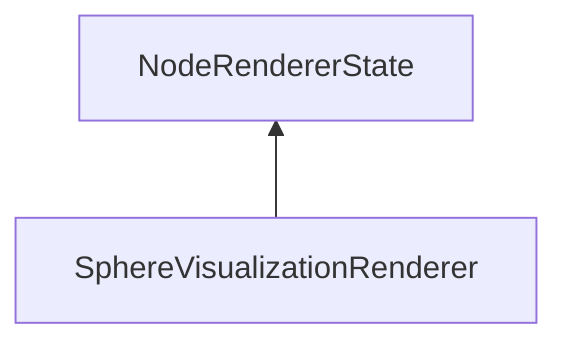

| public |
{:.api_label}

#### Inheritance Graph

## Description

 [Renderer](classMinSG_1_1SVS_1_1Renderer) that uses preprocessed visibility information. This information has to be attached to the nodes that are to be rendered. By using this information, occlusion culling is performed.

**Author**: Benjamin Eikel

**Date**: 2013-11-28

## Public Functions

|
| ------: | ----------------- |
|  | |
|  | **[SphereVisualizationRenderer](#classMinSG_1_1SVS_1_1SphereVisualizationRenderer_1a873611ee118afc2b3bf139e4f00cd387)**() |
|  | |
| [SphereVisualizationRenderer](classMinSG_1_1SVS_1_1SphereVisualizationRenderer) * | **[clone](#classMinSG_1_1SVS_1_1SphereVisualizationRenderer_1a19514631f390ba352389ebbd76e0aa21)**() const   Create a duplicate of this [State](classMinSG_1_1State) object. |
{: .nohead .nowrap1 .api_section }

-------------------------------------------------------------------

## Documentation

### <small>function</small>  MinSG::SVS::SphereVisualizationRenderer::SphereVisualizationRenderer {#classMinSG_1_1SVS_1_1SphereVisualizationRenderer_1a873611ee118afc2b3bf139e4f00cd387}

| public |
{:.api_label}

|
| ------: | ----------------- |
|  |
|  **[SphereVisualizationRenderer](#classMinSG_1_1SVS_1_1SphereVisualizationRenderer_1a873611ee118afc2b3bf139e4f00cd387)**( |  ) |
{: .nohead .nowrap1 .api_doc }

Defined in `MinSG/Ext/SVS/SphereVisualizationRenderer.h:37`{:style="float: right"}

-------------------------------------------------------------------

### <small>function</small>  MinSG::SVS::SphereVisualizationRenderer::clone {#classMinSG_1_1SVS_1_1SphereVisualizationRenderer_1a19514631f390ba352389ebbd76e0aa21}

| public | const | virtual |
{:.api_label}

|
| ------: | ----------------- |
|  |
| [SphereVisualizationRenderer](classMinSG_1_1SVS_1_1SphereVisualizationRenderer) * **[clone](#classMinSG_1_1SVS_1_1SphereVisualizationRenderer_1a19514631f390ba352389ebbd76e0aa21)**( |  ) const |
{: .nohead .nowrap1 .api_doc }

Create a duplicate of this [State](classMinSG_1_1State) object.

Defined in `MinSG/Ext/SVS/SphereVisualizationRenderer.h:39`{:style="float: right"}

-------------------------------------------------------------------

