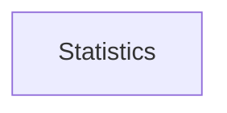

| public |
{:.api_label}

#### Inheritance Graph

## Description

Singleton holder object for [SVS](namespaceMinSG_1_1SVS) related counters.

## Public Static Functions

|
| ------: | ----------------- |
|  | |
| [Statistics](classMinSG_1_1SVS_1_1Statistics) & | **[instance](#classMinSG_1_1SVS_1_1Statistics_1a3d44c5f5456398063931aad136d9fa32)**( [MinSG::Statistics](classMinSG_1_1Statistics) & statistics)   Return singleton instance. |
{: .nohead .nowrap1 .api_section }

## Public Functions

|
| ------: | ----------------- |
|  | |
| uint32_t | **[getVisitedSpheresCounter](#classMinSG_1_1SVS_1_1Statistics_1a6c6bd140cab55da0bde7f4e7d20d7ce7)**() const |
|  | |
| uint32_t | **[getEnteredSpheresCounter](#classMinSG_1_1SVS_1_1Statistics_1aad3ada4c4046d76883c962e487fac6d9)**() const |
{: .nohead .nowrap1 .api_section }

-------------------------------------------------------------------

## Documentation

### <small>function</small>  MinSG::SVS::Statistics::instance {#classMinSG_1_1SVS_1_1Statistics_1a3d44c5f5456398063931aad136d9fa32}

| public | static |
{:.api_label}

|
| ------: | ----------------- |
|  |
| [Statistics](classMinSG_1_1SVS_1_1Statistics) & **[instance](#classMinSG_1_1SVS_1_1Statistics_1a3d44c5f5456398063931aad136d9fa32)**( |  [MinSG::Statistics](classMinSG_1_1Statistics) & | **statistics** ) |
{: .nohead .nowrap1 .api_doc }

Return singleton instance.

Defined in `MinSG/Ext/SVS/Statistics.h:35`{:style="float: right"}

-------------------------------------------------------------------

### <small>function</small>  MinSG::SVS::Statistics::getVisitedSpheresCounter {#classMinSG_1_1SVS_1_1Statistics_1a6c6bd140cab55da0bde7f4e7d20d7ce7}

| public | const | inline |
{:.api_label}

|
| ------: | ----------------- |
|  |
| uint32_t **[getVisitedSpheresCounter](#classMinSG_1_1SVS_1_1Statistics_1a6c6bd140cab55da0bde7f4e7d20d7ce7)**( |  ) const |
{: .nohead .nowrap1 .api_doc }

Defined in `MinSG/Ext/SVS/Statistics.h:37`{:style="float: right"}

-------------------------------------------------------------------

### <small>function</small>  MinSG::SVS::Statistics::getEnteredSpheresCounter {#classMinSG_1_1SVS_1_1Statistics_1aad3ada4c4046d76883c962e487fac6d9}

| public | const | inline |
{:.api_label}

|
| ------: | ----------------- |
|  |
| uint32_t **[getEnteredSpheresCounter](#classMinSG_1_1SVS_1_1Statistics_1aad3ada4c4046d76883c962e487fac6d9)**( |  ) const |
{: .nohead .nowrap1 .api_doc }

Defined in `MinSG/Ext/SVS/Statistics.h:40`{:style="float: right"}

-------------------------------------------------------------------

