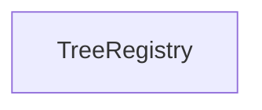

| public |
{:.api_label}

#### Inheritance Graph

```mermaid
graph BT
	TreeRegistry
	click TreeRegistry "classMinSG_1_1SceneManagement_1_1TreeRegistry"
```

## Description

-------------------------------------------------------------------

