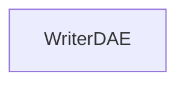

| public |
{:.api_label}

#### Inheritance Graph

## Description

Class to save a COLLAborative Design Activity (COLLADA) stored inside a Digital Asset Exchange (DAE) XML document.

**Author**: Benjamin Eikel

**Date**: 2009-08-08

*See also*: [http://www.khronos.org/collada/](http://www.khronos.org/collada/)

## Public Static Functions

|
| ------: | ----------------- |
|  | |
| bool | **[saveFile](#classMinSG_1_1SceneManagement_1_1WriterDAE_1a0409ca22cd85db94dd2cb7b4515aeefd)**(const [Util::FileName](classUtil_1_1FileName) & fileName,  [Node](classMinSG_1_1Node) * scene) |
{: .nohead .nowrap1 .api_section }

-------------------------------------------------------------------

## Documentation

### <small>function</small>  MinSG::SceneManagement::WriterDAE::saveFile {#classMinSG_1_1SceneManagement_1_1WriterDAE_1a0409ca22cd85db94dd2cb7b4515aeefd}

| public | static |
{:.api_label}

|
| ------: | ----------------- |
|  |
| bool **[saveFile](#classMinSG_1_1SceneManagement_1_1WriterDAE_1a0409ca22cd85db94dd2cb7b4515aeefd)**( | const [Util::FileName](classUtil_1_1FileName) & | **fileName**, |
| |  [Node](classMinSG_1_1Node) * | **scene** |
|   ) |
{: .nohead .nowrap1 .api_doc }

Save the scene given by its root node to a document given by its file name.

#### Parameters
**fileName**
:  File name of the file to save. If empty, output the data to standard output.

**scene**
:  Root node of the scene graph

#### Returns
`true`on success,`false`otherwise

Defined in `MinSG/SceneManagement/Exporter/WriterDAE.h:51`{:style="float: right"}

-------------------------------------------------------------------

