| public | abstract |
{:.api_label}

#### Inheritance Graph

```mermaid
graph BT
	State
	State --> ReferenceCounter
	State --> AttributeProvider
	CHCppRenderer --> State
	CHCRenderer --> State
	EnvironmentState --> State
	GroupState --> State
	HOMRenderer --> State
	LightingState --> State
	AlgoSelector --> State
	MirrorState --> State
	NaiveOccRenderer --> State
	NodeRendererState --> State
	OccludeeRenderer --> State
	OccRenderer --> State
	Collector --> State
	RandomColorRenderer --> State
	RenderingParametersState --> State
	ShaderState --> State
	ShaderUniformState --> State
	ShadowState --> State
	SkyboxState --> State
	StrangeExampleRenderer --> State
	TextureState --> State
	TreeVisualization --> State
	TwinPartitionsRenderer --> State
	PVSRenderer --> State
	VisibilitySubdivisionRenderer --> State
	RenderingParametersState --> State
	RenderingParametersState --> State
	RenderingParametersState --> State
	RenderingParametersState --> State
	RenderingParametersState --> State
	RenderingParametersState --> State
	click State "classMinSG_1_1State"
	click ReferenceCounter "classUtil_1_1ReferenceCounter"
	click AttributeProvider "classUtil_1_1AttributeProvider"
	click CHCppRenderer "classMinSG_1_1CHCppRenderer"
	click CHCRenderer "classMinSG_1_1CHCRenderer"
	click EnvironmentState "classMinSG_1_1EnvironmentState"
	click GroupState "classMinSG_1_1GroupState"
	click HOMRenderer "classMinSG_1_1HOMRenderer"
	click LightingState "classMinSG_1_1LightingState"
	click AlgoSelector "classMinSG_1_1MAR_1_1AlgoSelector"
	click MirrorState "classMinSG_1_1MirrorState"
	click NaiveOccRenderer "classMinSG_1_1NaiveOccRenderer"
	click NodeRendererState "classMinSG_1_1NodeRendererState"
	click OccludeeRenderer "classMinSG_1_1OccludeeRenderer"
	click OccRenderer "classMinSG_1_1OccRenderer"
	click Collector "classMinSG_1_1PipelineStatistics_1_1Collector"
	click RandomColorRenderer "classMinSG_1_1RandomColorRenderer"
	click RenderingParametersState "classMinSG_1_1RenderingParametersState"
	click ShaderState "classMinSG_1_1ShaderState"
	click ShaderUniformState "classMinSG_1_1ShaderUniformState"
	click ShadowState "classMinSG_1_1ShadowState"
	click SkyboxState "classMinSG_1_1SkyboxState"
	click StrangeExampleRenderer "classMinSG_1_1StrangeExampleRenderer"
	click TextureState "classMinSG_1_1TextureState"
	click TreeVisualization "classMinSG_1_1TriangleTrees_1_1TreeVisualization"
	click TwinPartitionsRenderer "classMinSG_1_1TwinPartitions_1_1TwinPartitionsRenderer"
	click PVSRenderer "classMinSG_1_1VisibilitySubdivision_1_1PVSRenderer"
	click VisibilitySubdivisionRenderer "classMinSG_1_1VisibilitySubdivision_1_1VisibilitySubdivisionRenderer"
	click RenderingParametersState "classMinSG_1_1RenderingParametersState"
	click RenderingParametersState "classMinSG_1_1RenderingParametersState"
	click RenderingParametersState "classMinSG_1_1RenderingParametersState"
	click RenderingParametersState "classMinSG_1_1RenderingParametersState"
	click RenderingParametersState "classMinSG_1_1RenderingParametersState"
	click RenderingParametersState "classMinSG_1_1RenderingParametersState"
```

## Description

Representation of a state, that can be bound to a node.

## Rendering layers

|
| ------: | ----------------- |
|  | |
| [renderingLayerMask_t](group%5F%5Fhelper#group%5F%5Fhelper_1ga30f7dde035c18fc6d65d6a663d794ab3) | **[getRenderingLayers](#classMinSG_1_1State_1a4f41c87e631b910bb952551ed9028e27)**() const |
|  | |
| void | **[setRenderingLayers](#classMinSG_1_1State_1ab7ac493c1e611d54f7327a2954bcc84d)**( [renderingLayerMask_t](group%5F%5Fhelper#group%5F%5Fhelper_1ga30f7dde035c18fc6d65d6a663d794ab3)  l) |
|  | |
| bool | **[testRenderingLayer](#classMinSG_1_1State_1ad7ce5e0e7bdd41436c740ba261b13b44)**( [renderingLayerMask_t](group%5F%5Fhelper#group%5F%5Fhelper_1ga30f7dde035c18fc6d65d6a663d794ab3)  l) const |
{: .nohead .nowrap1 .api_section }

## Public Types

|
| ------: | ----------------- |
|  | |
| enum | **[stateResult_t](#classMinSG_1_1State_1a845dea0cc4734d4e6e1ddad95d29e6c1)** {STATE_OK, STATE_SKIPPED, STATE_SKIP_OTHER_STATES, STATE_SKIP_RENDERING}   Return type of [enableState()](classMinSG_1_1State#classMinSG_1_1State_1a8b9bf6493ba8c6c48f97358d2de9b68e) . |
{: .nohead .nowrap1 .api_section }

## Public Functions

|
| ------: | ----------------- |
|  | |
|  | **[State](#classMinSG_1_1State_1af7caa511250c0235d59ff6e2721e57ac)**() |
|  | |
|  | **[State](#classMinSG_1_1State_1a1aed84b7de243ab8c188879fbec88af2)**(const [State](classMinSG_1_1State) & void) |
|  | |
|  | **[State](#classMinSG_1_1State_1aca08ab52af88dd4bb50ef9ba3acb87ba)**( [State](classMinSG_1_1State) && void) |
|  | |
| [State](classMinSG_1_1State) & | **[operator=](#classMinSG_1_1State_1a097a599f230ba637eee0f470a391d014)**(const [State](classMinSG_1_1State) & void) |
|  | |
| [State](classMinSG_1_1State) & | **[operator=](#classMinSG_1_1State_1a7a9ad7be469a984e524e82aa0b902612)**( [State](classMinSG_1_1State) && void) |
|  | |
|  | **[~State](#classMinSG_1_1State_1a614f18530a7ef444c05f6c632f093a77)**() |
|  | |
| [stateResult_t](classMinSG_1_1State#classMinSG_1_1State_1a845dea0cc4734d4e6e1ddad95d29e6c1) | **[enableState](#classMinSG_1_1State_1a8b9bf6493ba8c6c48f97358d2de9b68e)**( [FrameContext](classMinSG_1_1FrameContext) & context,  [Node](classMinSG_1_1Node) * node, const [RenderParam](classMinSG_1_1RenderParam) & rp) |
|  | |
| void | **[disableState](#classMinSG_1_1State_1ad197bf98b76fb732458d9f27c3f63ddd)**( [FrameContext](classMinSG_1_1FrameContext) & context,  [Node](classMinSG_1_1Node) * node, const [RenderParam](classMinSG_1_1RenderParam) & rp) |
|  | |
| [State](classMinSG_1_1State) * | **[clone](#classMinSG_1_1State_1a7403ced3f799a93f2b8b1305c27073e8)**() const   Create a duplicate of this [State](classMinSG_1_1State) object. |
|  | |
| bool | **[isActive](#classMinSG_1_1State_1af7586bd5019c4841d89473073d3d417e)**() const |
|  | |
| void | **[activate](#classMinSG_1_1State_1a56a6b355decef2ad31134934cfbe4a0d)**() |
|  | |
| void | **[deactivate](#classMinSG_1_1State_1a2b1da8f1efb8e7c8a7d3df3972ef81e7)**() |
|  | |
| bool | **[isTempState](#classMinSG_1_1State_1a3179c0378a1dad714df444b65b019d0a)**() const   If a [State](classMinSG_1_1State) is marked as tempState, it is ignored when saving the scene. |
|  | |
| void | **[setTempState](#classMinSG_1_1State_1a87e7adf5af8e9fb6b002048f0a80ed74)**(bool b) |
{: .nohead .nowrap1 .api_section }

-------------------------------------------------------------------

## Documentation

### <small>function</small>  MinSG::State::getRenderingLayers {#classMinSG_1_1State_1a4f41c87e631b910bb952551ed9028e27}

| public | const | inline |
{:.api_label}

|
| ------: | ----------------- |
|  |
| [renderingLayerMask_t](group%5F%5Fhelper#group%5F%5Fhelper_1ga30f7dde035c18fc6d65d6a663d794ab3) **[getRenderingLayers](#classMinSG_1_1State_1a4f41c87e631b910bb952551ed9028e27)**( |  ) const |
{: .nohead .nowrap1 .api_doc }

Defined in `MinSG/Core/States/State.h:145`{:style="float: right"}

-------------------------------------------------------------------

### <small>function</small>  MinSG::State::setRenderingLayers {#classMinSG_1_1State_1ab7ac493c1e611d54f7327a2954bcc84d}

| public | inline |
{:.api_label}

|
| ------: | ----------------- |
|  |
| void **[setRenderingLayers](#classMinSG_1_1State_1ab7ac493c1e611d54f7327a2954bcc84d)**( |  [renderingLayerMask_t](group%5F%5Fhelper#group%5F%5Fhelper_1ga30f7dde035c18fc6d65d6a663d794ab3)  | **l** ) |
{: .nohead .nowrap1 .api_doc }

Defined in `MinSG/Core/States/State.h:146`{:style="float: right"}

-------------------------------------------------------------------

### <small>function</small>  MinSG::State::testRenderingLayer {#classMinSG_1_1State_1ad7ce5e0e7bdd41436c740ba261b13b44}

| public | const | inline |
{:.api_label}

|
| ------: | ----------------- |
|  |
| bool **[testRenderingLayer](#classMinSG_1_1State_1ad7ce5e0e7bdd41436c740ba261b13b44)**( |  [renderingLayerMask_t](group%5F%5Fhelper#group%5F%5Fhelper_1ga30f7dde035c18fc6d65d6a663d794ab3)  | **l** ) const |
{: .nohead .nowrap1 .api_doc }

Defined in `MinSG/Core/States/State.h:147`{:style="float: right"}

-------------------------------------------------------------------

### <small>enum</small>  MinSG::State::stateResult_t {#classMinSG_1_1State_1a845dea0cc4734d4e6e1ddad95d29e6c1}

| public |
{:.api_label}

|
| ------: | ----------------- |
|  |
| enum **[stateResult_t](#classMinSG_1_1State_1a845dea0cc4734d4e6e1ddad95d29e6c1)** |
{: .nohead .nowrap1 .api_doc }

| Enumerator              |     | Description                                                                                                                                                                                                                                                                                                                             | 
| ----------------------- | --- | --------------------------------------------------------------------------------------------------------------------------------------------------------------------------------------------------------------------------------------------------------------------------------------------------------------------------------------- | 
| Enumerator              |     | Description                                                                                                                                                                                                                                                                                                                             | 
| STATE_OK                | = 0 | The state was enabled. It has to be disabled for the node using [disableState()](classMinSG_1_1State#classMinSG_1_1State_1ad197bf98b76fb732458d9f27c3f63ddd) .                                                                                                                                                                          | 
| STATE_SKIPPED           | = 1 | The state is not enabled (e.g. due to an error). [disableState()](classMinSG_1_1State#classMinSG_1_1State_1ad197bf98b76fb732458d9f27c3f63ddd) must not be called for the node.                                                                                                                                                          | 
| STATE_SKIP_OTHER_STATES | = 2 | The state was enabled. No further states of the node should be enabled. The state has to be disabled for this node using [disableState()](classMinSG_1_1State#classMinSG_1_1State_1ad197bf98b76fb732458d9f27c3f63ddd) .                                                                                                                 | 
| STATE_SKIP_RENDERING    | = 3 | [Rendering](namespaceRendering) of the node should be skipped (e.g. if the rendering has been handled by this state because it is a renderer). After the call, the state is not active for that node, so [disableState()](classMinSG_1_1State#classMinSG_1_1State_1ad197bf98b76fb732458d9f27c3f63ddd) must not be called for that node. | 

Return type of [enableState()](classMinSG_1_1State#classMinSG_1_1State_1a8b9bf6493ba8c6c48f97358d2de9b68e) .

Defined in `MinSG/Core/States/State.h:46`{:style="float: right"}

-------------------------------------------------------------------

### <small>function</small>  MinSG::State::State {#classMinSG_1_1State_1af7caa511250c0235d59ff6e2721e57ac}

| public | inline |
{:.api_label}

|
| ------: | ----------------- |
|  |
|  **[State](#classMinSG_1_1State_1af7caa511250c0235d59ff6e2721e57ac)**( |  ) |
{: .nohead .nowrap1 .api_doc }

Defined in `MinSG/Core/States/State.h:38`{:style="float: right"}

-------------------------------------------------------------------

### <small>function</small>  MinSG::State::State {#classMinSG_1_1State_1a1aed84b7de243ab8c188879fbec88af2}

| public |
{:.api_label}

|
| ------: | ----------------- |
|  |
|  **[State](#classMinSG_1_1State_1a1aed84b7de243ab8c188879fbec88af2)**( | const [State](classMinSG_1_1State) & | **void** ) |
{: .nohead .nowrap1 .api_doc }

Defined in `MinSG/Core/States/State.h:39`{:style="float: right"}

-------------------------------------------------------------------

### <small>function</small>  MinSG::State::State {#classMinSG_1_1State_1aca08ab52af88dd4bb50ef9ba3acb87ba}

| public |
{:.api_label}

|
| ------: | ----------------- |
|  |
|  **[State](#classMinSG_1_1State_1aca08ab52af88dd4bb50ef9ba3acb87ba)**( |  [State](classMinSG_1_1State) && | **void** ) |
{: .nohead .nowrap1 .api_doc }

Defined in `MinSG/Core/States/State.h:40`{:style="float: right"}

-------------------------------------------------------------------

### <small>function</small>  MinSG::State::operator= {#classMinSG_1_1State_1a097a599f230ba637eee0f470a391d014}

| public |
{:.api_label}

|
| ------: | ----------------- |
|  |
| [State](classMinSG_1_1State) & **[operator=](#classMinSG_1_1State_1a097a599f230ba637eee0f470a391d014)**( | const [State](classMinSG_1_1State) & | **void** ) |
{: .nohead .nowrap1 .api_doc }

Defined in `MinSG/Core/States/State.h:41`{:style="float: right"}

-------------------------------------------------------------------

### <small>function</small>  MinSG::State::operator= {#classMinSG_1_1State_1a7a9ad7be469a984e524e82aa0b902612}

| public |
{:.api_label}

|
| ------: | ----------------- |
|  |
| [State](classMinSG_1_1State) & **[operator=](#classMinSG_1_1State_1a7a9ad7be469a984e524e82aa0b902612)**( |  [State](classMinSG_1_1State) && | **void** ) |
{: .nohead .nowrap1 .api_doc }

Defined in `MinSG/Core/States/State.h:42`{:style="float: right"}

-------------------------------------------------------------------

### <small>function</small>  MinSG::State::~State {#classMinSG_1_1State_1a614f18530a7ef444c05f6c632f093a77}

| public | inline | virtual |
{:.api_label}

|
| ------: | ----------------- |
|  |
|  **[~State](#classMinSG_1_1State_1a614f18530a7ef444c05f6c632f093a77)**( |  ) |
{: .nohead .nowrap1 .api_doc }

Defined in `MinSG/Core/States/State.h:43`{:style="float: right"}

-------------------------------------------------------------------

### <small>function</small>  MinSG::State::enableState {#classMinSG_1_1State_1a8b9bf6493ba8c6c48f97358d2de9b68e}

| public | inline |
{:.api_label}

|
| ------: | ----------------- |
|  |
| [stateResult_t](classMinSG_1_1State#classMinSG_1_1State_1a845dea0cc4734d4e6e1ddad95d29e6c1) **[enableState](#classMinSG_1_1State_1a8b9bf6493ba8c6c48f97358d2de9b68e)**( |  [FrameContext](classMinSG_1_1FrameContext) & | **context**, |
| |  [Node](classMinSG_1_1Node) * | **node**, |
| | const [RenderParam](classMinSG_1_1RenderParam) & | **rp** |
|   ) |
{: .nohead .nowrap1 .api_doc }

Enable this state for the given node (=subtree).

#### Parameters
**context**
:   [FrameContext](classMinSG_1_1FrameContext) to be used by this state.

**node**
:   [Node](classMinSG_1_1Node) that this state should be enabled for.

**rp**
:   [Rendering](namespaceRendering) options.

#### Returns
Special result enumerator

*See also*:  [stateResult_t](classMinSG_1_1State#classMinSG_1_1State_1a845dea0cc4734d4e6e1ddad95d29e6c1) for description of return type

Defined in `MinSG/Core/States/State.h:79`{:style="float: right"}

-------------------------------------------------------------------

### <small>function</small>  MinSG::State::disableState {#classMinSG_1_1State_1ad197bf98b76fb732458d9f27c3f63ddd}

| public | inline |
{:.api_label}

|
| ------: | ----------------- |
|  |
| void **[disableState](#classMinSG_1_1State_1ad197bf98b76fb732458d9f27c3f63ddd)**( |  [FrameContext](classMinSG_1_1FrameContext) & | **context**, |
| |  [Node](classMinSG_1_1Node) * | **node**, |
| | const [RenderParam](classMinSG_1_1RenderParam) & | **rp** |
|   ) |
{: .nohead .nowrap1 .api_doc }

Disable this state for the given node (=subtree).

#### Parameters
**context**
:   [FrameContext](classMinSG_1_1FrameContext) to be used by this state.

**node**
:   [Node](classMinSG_1_1Node) that this state should be enabled for.

**rp**
:   [Rendering](namespaceRendering) options.

Defined in `MinSG/Core/States/State.h:92`{:style="float: right"}

-------------------------------------------------------------------

### <small>function</small>  MinSG::State::clone {#classMinSG_1_1State_1a7403ced3f799a93f2b8b1305c27073e8}

| public | const | virtual |
{:.api_label}

|
| ------: | ----------------- |
|  |
| [State](classMinSG_1_1State) * **[clone](#classMinSG_1_1State_1a7403ced3f799a93f2b8b1305c27073e8)**( |  ) const |
{: .nohead .nowrap1 .api_doc }

Create a duplicate of this [State](classMinSG_1_1State) object.

Defined in `MinSG/Core/States/State.h:98`{:style="float: right"}

-------------------------------------------------------------------

### <small>function</small>  MinSG::State::isActive {#classMinSG_1_1State_1af7586bd5019c4841d89473073d3d417e}

| public | const | inline |
{:.api_label}

|
| ------: | ----------------- |
|  |
| bool **[isActive](#classMinSG_1_1State_1af7586bd5019c4841d89473073d3d417e)**( |  ) const |
{: .nohead .nowrap1 .api_doc }

Defined in `MinSG/Core/States/State.h:100`{:style="float: right"}

-------------------------------------------------------------------

### <small>function</small>  MinSG::State::activate {#classMinSG_1_1State_1a56a6b355decef2ad31134934cfbe4a0d}

| public | inline |
{:.api_label}

|
| ------: | ----------------- |
|  |
| void **[activate](#classMinSG_1_1State_1a56a6b355decef2ad31134934cfbe4a0d)**( |  ) |
{: .nohead .nowrap1 .api_doc }

Defined in `MinSG/Core/States/State.h:101`{:style="float: right"}

-------------------------------------------------------------------

### <small>function</small>  MinSG::State::deactivate {#classMinSG_1_1State_1a2b1da8f1efb8e7c8a7d3df3972ef81e7}

| public | inline |
{:.api_label}

|
| ------: | ----------------- |
|  |
| void **[deactivate](#classMinSG_1_1State_1a2b1da8f1efb8e7c8a7d3df3972ef81e7)**( |  ) |
{: .nohead .nowrap1 .api_doc }

Defined in `MinSG/Core/States/State.h:102`{:style="float: right"}

-------------------------------------------------------------------

### <small>function</small>  MinSG::State::isTempState {#classMinSG_1_1State_1a3179c0378a1dad714df444b65b019d0a}

| public | const | inline |
{:.api_label}

|
| ------: | ----------------- |
|  |
| bool **[isTempState](#classMinSG_1_1State_1a3179c0378a1dad714df444b65b019d0a)**( |  ) const |
{: .nohead .nowrap1 .api_doc }

If a [State](classMinSG_1_1State) is marked as tempState, it is ignored when saving the scene.

Defined in `MinSG/Core/States/State.h:105`{:style="float: right"}

-------------------------------------------------------------------

### <small>function</small>  MinSG::State::setTempState {#classMinSG_1_1State_1a87e7adf5af8e9fb6b002048f0a80ed74}

| public | inline |
{:.api_label}

|
| ------: | ----------------- |
|  |
| void **[setTempState](#classMinSG_1_1State_1a87e7adf5af8e9fb6b002048f0a80ed74)**( | bool | **b** ) |
{: .nohead .nowrap1 .api_doc }

Defined in `MinSG/Core/States/State.h:106`{:style="float: right"}

-------------------------------------------------------------------

